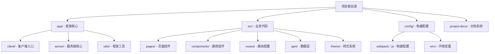

# 整体架构设计分析

> 📋 从顶层视角分析 AgentFlow-FE 的架构设计理念和目录组织原则

## 🎯 架构设计理念

### 核心设计原则



## 📁 目录职责矩阵

| 目录 | 职责范围 | 设计理念 | 合理性评分 |
|------|----------|----------|-----------|
| **app/** | 🏗️ SSR框架核心 | 框架与业务分离 | ⭐⭐⭐⭐⭐ |
| **src/** | 📱 业务代码 | 领域驱动设计 | ⭐⭐⭐⭐⭐ |
| **config/** | ⚙️ 构建配置 | 环境配置分离 | ⭐⭐⭐⭐ |
| **build/** | 📦 构建输出 | 构建产物隔离 | ⭐⭐⭐⭐⭐ |
| **public/** | 🌐 静态资源 | 公共资源管理 | ⭐⭐⭐⭐ |

## 🏗️ 架构层次分析

### 1. 框架层 (app/)
```typescript
// 架构分层示意
┌─────────────────────────────────────┐
│           业务应用层 (src/)          │  ← 业务逻辑、页面组件
├─────────────────────────────────────┤
│           框架核心层 (app/)          │  ← SSR框架、路由、工具
├─────────────────────────────────────┤
│          构建配置层 (config/)        │  ← Webpack、Babel、环境
├─────────────────────────────────────┤
│           基础设施层                │  ← Node.js、React、Koa
└─────────────────────────────────────┘
```

**设计优势：**
- ✅ **关注点分离**：框架代码与业务代码完全隔离
- ✅ **可复用性**：app/ 目录可以作为独立的 SSR 框架使用
- ✅ **维护性**：框架升级不影响业务代码

**潜在问题：**
- ⚠️ **学习成本**：自定义框架需要更多文档和学习时间
- ⚠️ **社区支持**：不如 Next.js 等成熟框架的生态

### 2. 业务层 (src/)
```typescript
// 业务层组织原则
src/
├── pages/           # 页面级组件（路由对应）
├── components/      # 可复用UI组件
├── apis/           # 数据获取层
├── routes/         # 路由配置
├── theme/          # 样式系统
├── types/          # 类型定义
└── utils/          # 业务工具函数
```

**设计优势：**
- ✅ **清晰的分层**：按功能职责划分目录
- ✅ **可扩展性**：易于添加新的业务模块
- ✅ **团队协作**：不同开发者可专注不同模块

## 🔍 设计合理性深度评估

### 优秀设计点

#### 1. 框架与业务分离 ⭐⭐⭐⭐⭐
```typescript
// app/ - 框架核心，不包含业务逻辑
app/
├── client/         # 客户端水合逻辑
├── server/         # 服务端渲染核心
└── utils/          # 框架级工具函数

// src/ - 纯业务代码
src/
├── pages/          # 业务页面
├── apis/           # 业务API
└── components/     # 业务组件
```

**评估结果：** 这种分离方式非常优秀，实现了真正的框架与业务解耦。

#### 2. 构建配置外置 ⭐⭐⭐⭐
```typescript
config/
├── webpack.config.js    # 基础配置
├── webpack.dev.js       # 开发环境
├── webpack.prod.js      # 生产环境
└── env/                # 环境变量配置
```

**评估结果：** 配置分离清晰，便于维护和环境管理。

### 待优化设计点

#### 1. 缺少明确的 shared/ 目录 ⭐⭐⭐
```typescript
// 当前结构
src/
├── utils/          # 业务工具 - 职责不够明确
├── types/          # 类型定义 - 可能包含框架和业务类型

// 建议优化
src/
├── shared/         # 共享代码
│   ├── utils/      # 共享工具
│   ├── types/      # 共享类型
│   ├── constants/  # 共享常量
│   └── hooks/      # 共享Hooks
├── domains/        # 业务领域
│   ├── agents/     # Agent领域
│   └── jobs/       # Job领域
```

#### 2. API 层设计可优化 ⭐⭐⭐
```typescript
// 当前结构
src/apis/
├── services/       # API服务
├── model/          # 数据模型
└── queryKeys.ts    # 查询键

// 建议优化 - 按业务领域组织
src/apis/
├── agents/         # Agent相关API
│   ├── services.ts
│   ├── types.ts
│   └── queries.ts
├── jobs/          # Job相关API
└── shared/        # 共享API逻辑
```

## 🎯 架构设计评分卡

| 维度 | 当前评分 | 满分 | 评估说明 |
|------|----------|------|----------|
| **模块化程度** | 9 | 10 | 框架与业务分离优秀 |
| **可维护性** | 8 | 10 | 目录清晰，职责明确 |
| **可扩展性** | 7 | 10 | 缺少领域划分 |
| **团队协作** | 8 | 10 | 分工明确，冲突较少 |
| **学习成本** | 6 | 10 | 自定义框架需要学习 |
| **复用性** | 9 | 10 | 框架层高度可复用 |

**总体评分：7.8/10** - 架构设计整体优秀，有少量改进空间

## 🚀 与主流方案对比

### vs Next.js 架构
| 方面 | AgentFlow-FE | Next.js | 优劣分析 |
|------|--------------|---------|----------|
| **目录结构** | 框架/业务分离 | 约定式结构 | AgentFlow 更灵活 |
| **定制化** | 完全可控 | 框架限制 | AgentFlow 优势明显 |
| **学习成本** | 较高 | 较低 | Next.js 更易上手 |
| **生态系统** | 需自建 | 丰富 | Next.js 优势明显 |

### vs Nuxt.js 架构
| 方面 | AgentFlow-FE | Nuxt.js | 优劣分析 |
|------|--------------|---------|----------|
| **技术栈** | React生态 | Vue生态 | 各有优势 |
| **架构灵活性** | 高 | 中等 | AgentFlow 更灵活 |
| **约定配置** | 配置优先 | 约定优先 | 各有适用场景 |

## 🔄 改进建议

### 短期优化 (1-2周)
1. **添加 shared/ 目录**：统一管理共享代码
2. **API层重构**：按业务领域组织API代码
3. **类型定义整理**：区分框架类型和业务类型

### 中期优化 (1-2月)
1. **引入领域驱动设计**：按业务领域组织代码
2. **完善错误边界**：添加更细粒度的错误处理
3. **增加代码生成工具**：提升开发效率

### 长期规划 (3-6月)
1. **微前端架构**：支持多团队开发
2. **插件系统**：提升框架扩展性
3. **可视化配置**：降低使用门槛

## 📚 学习建议

### 深入理解路径
1. **先理解分层思想**：框架层 → 业务层 → 配置层
2. **分析数据流**：客户端 ↔ 服务端 ↔ API
3. **掌握构建流程**：开发环境 → 构建过程 → 部署产物

### 实践练习
1. **添加新页面**：体验路由配置和页面开发流程
2. **集成新API**：理解数据层的设计模式
3. **修改构建配置**：学习工程化配置

这种架构设计为大型项目提供了良好的基础，通过持续优化可以支撑更复杂的业务场景。