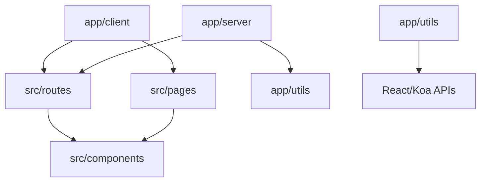
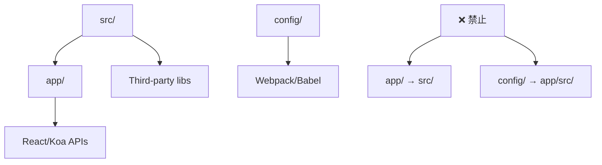

# 目录职责划分深度分析

> 📂 详细分析 AgentFlow-FE 每个目录的设计职责、功能边界和协作关系

## 🎯 目录职责概览

### 核心设计原则

1. **关注点分离** - 每个目录有明确的单一职责
2. **分层架构** - 清晰的架构层次，避免循环依赖  
3. **可维护性** - 目录结构便于代码维护和团队协作
4. **可扩展性** - 支持项目规模增长和功能扩展

## 📁 一级目录职责分析

```
agentflow-fe/
├── app/                 # 🏗️ SSR 框架核心
├── src/                 # 📱 业务应用代码
├── config/              # ⚙️ 构建和环境配置
├── build/               # 📦 构建输出产物
├── public/              # 🌐 静态资源文件
├── project-docs/        # 📚 项目文档
├── project-docs-code/   # 🔍 代码分析文档
├── database/            # 🗄️ 数据库相关
├── mocks/               # 🎭 模拟数据
├── logs/                # 📝 日志文件
├── scripts/             # 🛠️ 开发脚本
└── docs/                # 📖 其他文档
```

### 职责矩阵分析

| 目录 | 主要职责 | 次要职责 | 不应包含 | 依赖关系 |
|------|----------|----------|----------|----------|
| **app/** | SSR框架实现 | 工具函数 | 业务逻辑 | → React, Koa |
| **src/** | 业务功能 | UI组件 | 框架代码 | → app/, config/ |
| **config/** | 构建配置 | 环境变量 | 运行时代码 | → webpack, babel |
| **build/** | 构建产物 | 静态资源 | 源代码 | ← app/, src/ |
| **public/** | 静态文件 | 模板文件 | 动态内容 | 独立 |

## 🏗️ app/ 目录深度解析

### 目录结构与职责
```
app/
├── client/              # 客户端入口和水合
│   └── index.tsx        # 客户端水合逻辑
├── server/              # 服务端渲染核心
│   ├── index.tsx        # SSR 主渲染器
│   ├── app.tsx          # React 应用配置
│   ├── html.tsx         # HTML 模板生成
│   ├── server.ts        # Koa 服务器入口
│   ├── serverless.ts    # Serverless 适配
│   ├── middleware/      # 服务端中间件
│   └── stream/          # 流式渲染
└── utils/               # 框架级工具函数
    ├── constants.ts     # 框架常量
    ├── emotionCache.ts  # Emotion 缓存配置
    ├── loadable.tsx     # 代码分割工具
    └── routesTypes.ts   # 路由类型定义
```

### 🎯 设计职责边界

#### ✅ 应该包含的内容
- **SSR 核心逻辑**：服务端渲染的实现细节
- **客户端水合**：浏览器端的渲染接管逻辑
- **框架工具**：支撑 SSR 功能的通用工具
- **类型定义**：框架级别的 TypeScript 类型

#### ❌ 不应该包含的内容
- **业务逻辑**：具体的业务功能实现
- **UI 组件**：页面级或业务级组件
- **API 调用**：业务相关的数据获取
- **样式定义**：具体的样式文件

#### 🔄 依赖关系分析


### 🔧 优化建议

#### 1. 接口抽象化
```typescript
// 当前实现：直接耦合
import routes from '../../src/routes';

// 建议：接口抽象
interface RouteProvider {
  getRoutes(): PreFetchRouteObject[];
  getRoute(path: string): PreFetchRouteObject | null;
}

// app/server/index.tsx
const renderApp = async (ctx: Context, routeProvider: RouteProvider) => {
  const routes = routeProvider.getRoutes();
  // 渲染逻辑...
};
```

#### 2. 插件化架构
```typescript
// app/utils/plugins.ts
interface SSRPlugin {
  name: string;
  beforeRender?(ctx: Context): Promise<void>;
  afterRender?(html: string, ctx: Context): Promise<string>;
}

class PluginManager {
  private plugins: SSRPlugin[] = [];
  
  register(plugin: SSRPlugin) {
    this.plugins.push(plugin);
  }
  
  async executeHook(hook: keyof SSRPlugin, ...args: any[]) {
    for (const plugin of this.plugins) {
      if (plugin[hook]) {
        await (plugin[hook] as Function)(...args);
      }
    }
  }
}
```

## 📱 src/ 目录深度解析

### 目录结构与职责
```
src/
├── pages/               # 📄 页面级组件
│   ├── Agents/          # Agent 管理页面
│   ├── Jobs/            # Job 管理页面
│   ├── Home/            # 首页
│   └── EmotionCacheTestPage/  # 测试页面
├── components/          # 🧩 可复用组件
│   └── Layout/          # 布局组件
├── routes/              # 🛣️ 路由配置
│   └── index.tsx        # 路由定义
├── apis/                # 🔌 数据层
│   ├── services/        # API 服务
│   ├── model/           # 数据模型
│   └── queryKeys.ts     # 查询键管理
├── theme/               # 🎨 样式系统
│   ├── index.less       # 全局样式
│   └── material-ui.ts   # MUI 主题配置
├── types/               # 📝 类型定义
│   └── agents.ts        # 业务类型
├── utils/               # 🛠️ 业务工具
│   └── index.ts         # 工具函数
└── index.tsx            # 🚀 业务入口
```

### 🎯 设计职责详解

#### 1. pages/ - 页面组件层
```typescript
// 职责：页面级业务逻辑和布局
// src/pages/Agents/index.tsx
const AgentsPage: React.FC = () => {
  const { data: agents, isLoading } = useAgents();
  
  return (
    <Layout>
      <AgentList agents={agents} loading={isLoading} />
    </Layout>
  );
};

// 设计原则：
// ✅ 页面级数据获取
// ✅ 页面级状态管理
// ✅ 页面级错误处理
// ❌ 复杂业务逻辑（应提取到 hooks 或 services）
// ❌ 通用组件定义（应放在 components/）
```

#### 2. components/ - 组件复用层
```typescript
// 职责：可复用的 UI 组件
// src/components/Layout/index.tsx
interface LayoutProps {
  children: React.ReactNode;
  title?: string;
  sidebar?: boolean;
}

const Layout: React.FC<LayoutProps> = ({ children, title, sidebar = true }) => {
  return (
    <div className="layout">
      <Header title={title} />
      {sidebar && <Sidebar />}
      <main>{children}</main>
    </div>
  );
};

// 设计原则：
// ✅ 高复用性
// ✅ 无业务逻辑
// ✅ 通过 props 配置
// ❌ 硬编码业务数据
// ❌ 直接调用 API
```

#### 3. apis/ - 数据访问层
```typescript
// 职责：统一的数据获取和管理
// src/apis/services/Agents.ts
export const AgentService = {
  getList: async (): Promise<Agent[]> => {
    const response = await fetch('/api/agents');
    return response.json();
  },
  
  getById: async (id: string): Promise<Agent> => {
    const response = await fetch(`/api/agents/${id}`);
    return response.json();
  },
  
  create: async (agent: CreateAgentRequest): Promise<Agent> => {
    const response = await fetch('/api/agents', {
      method: 'POST',
      body: JSON.stringify(agent),
    });
    return response.json();
  },
};

// React Query 集成
export const useAgents = () => {
  return useQuery({
    queryKey: ['agents'],
    queryFn: AgentService.getList,
  });
};
```

### 🔧 src/ 目录优化建议

#### 1. 按业务领域重构
```typescript
// 当前结构 - 按技术分层
src/
├── pages/
├── components/
├── apis/
└── types/

// 建议结构 - 按业务领域 + 技术分层
src/
├── domains/             # 业务领域
│   ├── agents/          # Agent 领域
│   │   ├── components/  # Agent 相关组件
│   │   ├── pages/       # Agent 页面
│   │   ├── services/    # Agent API
│   │   ├── types/       # Agent 类型
│   │   └── hooks/       # Agent Hooks
│   └── jobs/            # Job 领域
├── shared/              # 共享资源
│   ├── components/      # 通用组件
│   ├── hooks/           # 通用 Hooks
│   ├── utils/           # 工具函数
│   └── types/           # 共享类型
└── app/                 # 应用级配置
    ├── routes/          # 路由配置
    ├── theme/           # 主题配置
    └── providers/       # 全局 Provider
```

#### 2. 增强类型系统
```typescript
// src/shared/types/api.ts
export interface ApiResponse<T> {
  data: T;
  success: boolean;
  message?: string;
  code: number;
}

export interface PaginatedResponse<T> extends ApiResponse<T[]> {
  pagination: {
    page: number;
    size: number;
    total: number;
    pages: number;
  };
}

// src/shared/types/entities.ts
export interface BaseEntity {
  id: string;
  createdAt: string;
  updatedAt: string;
}

export interface Agent extends BaseEntity {
  name: string;
  type: AgentType;
  status: AgentStatus;
  config: AgentConfig;
}
```

## ⚙️ config/ 目录深度解析

### 目录结构与职责
```
config/
├── webpack.config.js    # Webpack 基础配置
├── webpack.dev.js       # 开发环境配置
├── webpack.prod.js      # 生产环境配置
├── constants.js         # 构建常量
├── clean.sh             # 清理脚本
└── env/                 # 环境变量配置
    ├── local.js         # 本地环境
    ├── test.js          # 测试环境
    ├── beta.js          # 预发布环境
    └── online.js        # 生产环境
```

### 🎯 设计原则分析

#### ✅ 优秀设计点
1. **环境分离**：不同环境的配置完全隔离
2. **配置复用**：基础配置通过 merge 复用
3. **常量提取**：构建常量统一管理

#### ⚠️ 改进空间
```typescript
// 建议：配置类型化
// config/types.ts
interface BuildConfig {
  mode: 'development' | 'production';
  publicPath: string;
  outputPath: string;
  sourceMap: boolean;
  optimization: {
    splitChunks: boolean;
    minimize: boolean;
  };
}

interface EnvironmentConfig {
  apiEndpoint: string;
  enableMock: boolean;
  logLevel: 'debug' | 'info' | 'warn' | 'error';
  features: {
    [key: string]: boolean;
  };
}

// config/webpack.config.ts
const createWebpackConfig = (env: string): Configuration => {
  const buildConfig: BuildConfig = getBuildConfig(env);
  const envConfig: EnvironmentConfig = getEnvConfig(env);
  
  return {
    // 类型安全的配置
  };
};
```

## 🗂️ 其他目录职责分析

### build/ - 构建产物
```
build/
├── client/              # 客户端构建产物
│   ├── static/          # 静态资源
│   ├── index.html       # HTML 模板
│   └── manifest.json    # 资源清单
├── server.js            # 服务端构建产物
├── serverless.js        # Serverless 构建产物
└── loadable-stats.json  # 代码分割统计
```

**职责边界：**
- ✅ 自动生成的构建产物
- ✅ 优化后的生产代码
- ❌ 不应手动修改
- ❌ 不应提交到版本控制

### public/ - 静态资源
```
public/
├── index.ejs            # HTML 模板
├── favicon.ico          # 网站图标
├── robots.txt           # 爬虫配置
└── sitemap.xml          # 站点地图
```

**职责边界：**
- ✅ 不需要编译的静态文件
- ✅ 直接复制到输出目录的资源
- ❌ 需要处理的图片、样式
- ❌ 组件相关的资源

## 🎯 目录职责优化建议

### 1. 职责边界清晰化
```typescript
// 建立明确的导入规则
module.exports = {
  rules: {
    // app/ 目录不能导入 src/ 的业务代码
    'no-restricted-imports': [
      'error',
      {
        zones: [
          {
            target: './app/**/*',
            from: './src/**/*',
            except: ['./src/routes/index.tsx'], // 只允许导入路由配置
          },
        ],
      },
    ],
  },
};
```

### 2. 依赖方向控制


### 3. 模块边界监控
```typescript
// tools/architecture-guard.js
const architectureRules = {
  'app/': {
    canImport: ['react', 'koa', 'node_modules/**'],
    cannotImport: ['src/**/*.ts', 'src/**/*.tsx'],
    exceptions: ['src/routes/index.tsx'],
  },
  'src/pages/': {
    canImport: ['src/components/**', 'src/apis/**', 'app/utils/**'],
    cannotImport: ['app/server/**', 'app/client/**'],
  },
  'src/components/': {
    canImport: ['src/shared/**', 'src/types/**'],
    cannotImport: ['src/pages/**', 'src/apis/**'],
  },
};

// 在 CI 中检查架构规则
const checkArchitecture = () => {
  // 检查导入关系是否符合规则
};
```

## 📊 目录职责评估总结

### 当前架构评分

| 维度 | 评分 | 说明 |
|------|------|------|
| **职责清晰度** | 8/10 | 大部分目录职责明确，少量边界模糊 |
| **分层合理性** | 9/10 | 框架/业务分离优秀 |
| **可维护性** | 7/10 | 结构清晰，但缺少强制约束 |
| **可扩展性** | 6/10 | 缺少领域划分，大项目难扩展 |
| **团队协作** | 8/10 | 分工明确，冲突较少 |

### 改进优先级

1. **高优先级**：建立 ESLint 规则强制目录边界
2. **中优先级**：重构 src/ 为领域驱动结构  
3. **低优先级**：配置文件类型化改造

通过明确的目录职责划分和边界约束，可以显著提升项目的可维护性和团队协作效率。