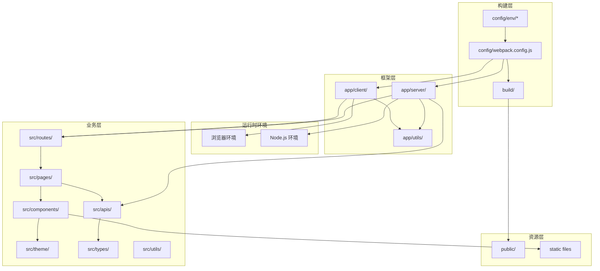
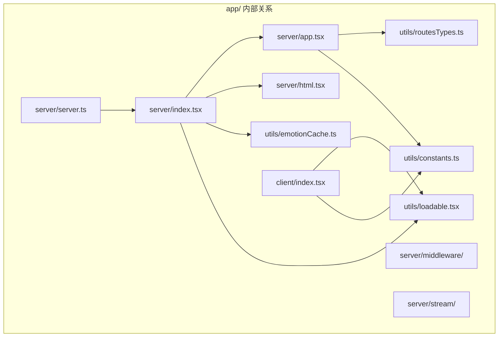
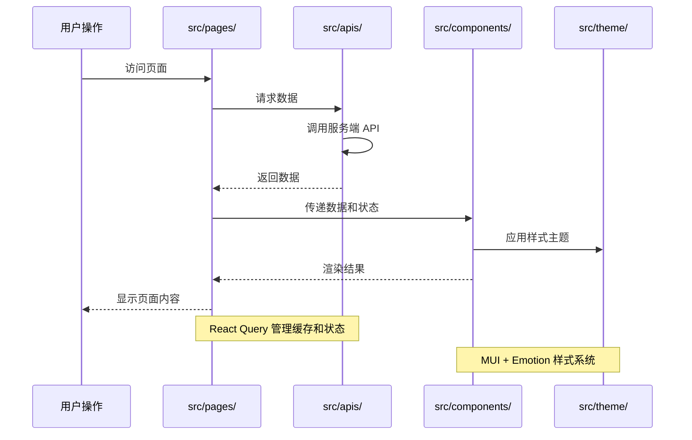

# 模块间关系分析

> 🔗 深入分析 AgentFlow-FE 各模块间的依赖关系、通信机制和协作模式

## 🎯 模块关系概览

### 核心模块依赖图



## 🏗️ 构建时依赖关系

### 1. 配置层依赖链

```typescript
// 配置依赖分析
interface BuildDependencyChain {
  entry: string;
  dependencies: string[];
  outputs: string[];
}

const buildChain: BuildDependencyChain[] = [
  {
    entry: 'config/webpack.config.js',
    dependencies: [
      'config/env/*.js',        // 环境变量配置
      'package.json',           // 依赖声明
      'tsconfig.json',          // TypeScript 配置
      'babel.config.js',        // Babel 配置
    ],
    outputs: [
      'build/client/',          // 客户端产物
      'build/server.js',        // 服务端产物
      'build/serverless.js',    // Serverless 产物
    ],
  },
];
```

### 2. 构建依赖关系矩阵

| 配置文件 | 影响范围 | 依赖文件 | 输出产物 |
|----------|----------|----------|----------|
| **webpack.config.js** | 🌍 全局 | env/, package.json | build/* |
| **tsconfig.json** | 📝 类型检查 | src/types/, app/utils/ | 类型声明 |
| **babel.config.js** | 🔄 代码转换 | src/**, app/** | 转换后的 JS |
| **postcss.config.js** | 🎨 样式处理 | src/theme/, *.css | 处理后的 CSS |

### 3. 构建流程关键节点

```typescript
// 构建流程分析
interface BuildStage {
  stage: string;
  inputs: string[];
  processor: string;
  outputs: string[];
  dependencies: string[];
}

const buildStages: BuildStage[] = [
  {
    stage: 'TypeScript 编译',
    inputs: ['src/**/*.tsx', 'app/**/*.tsx'],
    processor: 'ts-loader + fork-ts-checker',
    outputs: ['临时 JS 文件'],
    dependencies: ['tsconfig.json', 'src/types/*'],
  },
  {
    stage: 'Babel 转换',
    inputs: ['临时 JS 文件'],
    processor: 'babel-loader',
    outputs: ['兼容性 JS 文件'],
    dependencies: ['babel.config.js', '@babel/preset-*'],
  },
  {
    stage: '代码分割',
    inputs: ['兼容性 JS 文件'],
    processor: '@loadable/webpack-plugin',
    outputs: ['分割后的 chunks'],
    dependencies: ['app/utils/loadable.tsx'],
  },
  {
    stage: '样式处理',
    inputs: ['src/**/*.less', 'src/**/*.css'],
    processor: 'less-loader + postcss-loader',
    outputs: ['处理后的 CSS'],
    dependencies: ['postcss.config.js', 'tailwind.config.js'],
  },
];
```

## 🔄 运行时模块关系

### 1. 服务端模块协作

```typescript
// 服务端模块协作流程
interface ServerModuleFlow {
  trigger: string;
  modules: Array<{
    module: string;
    action: string;
    dependencies: string[];
    outputs: string[];
  }>;
}

const serverRequestFlow: ServerModuleFlow = {
  trigger: 'HTTP 请求到达',
  modules: [
    {
      module: 'app/server/server.ts',
      action: '接收请求，启动 Koa',
      dependencies: ['koa', 'app/server/index.tsx'],
      outputs: ['Context 对象'],
    },
    {
      module: 'app/server/index.tsx',
      action: '执行 SSR 渲染',
      dependencies: [
        'src/routes/index.tsx',     // 路由配置
        'app/utils/loadable.tsx',   // 代码分割
        'app/utils/emotionCache.ts', // 样式缓存
      ],
      outputs: ['渲染后的 JSX'],
    },
    {
      module: 'app/server/html.tsx',
      action: '生成 HTML 模板',
      dependencies: [
        'React Helmet 数据',       // SEO 标签
        'Styled Components 样式',  // 样式标签
        'Loadable Stats',          // 资源清单
      ],
      outputs: ['完整 HTML 字符串'],
    },
  ],
};
```

### 2. 客户端模块协作

```typescript
// 客户端水合流程
const clientHydrationFlow: ServerModuleFlow = {
  trigger: '浏览器加载完成',
  modules: [
    {
      module: 'app/client/index.tsx',
      action: '检测 SSR 标记，启动水合',
      dependencies: [
        '@loadable/component',      // 等待代码分割
        'window.__REACT_QUERY_STATE__', // 服务端状态
      ],
      outputs: ['React Root 实例'],
    },
    {
      module: 'src/routes/index.tsx',
      action: '路由匹配和组件加载',
      dependencies: [
        'src/pages/*',             // 页面组件
        'react-router-dom',        // 路由库
      ],
      outputs: ['匹配的路由组件'],
    },
    {
      module: 'src/apis/*',
      action: '恢复服务端数据状态',
      dependencies: [
        '@tanstack/react-query',   // 状态管理
        'window.__REACT_QUERY_STATE__',
      ],
      outputs: ['水合后的数据状态'],
    },
  ],
};
```

## 📦 框架层内部关系

### 1. app/ 目录内部依赖



### 2. 关键接口定义

```typescript
// app/utils/routesTypes.ts - 核心类型接口
export interface PreFetchRouteObject extends RouteObject {
  loadData?: (queryClient: QueryClient, params?: any) => Promise<void>;
  queryKey?: (string | number)[];
  children?: PreFetchRouteObject[];
}

// app/utils/constants.ts - 共享常量
export const helmetTagNameList = [
  'title', 'meta', 'link', 'script', 'style'
] as const;

export const TempThemeMap = {
  light: '#ffffff',
  dark: '#000000',
} as const;

// 接口使用分析
interface InterfaceUsage {
  interface: string;
  usedBy: string[];
  purpose: string;
}

const interfaceUsageMap: InterfaceUsage[] = [
  {
    interface: 'PreFetchRouteObject',
    usedBy: [
      'src/routes/index.tsx',      // 路由定义
      'app/server/app.tsx',        // 服务端路由处理
      'app/client/index.tsx',      // 客户端路由处理
    ],
    purpose: '统一路由配置和数据预取接口',
  },
  {
    interface: 'helmetTagNameList',
    usedBy: [
      'app/server/index.tsx',      // 服务端 SEO 标签处理
      'app/server/html.tsx',       // HTML 模板生成
    ],
    purpose: 'SEO 标签的统一管理',
  },
];
```

## 🎯 业务层模块关系

### 1. src/ 目录内部依赖网络

```typescript
// 业务层依赖关系分析
interface BusinessModuleDependency {
  module: string;
  directDependencies: string[];
  indirectDependencies: string[];
  dependents: string[];
  coupling: 'high' | 'medium' | 'low';
}

const businessDependencies: BusinessModuleDependency[] = [
  {
    module: 'src/pages/',
    directDependencies: [
      'src/components/',         // UI 组件
      'src/apis/',              // 数据获取
      'react-router-dom',       // 路由功能
    ],
    indirectDependencies: [
      'src/types/',             // 通过 apis 间接依赖
      'src/theme/',             // 通过 components 间接依赖
    ],
    dependents: [
      'src/routes/',            // 路由配置依赖页面
    ],
    coupling: 'medium',
  },
  
  {
    module: 'src/components/',
    directDependencies: [
      'src/theme/',             // 样式主题
      '@mui/material',          // UI 库
      'react',                  // 基础库
    ],
    indirectDependencies: [
      'src/types/',             // 组件属性类型
    ],
    dependents: [
      'src/pages/',             // 页面使用组件
    ],
    coupling: 'low',
  },
  
  {
    module: 'src/apis/',
    directDependencies: [
      'src/types/',             // 数据类型
      '@tanstack/react-query',  // 状态管理
      'axios',                  // HTTP 客户端
    ],
    indirectDependencies: [],
    dependents: [
      'src/pages/',             // 页面调用 API
    ],
    coupling: 'low',
  },
];
```

### 2. 数据流向分析



## 🔗 跨层模块通信

### 1. 框架与业务层通信机制

```typescript
// 通信接口分析
interface CrossLayerCommunication {
  from: string;
  to: string;
  mechanism: string;
  dataFlow: 'unidirectional' | 'bidirectional';
  examples: string[];
}

const communicationPatterns: CrossLayerCommunication[] = [
  {
    from: 'app/server/',
    to: 'src/routes/',
    mechanism: 'ES Module Import',
    dataFlow: 'unidirectional',
    examples: [
      'import routes from "../../src/routes"',
      '路由配置传递给 SSR 渲染器',
    ],
  },
  
  {
    from: 'app/client/',
    to: 'src/pages/',
    mechanism: 'React Router + Loadable',
    dataFlow: 'bidirectional',
    examples: [
      '客户端路由匹配页面组件',
      '页面组件触发路由导航',
    ],
  },
  
  {
    from: 'src/apis/',
    to: 'app/server/',
    mechanism: 'React Query Dehydration',
    dataFlow: 'unidirectional',
    examples: [
      '服务端数据预取结果传递给客户端',
      'dehydrate(queryClient) 序列化状态',
    ],
  },
];
```

### 2. 配置传递链路

```typescript
// 配置在各层间的传递
interface ConfigPropagation {
  config: string;
  path: string[];
  purpose: string;
}

const configFlows: ConfigPropagation[] = [
  {
    config: 'API_BASE_URL',
    path: [
      'config/env/online.js',
      'webpack.config.js (EnvironmentPlugin)',
      'process.env.API_BASE_URL',
      'src/apis/services/*.ts',
    ],
    purpose: 'API 基础 URL 配置',
  },
  
  {
    config: 'MUI Theme',
    path: [
      'src/theme/material-ui.ts',
      'src/components/Layout/index.tsx',
      '@mui/material/ThemeProvider',
      'src/pages/* (继承主题)',
    ],
    purpose: 'Material-UI 主题配置传递',
  },
  
  {
    config: 'Emotion Cache',
    path: [
      'app/utils/emotionCache.ts',
      'app/server/index.tsx (SSR)',
      'app/client/index.tsx (Hydration)',
      'src/components/* (样式应用)',
    ],
    purpose: 'Emotion CSS-in-JS 缓存配置',
  },
];
```

## 🔍 依赖关系问题分析

### 1. 当前存在的问题

#### 循环依赖风险
```typescript
// 潜在循环依赖分析
const potentialCircularDeps = [
  {
    cycle: 'src/components/ ↔ src/pages/',
    risk: 'medium',
    description: '页面组件可能导入公共组件，公共组件可能硬编码页面路径',
    solution: '建立明确的单向依赖规则',
  },
  
  {
    cycle: 'src/apis/ ↔ src/types/',
    risk: 'low',
    description: 'API 定义类型，类型可能引用 API 常量',
    solution: '分离类型定义和 API 实现',
  },
];
```

#### 耦合度过高
```typescript
// 高耦合模块识别
const highCouplingIssues = [
  {
    modules: ['app/server/index.tsx', 'src/routes/index.tsx'],
    issue: '直接导入业务路由配置',
    impact: '框架代码与业务代码耦合',
    solution: '通过接口抽象解耦',
  },
  
  {
    modules: ['src/pages/*', 'src/apis/services/*'],
    issue: '页面直接调用具体 API 服务',
    impact: 'API 变更影响多个页面',
    solution: '引入 API 抽象层或统一 Hook',
  },
];
```

### 2. 优化建议

#### 依赖注入模式
```typescript
// 建议：引入依赖注入减少耦合
interface RouteProvider {
  getRoutes(): PreFetchRouteObject[];
  matchRoute(path: string): PreFetchRouteObject | null;
}

interface APIProvider {
  get<T>(endpoint: string): Promise<T>;
  post<T>(endpoint: string, data: any): Promise<T>;
}

// app/server/index.tsx
const renderApp = async (
  ctx: Context, 
  routeProvider: RouteProvider,
  apiProvider: APIProvider
) => {
  // 通过接口而非直接导入使用
  const routes = routeProvider.getRoutes();
  // 渲染逻辑...
};
```

#### 模块边界强化
```typescript
// 建议：ESLint 规则强化模块边界
module.exports = {
  rules: {
    'no-restricted-imports': [
      'error',
      {
        zones: [
          {
            target: './app/**/*',
            from: './src/**/*',
            except: ['./src/routes/index.tsx'],
            message: '框架层不应直接依赖业务层代码',
          },
          {
            target: './src/components/**/*',
            from: './src/pages/**/*',
            message: '公共组件不应依赖页面组件',
          },
        ],
      },
    ],
  },
};
```

## 📊 模块关系健康度评估

### 关系质量评分卡

| 评估维度 | 当前得分 | 满分 | 问题描述 | 改进建议 |
|----------|----------|------|----------|----------|
| **依赖方向清晰度** | 7/10 | 10 | 框架与业务存在直接依赖 | 引入接口抽象 |
| **循环依赖控制** | 8/10 | 10 | 无明显循环依赖 | 建立检测机制 |
| **耦合度控制** | 6/10 | 10 | 部分模块耦合较紧 | 增加抽象层 |
| **接口定义规范** | 7/10 | 10 | 接口定义相对清晰 | 完善类型定义 |
| **模块职责边界** | 8/10 | 10 | 职责划分较明确 | 强化边界约束 |

### 总体评估

**综合得分：7.2/10** - 模块关系整体健康，但有优化空间

**主要优势：**
- ✅ 框架与业务分层清晰
- ✅ 构建流程依赖明确
- ✅ 无明显循环依赖

**改进重点：**
- 🔧 减少框架与业务层的直接耦合
- 🔧 建立更强的模块边界约束
- 🔧 完善接口抽象和依赖注入

通过持续优化模块关系，可以提升代码的可维护性、可测试性和可扩展性。