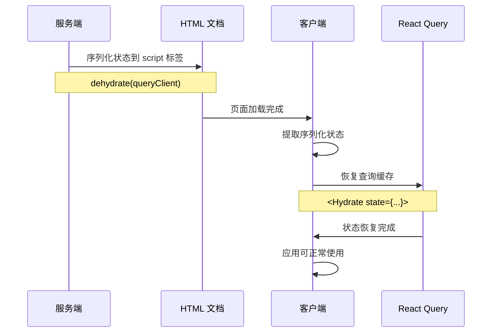

# app/client 客户端入口深度分析

> 🌐 深入分析客户端水合机制、代码分割策略和性能优化实现

## 📁 目录结构分析

```
app/client/
└── index.tsx           # 客户端入口和水合逻辑
```

虽然只有一个文件，但这个文件承担着客户端渲染的核心职责，是 SSR 应用客户端接管的关键节点。

## 🔍 核心代码深度解析

### 1. 客户端入口实现

```typescript
// app/client/index.tsx - 核心代码分析
import { hydrateRoot, createRoot } from 'react-dom/client';
import { BrowserRouter } from 'react-router-dom';
import { loadableReady } from '@loadable/component';
import { Hydrate, QueryClient, QueryClientProvider } from '@tanstack/react-query';
```

#### 关键设计决策分析

**React 18 渲染API选择**
```typescript
// 智能渲染策略选择
tradeFlag.isSSR
  ? loadableReady(() => {
      hydrateRoot(root, <ClientApp />);    // SSR 水合
    })
  : createRoot(root).render(<ClientApp />); // CSR 渲染

// 设计分析：
// ✅ 优秀设计：根据渲染模式智能选择API
// ✅ React 18兼容：使用最新的并发特性
// ✅ 代码分割支持：loadableReady确保chunks加载完成
```

**SSR/CSR 模式检测**
```typescript
// 渲染模式标记获取
const tradeFlag: TradeFlagType = JSON.parse(
  document.querySelector('#__APP_FLAG__')?.textContent
);

// 设计评估：
// ✅ 灵活的模式切换：支持同一应用的不同渲染模式
// ⚠️ 硬编码选择器：如果HTML结构变化可能出错
// 💡 改进建议：增加容错处理
```

### 2. 状态水合机制

#### React Query 状态恢复
```typescript
// 服务端状态反序列化
const dehydratedState = document.querySelector('#__REACT_QUERY_STATE__')?.textContent;

const ClientApp = () => (
  <QueryClientProvider client={queryClient}>
    <Hydrate state={JSON.parse(dehydratedState)}>
      {/* 应用组件 */}
    </Hydrate>
  </QueryClientProvider>
);
```

**水合流程分析：**



#### 设计优势分析
```typescript
// 状态水合的关键配置
const queryClient = new QueryClient({
  defaultOptions: {
    queries: {
      refetchOnWindowFocus: false,    // 避免不必要的重新获取
    },
  },
});

// 优势：
// ✅ 无缝状态转移：客户端继承服务端的数据状态
// ✅ 避免重复请求：客户端不会重新请求已有数据
// ✅ 用户体验优化：页面内容立即可用，无loading状态
```

### 3. 样式系统集成

#### Emotion Cache 共享
```typescript
// 客户端使用相同的 emotion cache 配置
const emotionCache = createEmotionCache();

const ClientApp = () => (
  <CacheProvider value={emotionCache}>
    <ThemeProvider theme={theme}>
      <CssBaseline />
      <App />
    </ThemeProvider>
  </CacheProvider>
);
```

#### FOUC 防护机制
```typescript
// 防闪烁设计分析
interface FOUCPrevention {
  mechanism: string;
  implementation: string;
  effectiveness: 'high' | 'medium' | 'low';
}

const foucPreventionMethods: FOUCPrevention[] = [
  {
    mechanism: 'Emotion Cache 共享',
    implementation: '服务端和客户端使用相同的 cache key',
    effectiveness: 'high',
  },
  {
    mechanism: 'Critical CSS 注入',
    implementation: '服务端渲染时提取关键样式',
    effectiveness: 'high', 
  },
  {
    mechanism: 'MUI CssBaseline',
    implementation: '统一浏览器默认样式',
    effectiveness: 'medium',
  },
];
```

### 4. 代码分割处理

#### Loadable Components 集成
```typescript
// 等待代码分割chunks加载完成
loadableReady(() => {
  hydrateRoot(root, <ClientApp />);
});

// 工作机制：
// 1. 服务端生成 loadable-stats.json
// 2. 客户端检查所有必需的chunks是否已加载
// 3. 确保水合时组件定义已可用
// 4. 避免水合不匹配错误
```

#### 代码分割优化建议
```typescript
// 当前实现评估
interface CodeSplittingAnalysis {
  aspect: string;
  current: string;
  score: number;
  improvement: string;
}

const codeSplittingEvaluation: CodeSplittingAnalysis[] = [
  {
    aspect: '加载策略',
    current: 'loadableReady 等待所有chunks',
    score: 8,
    improvement: '可以实现渐进式加载',
  },
  {
    aspect: '错误处理',
    current: '基础的loadable错误处理',
    score: 6,
    improvement: '增加chunk加载失败的降级策略',
  },
  {
    aspect: '预加载优化',
    current: '无主动预加载',
    score: 5,
    improvement: '可以预加载关键路由的chunks',
  },
];
```

## 🎯 设计优势与不足

### ✅ 设计优势

#### 1. 渲染模式灵活性
```typescript
// 支持多种渲染模式
const renderModes = {
  SSR: {
    trigger: 'tradeFlag.isSSR === true',
    method: 'hydrateRoot',
    benefits: ['SEO友好', '首屏快速', '服务端缓存'],
  },
  
  CSR: {
    trigger: 'tradeFlag.isSSR === false',
    method: 'createRoot',
    benefits: ['客户端路由', '动态交互', '开发调试'],
  },
};
```

#### 2. 状态管理一致性
```typescript
// 服务端到客户端的状态无缝转移
const stateConsistency = {
  server: 'dehydrate(queryClient)',
  transfer: 'HTML script tag serialization', 
  client: 'JSON.parse + Hydrate component',
  result: '无需重新获取数据，用户体验流畅',
};
```

#### 3. 样式系统完整性
```typescript
// 完整的样式解决方案
const styleIntegration = {
  emotion: 'CSS-in-JS with cache sharing',
  mui: 'Component library with theming',
  cssBaseline: 'Browser normalization',
  result: '一致的样式渲染，无FOUC问题',
};
```

### ⚠️ 设计不足与改进建议

#### 1. 错误处理不够健壮
```typescript
// 当前问题：缺少容错处理
const dehydratedState = document.querySelector('#__REACT_QUERY_STATE__')?.textContent;
const tradeFlag = JSON.parse(document.querySelector('#__APP_FLAG__')?.textContent);

// 改进建议：增加错误处理
const getDehydratedState = (): any => {
  try {
    const element = document.querySelector('#__REACT_QUERY_STATE__');
    const content = element?.textContent;
    
    if (!content) {
      console.warn('No dehydrated state found, starting with empty state');
      return undefined;
    }
    
    return JSON.parse(content);
  } catch (error) {
    console.error('Failed to parse dehydrated state:', error);
    return undefined;
  }
};

const getTradeFlag = (): TradeFlagType => {
  try {
    const element = document.querySelector('#__APP_FLAG__');
    const content = element?.textContent;
    
    if (!content) {
      console.warn('No trade flag found, defaulting to CSR mode');
      return { isSSR: false };
    }
    
    return JSON.parse(content);
  } catch (error) {
    console.error('Failed to parse trade flag:', error);
    return { isSSR: false };
  }
};
```

#### 2. 性能监控缺失
```typescript
// 改进建议：增加性能监控
const performanceMonitor = {
  measureHydrationTime: () => {
    const start = performance.now();
    
    const observer = new PerformanceObserver((list) => {
      const entries = list.getEntries();
      entries.forEach((entry) => {
        if (entry.name === 'hydration-complete') {
          const duration = performance.now() - start;
          console.log(`Hydration completed in ${duration}ms`);
          
          // 发送到分析服务
          analytics?.track('hydration.time', duration);
        }
      });
    });
    
    observer.observe({ entryTypes: ['measure'] });
    
    return () => {
      performance.mark('hydration-complete');
      performance.measure('hydration-duration', 'hydration-start', 'hydration-complete');
    };
  },
  
  trackChunkLoadTime: () => {
    // 监控chunk加载时间
    loadableReady(() => {
      performance.mark('chunks-loaded');
      // 记录chunk加载完成时间
    });
  },
};
```

#### 3. 配置硬编码问题
```typescript
// 当前问题：配置硬编码在组件中
const theme = createTheme();  // 硬编码主题
const queryClient = new QueryClient({
  defaultOptions: {
    queries: {
      refetchOnWindowFocus: false,  // 硬编码配置
    },
  },
});

// 改进建议：配置外部化
interface ClientConfig {
  theme: {
    mode: 'light' | 'dark';
    primaryColor: string;
    customTheme?: any;
  };
  reactQuery: {
    defaultOptions: QueryClientConfig['defaultOptions'];
  };
  emotion: {
    key: string;
    prepend: boolean;
  };
}

const getClientConfig = (): ClientConfig => {
  // 从环境变量或配置文件读取
  return {
    theme: {
      mode: process.env.REACT_APP_THEME_MODE || 'light',
      primaryColor: process.env.REACT_APP_PRIMARY_COLOR || '#1976d2',
    },
    reactQuery: {
      defaultOptions: {
        queries: {
          refetchOnWindowFocus: process.env.NODE_ENV === 'development',
          staleTime: parseInt(process.env.REACT_APP_STALE_TIME || '300000'),
        },
      },
    },
    emotion: {
      key: process.env.REACT_APP_EMOTION_KEY || 'css',
      prepend: true,
    },
  };
};
```

## 🚀 性能优化建议

### 1. 渐进式水合
```typescript
// 实现渐进式水合，优先水合关键组件
interface ProgressiveHydrationConfig {
  critical: string[];     // 关键组件选择器
  important: string[];    // 重要组件选择器
  deferred: string[];     // 延迟组件选择器
}

const progressiveHydration = async (config: ProgressiveHydrationConfig) => {
  // 第一阶段：水合关键组件
  await hydrateCritical(config.critical);
  
  // 第二阶段：水合重要组件（用户交互后）
  requestIdleCallback(() => {
    hydrateImportant(config.important);
  });
  
  // 第三阶段：延迟水合非关键组件
  setTimeout(() => {
    hydrateDeferred(config.deferred);
  }, 1000);
};
```

### 2. 预加载优化
```typescript
// 智能预加载关键路由
const routePreloader = {
  preloadCriticalRoutes: async () => {
    const criticalRoutes = ['/agents', '/jobs'];
    
    await Promise.all(
      criticalRoutes.map(route => 
        import(/* webpackChunkName: "critical-[request]" */ `../../pages${route}`)
      )
    );
  },
  
  preloadOnHover: (routePath: string) => {
    // 用户悬停时预加载路由
    import(/* webpackChunkName: "hover-[request]" */ `../../pages${routePath}`);
  },
};
```

### 3. 内存优化
```typescript
// 避免内存泄漏
const cleanupManager = {
  cleanupOnUnmount: () => {
    // 清理事件监听器
    window.removeEventListener('beforeunload', handleBeforeUnload);
    
    // 清理定时器
    clearInterval(performanceMonitorInterval);
    
    // 清理 React Query 缓存
    queryClient.clear();
  },
  
  setupMemoryMonitoring: () => {
    // 监控内存使用
    if ('memory' in performance) {
      setInterval(() => {
        const memInfo = (performance as any).memory;
        if (memInfo.usedJSHeapSize > memInfo.jsHeapSizeLimit * 0.9) {
          console.warn('High memory usage detected');
          // 执行清理操作
        }
      }, 30000);
    }
  },
};
```

## 📊 客户端模块评估

### 综合评分

| 维度 | 评分 | 说明 |
|------|------|------|
| **架构设计** | 8/10 | 渲染模式灵活，状态管理完善 |
| **性能优化** | 7/10 | 基础优化到位，有进一步提升空间 |
| **错误处理** | 5/10 | 基础容错不足，需要加强 |
| **可维护性** | 7/10 | 代码清晰，但配置硬编码 |
| **可扩展性** | 6/10 | 基础功能完善，扩展接口有限 |

### 总体评估

**综合得分：6.6/10** - 基础实现优秀，有明确的优化方向

**核心优势：**
- ✅ SSR/CSR 模式切换灵活
- ✅ 状态水合机制完善
- ✅ 样式系统集成良好

**改进重点：**
- 🔧 增强错误处理和容错能力
- 🔧 添加性能监控和优化
- 🔧 配置外部化和可定制性

通过持续优化，这个客户端入口可以成为高性能 SSR 应用的坚实基础。

<function_calls>
<invoke name="Read">
<parameter name="file_path">/Users/wangdapang/Desktop/yideng/第六周/agentflow-fe/app/client/index.tsx