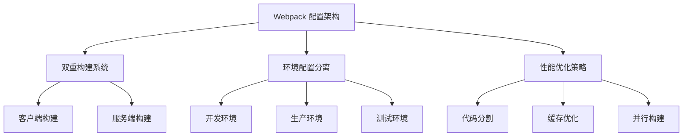

# config/webpack 配置架构深度分析

> ⚙️ 深度解析 AgentFlow-FE 的双重构建系统和 Webpack 配置架构设计

## 🏗️ 构建架构总览

### 配置文件结构

```
config/
├── webpack.config.js    # 🏗️ 基础配置和双重构建核心
├── webpack.dev.js       # 🛠️ 开发环境配置
├── webpack.prod.js      # 📦 生产环境配置
├── constants.js         # 📝 构建常量定义
└── env/                 # 🌍 环境变量配置
    ├── local.js         # 本地开发
    ├── beta.js          # 测试环境
    └── online.js        # 生产环境
```

### 核心设计理念



## 🎯 基础配置分析 (webpack.config.js)

### 核心配置架构

```typescript
// 配置结构解析
interface WebpackBaseConfig {
  target: 'client' | 'server';           // 构建目标
  mode: 'development' | 'production';    // 构建模式
  entry: Record<string, string[]>;       // 入口配置
  output: OutputConfiguration;           // 输出配置
  module: ModuleConfiguration;           // 模块处理
  plugins: WebpackPlugin[];              // 插件系统
  resolve: ResolveConfiguration;         // 模块解析
}

// 双重构建导出分析
module.exports = {
  client: baseClientConfig,  // 客户端构建函数
  server: baseServerConfig,  // 服务端构建函数
};
```

### 🔧 共享配置设计

```javascript
// 公共配置分析
const common = {
  // 🚀 性能优化
  cache: { type: "filesystem" },          // 文件系统缓存
  experiments: { topLevelAwait: true },    // 顶层 await 支持
  
  // 📊 监控配置
  stats: "errors-warnings",               // 只显示错误和警告
  watchOptions: {
    ignored: /node_modules\/\.cache/,     // 忽略缓存目录
  },
  
  // 🔧 模块处理
  module: {
    rules: [
      {
        test: /\.(t|j)sx?$/,
        use: [
          {
            loader: "thread-loader",      // 多线程构建
            options: { workers: 3 },     // 3个工作线程
          },
          {
            loader: "babel-loader",
            options: { cacheDirectory: true }, // Babel 缓存
          },
        ],
      },
    ],
  },
};
```

### 🎯 路径解析策略

```javascript
// 路径别名配置分析
resolve: {
  modules: ["node_modules", resolve("src"), resolve("app")],
  alias: {
    '@': resolve('src/'),                 // 根路径别名
    '@components': resolve('src/components'), // 组件路径
    '@hooks': resolve('src/hooks'),       // Hooks 路径
    '@pages': resolve('src/pages'),       // 页面路径
    '@assets': resolve('src/assets'),     // 资源路径
    '@utils': resolve('src/utils'),       // 工具路径
    '@store': resolve('src/store'),       // 状态管理
    '@apis': resolve('src/apis'),         // API 路径
    '@types': resolve('src/types'),       // 类型定义
  },
  extensions: [".js", ".ts", ".tsx", ".jsx"],
  plugins: [
    new TsconfigPathsPlugin({             // TypeScript 路径映射
      configFile: join("./tsconfig.json"),
      extensions: [".js", ".jsx", ".ts", ".tsx"],
    }),
  ],
};

// 设计评估
const pathResolutionAnalysis = {
  strengths: [
    "✅ 别名覆盖全面，开发体验好",
    "✅ TypeScript 路径映射集成",
    "✅ 支持多种文件扩展名",
  ],
  improvements: [
    "⚠️ 可以添加 @app 别名指向 app 目录",
    "⚠️ 考虑添加 @shared 别名用于共享代码",
  ],
};
```

## 🎯 客户端构建配置

### 入口和输出配置

```javascript
// 客户端构建分析
const baseClientConfig = (env) => {
  return merge(common, {
    name: `client:${name}`,               // 构建名称
    target: "browserslist",               // 浏览器目标
    entry: {
      client: [resolve("app/client/index.tsx")], // 客户端入口
    },
    output: {
      path: join(appConstants.buildPath, "client"), // 输出路径
      publicPath: `/static/client/`,      // 公共路径
      clean: true,                        // 清理输出目录
    },
  });
};
```

### 🎨 样式处理策略

```javascript
// 样式处理规则分析
const styleRules = {
  // CSS 处理
  css: {
    test: /\.css$/,
    use: [
      MiniCssExtractPlugin.loader,        // CSS 提取
      "css-loader",                       // CSS 解析
      "postcss-loader",                   // PostCSS 处理
    ],
    sideEffects: true,                    // 保留副作用
  },
  
  // LESS 处理 (普通)
  less: {
    test: /\.less$/,
    exclude: /\.module\.less$/,           // 排除模块化
    use: [
      MiniCssExtractPlugin.loader,
      { loader: "css-loader", options: { importLoaders: 2 } },
      "postcss-loader",
      "less-loader",
    ],
  },
  
  // LESS 模块化处理
  lessModule: {
    test: /\.module\.less$/,
    use: [
      MiniCssExtractPlugin.loader,
      {
        loader: "css-loader",
        options: {
          importLoaders: 2,
          modules: {
            localIdentName: isDevelopment 
              ? "[path][name]__[local]"     // 开发环境：可读性
              : "[hash:base64]",            // 生产环境：压缩
          },
        },
      },
      "postcss-loader",
      "less-loader",
    ],
  },
};
```

### 🖼️ 静态资源处理

```javascript
// 资源处理规则
const assetRules = {
  // 图片和字体资源
  images: {
    test: /\.(webp|png|jpg|jpeg|gif|eot|woff|woff2|ttf|otf)$/,
    type: "asset/resource",               // Webpack 5 资源模块
  },
  
  // SVG 特殊处理
  svg: {
    test: /\.svg$/i,
    issuer: /\.[jt]sx?$/,
    use: [
      "@svgr/webpack",                    // SVG 转 React 组件
      {
        loader: "file-loader",
        options: {
          name: "dist/media/[name].[contenthash:8].[ext]",
        },
      },
    ],
  },
};

// 设计优势
const assetHandlingAdvantages = {
  modernApproach: "使用 Webpack 5 asset/resource",
  svgOptimization: "SVG 可以作为组件使用",
  contentHashing: "文件名包含内容哈希，缓存友好",
  typeSupport: "支持现代图片格式如 WebP",
};
```

### 🔌 插件系统

```javascript
// 客户端插件配置
const clientPlugins = [
  // 代码分割统计
  new LoadablePlugin({
    outputAsset: false,                   // 不输出到资源
    writeToDisk: true,                    // 写入磁盘
    filename: `${buildPath}/loadable-stats.json`, // 统计文件
  }),
  
  // 资源清单
  new WebpackManifestPlugin(),            // 生成 manifest.json
  
  // 构建进度
  new WebpackBar({ 
    name: "client", 
    profile: true                         // 性能分析
  }),
  
  // 环境变量注入
  new EnvironmentPlugin(require(`./env/${env.goal}`)),
  
  // 全局变量提供
  new ProvidePlugin({ 
    process: "process/browser.js"         // 浏览器端 process polyfill
  }),
];
```

## 🖥️ 服务端构建配置

### 服务端特殊配置

```javascript
// 服务端构建分析
const serverConfig = (env) => merge(common, {
  name: `server:${name}`,
  externalsPresets: { node: true },       // Node.js 外部依赖预设
  target: "node",                         // Node.js 目标环境
  
  // 条件入口配置
  entry: omit({
    server: resolve("app/server/server.ts"),
    serverless: resolve("app/server/serverless.ts"),
  }, [
    // 根据环境选择入口
    ["online", "beta"].includes(env.goal) ? "server" : "serverless"
  ]),
  
  // 输出配置
  output: omit({
    libraryTarget: "commonjs",            // CommonJS 模块
    path: resolve(buildPath),
    filename: "[name].js",
    chunkFilename: "scripts/[name].server.js",
    publicPath: "/",
  }, [
    // 条件移除 libraryTarget
    !["online", "beta"].includes(env.goal) && "libraryTarget"
  ].filter(Boolean)),
});
```

### 🔒 外部依赖处理

```javascript
// 外部依赖策略 (当前注释掉)
// externals: [
//   webpackNodeExternals({
//     allowlist: [/rc-dropdown|lodash-es/],  // 允许列表
//   }),
// ],

// 静态资源忽略
module: {
  rules: [
    {
      test: /\.(less|css|svg|jpg|jpeg|png|webp|gif|eot|woff|woff2|ttf|otf)$/,
      loader: "ignore-loader",            // 服务端忽略静态资源
    },
  ],
},

// 设计分析
const serverBuildStrategy = {
  pros: [
    "✅ 服务端不处理静态资源，构建速度快",
    "✅ 支持 Serverless 和传统服务器部署",
    "✅ 条件入口配置，灵活适配不同环境",
  ],
  considerations: [
    "⚠️ 外部依赖注释掉，可能影响包大小",
    "⚠️ 需要确保服务端渲染时样式正确处理",
  ],
};
```

## 🛠️ 开发环境配置 (webpack.dev.js)

### 热模块替换 (HMR) 配置

```javascript
// 开发环境特殊配置
const devConfig = [
  // 客户端开发配置
  (env) => merge(baseConfig.client(env), {
    entry: {
      client: [
        // HMR 客户端
        `webpack-hot-middleware/client?path=http://localhost:${hmrPort}/__webpack_hmr`,
      ],
    },
    
    // 开发输出配置
    output: {
      assetModuleFilename: "media/[name].[ext]",
      filename: "js/[name].js",           // 无哈希文件名
      chunkFilename: "js/[name].chunk.js",
      publicPath: `http://localhost:${devPort}/static/client/`
    },
    
    // 开发工具
    devtool: "eval-source-map",           // 快速源码映射
    mode: "development",
  }),
  
  // 服务端开发配置
  (env) => merge(baseConfig.server(env), {
    mode: "development",
    devtool: "eval-source-map",
  }),
];
```

### 🔥 DevServer 配置

```javascript
// 开发服务器配置分析
devServer: {
  devMiddleware: {
    publicPath: appConstants.publicPath,
    serverSideRender: true,               // SSR 支持
    writeToDisk: true,                    // 写入磁盘
  },
  
  // 历史API回退
  historyApiFallback: {
    disableDotRule: true,
    index: `${appConstants.publicPath}/`,
  },
  
  // 热重载配置
  hot: true,                              // 启用 HMR
  
  // 静态文件服务
  static: {
    directory: "public",
  },
  
  // 安全配置
  allowedHosts: "all",                    // 允许所有主机
  compress: true,                         // 启用gzip压缩
  
  // 客户端配置
  client: {
    logging: "error",                     // 只显示错误日志
    progress: true,                       // 显示构建进度
    overlay: false,                       // 关闭错误覆盖
    webSocketURL: `ws://localhost:${hmrPort}/ws`,
  },
},
```

### 🔧 开发优化插件

```javascript
// 开发环境插件
plugins: [
  new webpack.HotModuleReplacementPlugin(), // HMR 插件
  new ReactRefreshWebpackPlugin(),          // React 快速刷新
  
  // CSS 提取 (开发环境也提取，便于调试)
  new MiniCssExtractPlugin({
    filename: "css/[name].css",
    chunkFilename: "css/[name].chunk.css",
  }),
  
  // 循环依赖检测
  new CircularDependencyPlugin({
    exclude: /node_modules/,
    include: /src/,
    failOnError: false,                   // 不中断构建
    allowAsyncCycles: false,
    cwd: process.cwd(),
  }),
];

// 开发体验优势
const devExperienceFeatures = {
  hotReload: "React 组件热重载",
  fastBuild: "eval-source-map 快速构建",
  errorDetection: "循环依赖检测",
  debugging: "完整的源码映射支持",
};
```

## 📦 生产环境配置 (webpack.prod.js)

### 生产优化策略

```javascript
// 生产环境配置分析
const prodConfig = {
  mode: "production",
  devtool: isTest ? "eval-source-map" : false, // 测试环境保留源码映射
  
  // 生产输出配置
  output: {
    filename: "js/[name].[contenthash:8].main.js",      // 内容哈希
    chunkFilename: "js/[name].[contenthash:8].chunk.js",
    assetModuleFilename: "media/[contenthash:8][ext]",
  },
};
```

### 🚀 代码分割策略

```javascript
// 代码分割配置深度分析
optimization: {
  minimize: true,
  minimizer: [
    new TerserPlugin({ parallel: true }),  // 并行压缩
    new CssMinimizerPlugin(),             // CSS 压缩
  ],
  
  // 运行时分离
  runtimeChunk: { name: "runtime" },
  
  // 代码分割策略
  splitChunks: {
    chunks: "all",                        // 分割所有类型的chunk
    minSize: 30000,                       // 最小chunk大小
    minRemainingSize: 30000,              // 分割后剩余最小大小
    minChunks: 1,                         // 最小引用次数
    maxAsyncRequests: 10,                 // 最大异步请求数
    maxInitialRequests: 10,               // 最大初始请求数
    enforceSizeThreshold: 50000,          // 强制分割阈值
    
    cacheGroups: {
      // 第三方库分离
      defaultVendors: {
        test: /[\\/]node_modules[\\/]/,
        minChunks: 1,
        priority: -10,
        reuseExistingChunk: true,
      },
      
      // 公共代码分离
      default: {
        minChunks: 2,                     // 至少被2个chunk引用
        priority: -20,
        reuseExistingChunk: true,
      },
    },
  },
},
```

### 🔧 生产环境插件

```javascript
// 生产环境插件配置
plugins: [
  // HTML 生成和优化
  new HtmlWebpackPlugin({
    filename: "index.html",
    template: "public/index.ejs",
    favicon: resolve(__dirname, "../public/favicon2.png"),
    inject: "body",
    templateParameters: {
      publicPath: appConstants.publicPath,
    },
    
    // HTML 压缩配置
    minify: {
      removeComments: true,               // 移除注释
      collapseWhitespace: true,           // 折叠空白
      removeRedundantAttributes: true,    // 移除冗余属性
      useShortDoctype: true,              // 使用短 DOCTYPE
      removeEmptyAttributes: true,        // 移除空属性
      removeStyleLinkTypeAttributes: true, // 移除样式链接类型
      keepClosingSlash: true,             // 保持闭合斜杠
      minifyJS: true,                     // 压缩 JS
      minifyCSS: true,                    // 压缩 CSS
      minifyURLs: true,                   // 压缩 URL
    },
  }),
  
  // CSS 提取和压缩
  new MiniCssExtractPlugin({
    filename: "css/[contenthash:5].css",
    chunkFilename: "css/[contenthash:5].css",
  }),
];
```

## 📊 构建常量配置 (constants.js)

```javascript
// 构建常量分析
module.exports = {
  buildPath: join(__dirname, '../build/'),  // 构建输出路径
  publicPath: '/static',                    // 静态资源公共路径
  devPort: 3001,                           // 开发服务器端口
  hmrPort: 8099                            // HMR 端口
};

// 设计评估
const constantsDesign = {
  pros: [
    "✅ 集中管理构建常量",
    "✅ 端口分离，避免冲突",
    "✅ 路径配置清晰",
  ],
  improvements: [
    "⚠️ 可以添加更多环境相关常量",
    "⚠️ 考虑添加 TypeScript 类型定义",
  ],
};
```

## 🎯 配置架构优化建议

### 1. 配置类型化

```typescript
// 建议：创建配置类型定义
// config/types.ts
interface BuildConstants {
  buildPath: string;
  publicPath: string;
  devPort: number;
  hmrPort: number;
  nodeEnv: 'development' | 'production' | 'test';
}

interface EnvironmentConfig {
  REACT_APP_ENV: string;
  API_ENDPOINT?: string;
  ENABLE_MOCK?: boolean;
  LOG_LEVEL?: 'debug' | 'info' | 'warn' | 'error';
}

// config/webpack.config.ts
const createWebpackConfig = (
  env: EnvironmentConfig,
  constants: BuildConstants
): Configuration => {
  // 类型安全的配置
};
```

### 2. 插件配置优化

```javascript
// 建议：插件配置工厂
// config/plugins/index.js
const createPlugins = (env, isDevelopment) => {
  const basePlugins = [
    new ESLintPlugin(createESLintConfig(isDevelopment)),
    new WebpackBar({ name: env.target }),
  ];
  
  const clientPlugins = [
    new LoadablePlugin(createLoadableConfig(env)),
    new MiniCssExtractPlugin(createCSSConfig(isDevelopment)),
  ];
  
  const devPlugins = isDevelopment ? [
    new webpack.HotModuleReplacementPlugin(),
    new ReactRefreshWebpackPlugin(),
    new CircularDependencyPlugin(createCircularConfig()),
  ] : [];
  
  const prodPlugins = !isDevelopment ? [
    new HtmlWebpackPlugin(createHTMLConfig(env)),
    new TerserPlugin(createTerserConfig()),
  ] : [];
  
  return [
    ...basePlugins,
    ...(env.target === 'client' ? clientPlugins : []),
    ...devPlugins,
    ...prodPlugins,
  ];
};
```

### 3. 性能监控增强

```javascript
// 建议：构建性能分析
// config/performance.js
const performanceConfig = {
  development: {
    hints: false,                         // 开发环境不显示性能提示
  },
  production: {
    hints: 'warning',
    maxEntrypointSize: 512000,            // 512KB 入口大小限制
    maxAssetSize: 512000,                 // 512KB 资源大小限制
    assetFilter: (assetFilename) => {
      return !/(\.map$|^(main\.|favicon\.))/.test(assetFilename);
    },
  },
};

// 构建分析插件
const analysisPlugins = [
  new BundleAnalyzerPlugin({
    analyzerMode: process.env.ANALYZE ? 'server' : 'disabled',
    openAnalyzer: false,
  }),
  new SpeedMeasurePlugin(),               // 构建速度分析
];
```

## 📊 配置架构评估总结

### 当前架构评分

| 维度 | 评分 | 说明 |
|------|------|------|
| **架构清晰度** | 9/10 | 双重构建分离清晰，职责明确 |
| **性能优化** | 8/10 | 缓存、并行构建、代码分割完备 |
| **开发体验** | 8/10 | HMR、快速构建、错误检测齐全 |
| **生产优化** | 9/10 | 压缩、分割、缓存策略优秀 |
| **可维护性** | 7/10 | 配置分离清晰，但可以更模块化 |
| **扩展性** | 7/10 | 基础架构良好，插件系统可扩展 |

### 改进建议优先级

#### 高优先级
1. **外部依赖配置完善**：取消注释并优化 externals 配置
2. **TypeScript 配置迁移**：将配置文件迁移到 TypeScript
3. **性能监控增强**：添加构建分析和性能指标

#### 中优先级
1. **插件系统模块化**：将插件配置提取为独立模块
2. **环境配置增强**：添加更多环境相关配置
3. **错误处理优化**：完善构建错误处理机制

#### 低优先级
1. **配置文档完善**：添加详细的配置说明文档
2. **自动化测试**：为配置添加单元测试
3. **可视化配置**：考虑添加配置可视化工具

这套 Webpack 配置架构为高性能 SSR 应用提供了坚实的构建基础，通过持续优化可以进一步提升开发效率和应用性能。