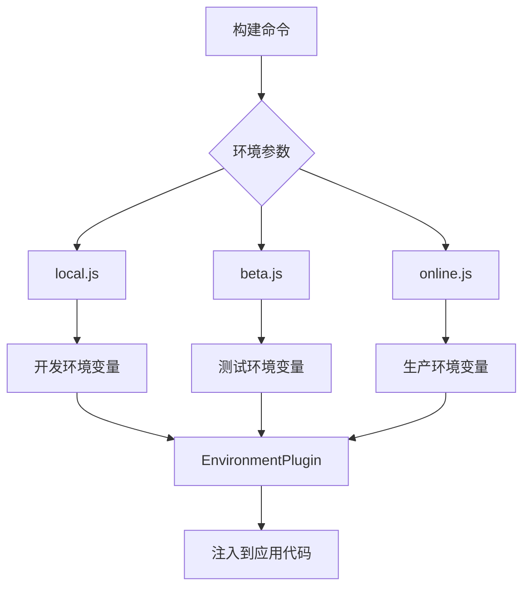

# config/env 环境配置策略深度分析

> 🌍 深度解析 AgentFlow-FE 的多环境配置管理策略与最佳实践

## 🎯 环境配置概览

### 配置文件结构

```
config/env/
├── local.js         # 🏠 本地开发环境
├── beta.js          # 🧪 测试环境 (预发布)
└── online.js        # 🚀 生产环境
```

### 环境配置流程



## 📋 当前配置分析

### 配置内容解析

```javascript
// config/env/local.js
module.exports = {
  REACT_APP_ENV: "local",    // 环境标识
};

// config/env/beta.js  
module.exports = {
  REACT_APP_ENV: "beta",     // 测试环境标识
};

// config/env/online.js
module.exports = {
  REACT_APP_ENV: "online",   // 生产环境标识
};
```

### 🎯 设计理念分析

```typescript
// 当前设计特点
interface CurrentEnvConfig {
  simplicity: "极简配置";           // 只有环境标识
  convention: "约定大于配置";       // 遵循约定命名
  isolation: "完全环境隔离";        // 各环境独立文件
  scalability: "可扩展性强";        // 易于添加新环境
}

// 优势分析
const configAdvantages = {
  clearSeparation: "✅ 环境分离清晰",
  easyMaintenance: "✅ 维护简单",
  noComplexity: "✅ 没有复杂逻辑",
  typeSafety: "⚠️ 缺少类型安全",
  validation: "⚠️ 缺少配置验证",
};
```

## 🔧 Webpack 集成机制

### EnvironmentPlugin 工作原理

```javascript
// webpack.config.js 中的集成
new EnvironmentPlugin(require(`./env/${env.goal}`))

// 实际效果分析
const envIntegration = {
  // 编译时替换
  'process.env.REACT_APP_ENV': JSON.stringify('local'),
  
  // 运行时访问
  if (process.env.REACT_APP_ENV === 'local') {
    // 开发环境逻辑
  }
  
  // 构建优化
  // 未使用的环境分支会被 tree-shaking 移除
};
```

### 环境变量注入流程

```typescript
// 构建时注入流程
interface EnvInjectionProcess {
  step1: "读取环境配置文件";
  step2: "通过 EnvironmentPlugin 注入";
  step3: "编译时替换 process.env 引用";
  step4: "Dead code elimination";
  step5: "最终 bundle 只包含当前环境代码";
}

// 使用示例
const envUsageExample = `
// 应用代码中使用
const isDevelopment = process.env.REACT_APP_ENV === 'local';
const isProduction = process.env.REACT_APP_ENV === 'online';
const isBeta = process.env.REACT_APP_ENV === 'beta';

// API 端点配置
const API_BASE_URL = isDevelopment 
  ? 'http://localhost:3000' 
  : isProduction 
    ? 'https://api.example.com'
    : 'https://beta-api.example.com';
`;
```

## 🚀 环境配置扩展建议

### 1. 完整的环境配置模板

```javascript
// 建议：完善的环境配置
// config/env/local.js
module.exports = {
  // 环境标识
  REACT_APP_ENV: "local",
  NODE_ENV: "development",
  
  // API 配置
  REACT_APP_API_BASE_URL: "http://localhost:8007",
  REACT_APP_MOCK_ENABLED: "true",
  
  // 功能开关
  REACT_APP_ENABLE_DEBUG: "true",
  REACT_APP_ENABLE_DEVTOOLS: "true",
  REACT_APP_ENABLE_HOT_RELOAD: "true",
  
  // 日志配置
  REACT_APP_LOG_LEVEL: "debug",
  
  // 第三方服务
  REACT_APP_ANALYTICS_ID: "",           // 开发环境不启用分析
  REACT_APP_SENTRY_DSN: "",             // 开发环境不启用错误追踪
  
  // 性能配置
  REACT_APP_ENABLE_PERFORMANCE_MONITOR: "true",
  
  // CDN 配置
  REACT_APP_CDN_BASE_URL: "",           // 开发环境不使用 CDN
  
  // WebSocket 配置
  REACT_APP_WS_URL: "ws://localhost:8008",
};

// config/env/beta.js
module.exports = {
  REACT_APP_ENV: "beta",
  NODE_ENV: "production",
  
  // API 配置
  REACT_APP_API_BASE_URL: "https://beta-api.example.com",
  REACT_APP_MOCK_ENABLED: "false",
  
  // 功能开关
  REACT_APP_ENABLE_DEBUG: "true",       // 测试环境保留调试
  REACT_APP_ENABLE_DEVTOOLS: "true",
  REACT_APP_ENABLE_HOT_RELOAD: "false",
  
  // 日志配置
  REACT_APP_LOG_LEVEL: "info",
  
  // 第三方服务
  REACT_APP_ANALYTICS_ID: "GA_BETA_ID",
  REACT_APP_SENTRY_DSN: "SENTRY_BETA_DSN",
  
  // 性能配置
  REACT_APP_ENABLE_PERFORMANCE_MONITOR: "true",
  
  // CDN 配置
  REACT_APP_CDN_BASE_URL: "https://beta-cdn.example.com",
  
  // WebSocket 配置
  REACT_APP_WS_URL: "wss://beta-ws.example.com",
};

// config/env/online.js
module.exports = {
  REACT_APP_ENV: "online",
  NODE_ENV: "production",
  
  // API 配置
  REACT_APP_API_BASE_URL: "https://api.example.com",
  REACT_APP_MOCK_ENABLED: "false",
  
  // 功能开关
  REACT_APP_ENABLE_DEBUG: "false",
  REACT_APP_ENABLE_DEVTOOLS: "false",
  REACT_APP_ENABLE_HOT_RELOAD: "false",
  
  // 日志配置
  REACT_APP_LOG_LEVEL: "error",
  
  // 第三方服务
  REACT_APP_ANALYTICS_ID: "GA_PROD_ID",
  REACT_APP_SENTRY_DSN: "SENTRY_PROD_DSN",
  
  // 性能配置
  REACT_APP_ENABLE_PERFORMANCE_MONITOR: "false",
  
  // CDN 配置
  REACT_APP_CDN_BASE_URL: "https://cdn.example.com",
  
  // WebSocket 配置
  REACT_APP_WS_URL: "wss://ws.example.com",
};
```

### 2. 类型安全的环境配置

```typescript
// 建议：创建类型定义
// config/env/types.ts
export interface EnvironmentConfig {
  // 基础配置
  REACT_APP_ENV: 'local' | 'beta' | 'online';
  NODE_ENV: 'development' | 'production';
  
  // API 配置
  REACT_APP_API_BASE_URL: string;
  REACT_APP_MOCK_ENABLED: 'true' | 'false';
  
  // 功能开关
  REACT_APP_ENABLE_DEBUG: 'true' | 'false';
  REACT_APP_ENABLE_DEVTOOLS: 'true' | 'false';
  REACT_APP_ENABLE_HOT_RELOAD: 'true' | 'false';
  
  // 日志配置
  REACT_APP_LOG_LEVEL: 'debug' | 'info' | 'warn' | 'error';
  
  // 第三方服务
  REACT_APP_ANALYTICS_ID: string;
  REACT_APP_SENTRY_DSN: string;
  
  // 性能配置
  REACT_APP_ENABLE_PERFORMANCE_MONITOR: 'true' | 'false';
  
  // CDN 配置
  REACT_APP_CDN_BASE_URL: string;
  
  // WebSocket 配置
  REACT_APP_WS_URL: string;
}

// 环境配置验证
export const validateEnvConfig = (config: any): config is EnvironmentConfig => {
  const requiredKeys: (keyof EnvironmentConfig)[] = [
    'REACT_APP_ENV',
    'NODE_ENV',
    'REACT_APP_API_BASE_URL',
    // ... 其他必需字段
  ];
  
  return requiredKeys.every(key => key in config);
};

// 环境配置加载器
export const loadEnvConfig = (env: string): EnvironmentConfig => {
  try {
    const config = require(`./${env}.js`);
    
    if (!validateEnvConfig(config)) {
      throw new Error(`Invalid environment config for ${env}`);
    }
    
    return config;
  } catch (error) {
    console.error(`Failed to load environment config for ${env}:`, error);
    throw error;
  }
};
```

### 3. 环境配置工厂

```javascript
// 建议：环境配置工厂函数
// config/env/factory.js
const { merge } = require('lodash');

// 基础配置
const baseConfig = {
  // 通用配置
  REACT_APP_VERSION: require('../../package.json').version,
  REACT_APP_BUILD_TIME: new Date().toISOString(),
};

// 开发环境配置
const developmentConfig = {
  NODE_ENV: "development",
  REACT_APP_ENABLE_DEBUG: "true",
  REACT_APP_ENABLE_DEVTOOLS: "true",
  REACT_APP_LOG_LEVEL: "debug",
  REACT_APP_MOCK_ENABLED: "true",
};

// 生产环境配置
const productionConfig = {
  NODE_ENV: "production",
  REACT_APP_ENABLE_DEBUG: "false",
  REACT_APP_ENABLE_DEVTOOLS: "false",
  REACT_APP_LOG_LEVEL: "error",
  REACT_APP_MOCK_ENABLED: "false",
};

// 环境特定配置
const environmentConfigs = {
  local: merge({}, baseConfig, developmentConfig, {
    REACT_APP_ENV: "local",
    REACT_APP_API_BASE_URL: "http://localhost:8007",
  }),
  
  beta: merge({}, baseConfig, productionConfig, {
    REACT_APP_ENV: "beta",
    REACT_APP_API_BASE_URL: "https://beta-api.example.com",
    REACT_APP_ENABLE_DEBUG: "true",  // 测试环境保留调试
    REACT_APP_LOG_LEVEL: "info",
  }),
  
  online: merge({}, baseConfig, productionConfig, {
    REACT_APP_ENV: "online", 
    REACT_APP_API_BASE_URL: "https://api.example.com",
  }),
};

// 导出配置
module.exports = (env) => {
  if (!environmentConfigs[env]) {
    throw new Error(`Unknown environment: ${env}`);
  }
  
  return environmentConfigs[env];
};
```

### 4. 动态环境配置

```javascript
// 建议：支持动态配置注入
// config/env/dynamic.js
const fs = require('fs');
const path = require('path');

// 从外部文件读取敏感配置
const loadSecrets = (env) => {
  const secretsPath = path.join(process.cwd(), '.secrets', `${env}.json`);
  
  if (fs.existsSync(secretsPath)) {
    const secrets = JSON.parse(fs.readFileSync(secretsPath, 'utf8'));
    return secrets;
  }
  
  return {};
};

// 从环境变量读取配置
const loadSystemEnv = () => {
  const systemEnvKeys = [
    'API_KEY',
    'DATABASE_URL',
    'REDIS_URL',
    'JWT_SECRET',
  ];
  
  const systemEnv = {};
  systemEnvKeys.forEach(key => {
    if (process.env[key]) {
      systemEnv[`REACT_APP_${key}`] = process.env[key];
    }
  });
  
  return systemEnv;
};

// 合并配置
const createEnvConfig = (env) => {
  const baseConfig = require(`./${env}.js`);
  const secrets = loadSecrets(env);
  const systemEnv = loadSystemEnv();
  
  return {
    ...baseConfig,
    ...secrets,
    ...systemEnv,
  };
};

module.exports = createEnvConfig;
```

## 🔐 安全配置管理

### 1. 敏感信息分离

```javascript
// .secrets/local.json (不提交到版本控制)
{
  "REACT_APP_API_KEY": "dev_api_key_123",
  "REACT_APP_SENTRY_DSN": "dev_sentry_dsn",
  "REACT_APP_ANALYTICS_ID": "dev_analytics_id"
}

// .secrets/beta.json
{
  "REACT_APP_API_KEY": "beta_api_key_456", 
  "REACT_APP_SENTRY_DSN": "beta_sentry_dsn",
  "REACT_APP_ANALYTICS_ID": "beta_analytics_id"
}

// .secrets/online.json  
{
  "REACT_APP_API_KEY": "prod_api_key_789",
  "REACT_APP_SENTRY_DSN": "prod_sentry_dsn", 
  "REACT_APP_ANALYTICS_ID": "prod_analytics_id"
}

// .gitignore 添加
.secrets/
*.env
*.env.local
*.env.production
```

### 2. 配置加密

```javascript
// 建议：配置加密工具
// config/env/encryption.js
const crypto = require('crypto');

const ENCRYPTION_KEY = process.env.CONFIG_ENCRYPTION_KEY || 'default_key';

// 加密配置
const encryptConfig = (config) => {
  const cipher = crypto.createCipher('aes-256-cbc', ENCRYPTION_KEY);
  let encrypted = cipher.update(JSON.stringify(config), 'utf8', 'hex');
  encrypted += cipher.final('hex');
  return encrypted;
};

// 解密配置
const decryptConfig = (encryptedConfig) => {
  const decipher = crypto.createDecipher('aes-256-cbc', ENCRYPTION_KEY);
  let decrypted = decipher.update(encryptedConfig, 'hex', 'utf8');
  decrypted += decipher.final('utf8');
  return JSON.parse(decrypted);
};

// 加密配置文件
const encryptConfigFile = (env) => {
  const config = require(`./${env}.js`);
  const encrypted = encryptConfig(config);
  fs.writeFileSync(`./encrypted/${env}.enc`, encrypted);
};

module.exports = { encryptConfig, decryptConfig, encryptConfigFile };
```

## 📱 运行时环境配置

### 1. 环境配置 Hook

```typescript
// src/hooks/useEnvironment.ts
import { useMemo } from 'react';

interface EnvironmentHook {
  env: 'local' | 'beta' | 'online';
  isDevelopment: boolean;
  isProduction: boolean;
  isBeta: boolean;
  apiBaseURL: string;
  enableDebug: boolean;
  enableMock: boolean;
  logLevel: string;
}

export const useEnvironment = (): EnvironmentHook => {
  return useMemo(() => {
    const env = process.env.REACT_APP_ENV as 'local' | 'beta' | 'online';
    
    return {
      env,
      isDevelopment: env === 'local',
      isProduction: env === 'online',
      isBeta: env === 'beta',
      apiBaseURL: process.env.REACT_APP_API_BASE_URL || '',
      enableDebug: process.env.REACT_APP_ENABLE_DEBUG === 'true',
      enableMock: process.env.REACT_APP_MOCK_ENABLED === 'true',
      logLevel: process.env.REACT_APP_LOG_LEVEL || 'info',
    };
  }, []);
};

// 使用示例
const MyComponent = () => {
  const { isDevelopment, apiBaseURL, enableDebug } = useEnvironment();
  
  return (
    <div>
      {enableDebug && <DebugPanel />}
      <ApiProvider baseURL={apiBaseURL}>
        {/* 组件内容 */}
      </ApiProvider>
    </div>
  );
};
```

### 2. 环境配置 Context

```typescript
// src/contexts/EnvironmentContext.tsx
import React, { createContext, useContext } from 'react';
import { useEnvironment } from '../hooks/useEnvironment';

const EnvironmentContext = createContext<ReturnType<typeof useEnvironment> | null>(null);

export const EnvironmentProvider: React.FC<{ children: React.ReactNode }> = ({ 
  children 
}) => {
  const environmentConfig = useEnvironment();
  
  return (
    <EnvironmentContext.Provider value={environmentConfig}>
      {children}
    </EnvironmentContext.Provider>
  );
};

export const useEnvironmentContext = () => {
  const context = useContext(EnvironmentContext);
  if (!context) {
    throw new Error('useEnvironmentContext must be used within EnvironmentProvider');
  }
  return context;
};
```

## 🧪 配置测试策略

### 1. 环境配置测试

```javascript
// tests/config/env.test.js
const { validateEnvConfig, loadEnvConfig } = require('../../config/env/types');

describe('Environment Configuration', () => {
  test('should load local environment config', () => {
    const config = loadEnvConfig('local');
    expect(config.REACT_APP_ENV).toBe('local');
    expect(config.NODE_ENV).toBe('development');
  });
  
  test('should validate environment config structure', () => {
    const validConfig = {
      REACT_APP_ENV: 'local',
      NODE_ENV: 'development',
      REACT_APP_API_BASE_URL: 'http://localhost:3000',
      // ... 其他必需字段
    };
    
    expect(validateEnvConfig(validConfig)).toBe(true);
  });
  
  test('should reject invalid environment config', () => {
    const invalidConfig = {
      REACT_APP_ENV: 'invalid',
      // 缺少必需字段
    };
    
    expect(validateEnvConfig(invalidConfig)).toBe(false);
  });
  
  test('should throw error for unknown environment', () => {
    expect(() => loadEnvConfig('unknown')).toThrow();
  });
});
```

### 2. 运行时配置测试

```typescript
// tests/hooks/useEnvironment.test.tsx
import { renderHook } from '@testing-library/react';
import { useEnvironment } from '../../src/hooks/useEnvironment';

// 模拟环境变量
const mockEnv = (env: Record<string, string>) => {
  const originalEnv = process.env;
  process.env = { ...originalEnv, ...env };
  return () => {
    process.env = originalEnv;
  };
};

describe('useEnvironment', () => {
  test('should return correct environment config for local', () => {
    const restore = mockEnv({
      REACT_APP_ENV: 'local',
      REACT_APP_API_BASE_URL: 'http://localhost:3000',
      REACT_APP_ENABLE_DEBUG: 'true',
    });
    
    const { result } = renderHook(() => useEnvironment());
    
    expect(result.current.env).toBe('local');
    expect(result.current.isDevelopment).toBe(true);
    expect(result.current.enableDebug).toBe(true);
    
    restore();
  });
  
  test('should return correct environment config for production', () => {
    const restore = mockEnv({
      REACT_APP_ENV: 'online',
      REACT_APP_API_BASE_URL: 'https://api.example.com',
      REACT_APP_ENABLE_DEBUG: 'false',
    });
    
    const { result } = renderHook(() => useEnvironment());
    
    expect(result.current.env).toBe('online');
    expect(result.current.isProduction).toBe(true);
    expect(result.current.enableDebug).toBe(false);
    
    restore();
  });
});
```

## 📊 环境配置评估总结

### 当前配置评分

| 维度 | 评分 | 说明 |
|------|------|------|
| **简洁性** | 9/10 | 配置极简，易于理解 |
| **可维护性** | 6/10 | 基础可维护，但功能有限 |
| **扩展性** | 8/10 | 易于添加新环境 |
| **安全性** | 4/10 | 缺少敏感信息保护 |
| **类型安全** | 3/10 | 没有类型检查 |
| **功能完整性** | 5/10 | 只有基础环境标识 |

### 优化建议优先级

#### 高优先级
1. **添加完整的环境配置**：API地址、功能开关、日志级别等
2. **实现敏感信息分离**：将API密钥等敏感配置独立管理
3. **添加类型安全支持**：TypeScript 类型定义和验证

#### 中优先级
1. **创建环境配置工厂**：统一配置生成和管理
2. **添加运行时配置 Hook**：便于组件使用环境配置
3. **实现配置验证机制**：确保配置完整性和正确性

#### 低优先级
1. **添加配置加密支持**：保护敏感配置信息
2. **完善配置测试**：确保配置的可靠性
3. **实现动态配置加载**：支持运行时配置更新

通过这些优化，环境配置系统将更加健壮、安全和易用，为不同环境的部署和管理提供强有力的支持。