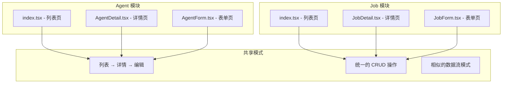

# src/pages 页面组件深度分析

> 📄 深入分析页面组件的设计模式、数据流管理和用户体验优化

## 📁 目录结构分析

```
src/pages/
├── Agents/                     # Agent 管理模块
│   ├── AgentDetail.tsx         # Agent 详情页
│   ├── AgentForm.tsx           # Agent 表单页（新增/编辑）
│   └── index.tsx               # Agent 列表页
├── Jobs/                       # Job 管理模块
│   ├── JobDetail.tsx           # Job 详情页
│   ├── JobForm.tsx             # Job 表单页（新增/编辑）
│   └── index.tsx               # Job 列表页
├── Home/                       # 首页模块
│   └── index.tsx               # 首页组件
└── EmotionCacheTestPage/       # 测试页面
    └── EmotionCacheTestPage.tsx # Emotion 缓存测试
```

## 🔍 页面组件设计模式分析

### 1. 模块化组织模式

#### 当前组织结构评估
```typescript
// 页面组织模式分析
interface PageOrganizationPattern {
  pattern: string;
  advantages: string[];
  disadvantages: string[];
  suitability: 'small' | 'medium' | 'large';
}

const currentPattern: PageOrganizationPattern = {
  pattern: '按业务功能分组 + CRUD 模式',
  advantages: [
    '业务逻辑集中，便于维护',
    '相关页面就近组织，降低认知负担',
    'CRUD 操作模式统一，开发效率高',
  ],
  disadvantages: [
    '缺少页面间的代码复用机制',
    '表单组件承担新增和编辑双重职责',
    '大型项目中模块可能过于庞大',
  ],
  suitability: 'medium',
};
```

#### 设计优势分析


### 2. 页面组件实现分析

#### 列表页模式 (Agents/index.tsx)

```typescript
// 列表页核心实现分析
const Agents = () => {
  const [currentPage, setCurrentPage] = useState(1);
  const [agents, setAgents] = useState([]);
  const [loading, setLoading] = useState(true);
  const [open, setOpen] = useState(false);
  const [searchValue, setSearchValue] = useState('');
  
  // 数据加载和状态管理
  useEffect(() => {
    const loadAgents = async () => {
      // 模拟数据加载逻辑
      await new Promise((resolve) => setTimeout(resolve, 500));
      setAgents(agentsData);
      setLoading(false);
    };
    loadAgents();
  }, []);
  
  // 分页逻辑
  const totalPages = Math.ceil(agents.length / itemsPerPage);
  const startIndex = (currentPage - 1) * itemsPerPage;
  
  // UI 渲染
  return (
    <div className="max-w-7xl mx-auto p-6">
      {/* 搜索和操作区 */}
      <SearchAndActions />
      
      {/* 数据展示区 */}
      <AgentGrid />
      
      {/* 分页组件 */}
      <Pagination />
      
      {/* 详情弹窗 */}
      <AgentDetail />
    </div>
  );
};
```

**设计模式分析：**

| 设计方面 | 当前实现 | 评分 | 分析 |
|----------|----------|------|------|
| **状态管理** | useState + useEffect | 6/10 | 基础实现，缺少缓存和错误处理 |
| **数据获取** | 模拟数据 + 手动状态管理 | 4/10 | 应使用 React Query 等库 |
| **UI 组织** | 单文件组件 | 5/10 | 组件过大，应拆分 |
| **交互逻辑** | 基础搜索和分页 | 7/10 | 功能完整，用户体验良好 |
| **性能优化** | 无明显优化 | 3/10 | 缺少虚拟化、防抖等优化 |

#### 表单页模式分析

**表单复用策略：**
```typescript
// AgentForm.tsx - 新增和编辑共用组件
const AgentForm = () => {
  const { id } = useParams();
  const isEditing = id !== 'new';
  
  // 根据模式加载数据
  useEffect(() => {
    if (isEditing) {
      // 加载编辑数据
      loadAgentData(id);
    }
  }, [id, isEditing]);
  
  return (
    <form>
      <h1>{isEditing ? '编辑 Agent' : '新增 Agent'}</h1>
      {/* 表单字段 */}
    </form>
  );
};

// 优势：
// ✅ 代码复用率高
// ✅ 维护成本低
// ✅ 用户体验一致

// 问题：
// ⚠️ 组件职责过重
// ⚠️ 逻辑分支较多
// ⚠️ 测试复杂度高
```

#### 详情页模式分析

**详情页设计评估：**
```typescript
// AgentDetail.tsx - 详情展示组件
interface AgentDetailProps {
  open: boolean;
  onClose: () => void;
  agent: IAgentDetail | null;
}

const AgentDetail: React.FC<AgentDetailProps> = ({ open, onClose, agent }) => {
  if (!agent) return null;
  
  return (
    <Modal open={open} onClose={onClose}>
      {/* 详情内容 */}
    </Modal>
  );
};

// 设计分析：
// ✅ 组件化程度高
// ✅ 数据驱动渲染
// ✅ 可复用性强

// 改进空间：
// 🔧 可以增加加载状态
// 🔧 可以增加错误边界
// 🔧 可以优化性能（lazy loading）
```

## 🎯 页面设计模式深度分析

### 1. 数据获取模式

#### 当前实现问题分析
```typescript
// 当前数据获取方式的问题
const problemsWithCurrentDataFetching = {
  issues: [
    '硬编码模拟数据，无法连接真实API',
    '手动状态管理，代码重复度高',
    '缺少错误处理和重试机制',
    '无缓存机制，性能不佳',
    '加载状态管理不一致',
  ],
  
  impacts: [
    '开发效率低下',
    '用户体验不佳',
    '维护成本高',
    '扩展性差',
  ],
};
```

#### 改进建议：React Query 集成
```typescript
// 推荐的数据获取模式
// hooks/useAgents.ts
import { useQuery, useMutation, useQueryClient } from '@tanstack/react-query';
import { AgentService } from '@/apis/services/Agent';

export const useAgents = (params?: AgentListParams) => {
  return useQuery({
    queryKey: ['agents', params],
    queryFn: () => AgentService.getList(params),
    staleTime: 5 * 60 * 1000, // 5分钟缓存
    retry: 3,
    retryDelay: (attemptIndex) => Math.min(1000 * 2 ** attemptIndex, 30000),
  });
};

export const useCreateAgent = () => {
  const queryClient = useQueryClient();
  
  return useMutation({
    mutationFn: AgentService.create,
    onSuccess: () => {
      // 创建成功后刷新列表
      queryClient.invalidateQueries({ queryKey: ['agents'] });
    },
    onError: (error) => {
      // 错误处理
      console.error('创建失败:', error);
    },
  });
};

export const useUpdateAgent = () => {
  const queryClient = useQueryClient();
  
  return useMutation({
    mutationFn: ({ id, data }: { id: string; data: UpdateAgentRequest }) =>
      AgentService.update(id, data),
    onSuccess: (updatedAgent) => {
      // 更新缓存中的数据
      queryClient.setQueryData(['agents', updatedAgent.id], updatedAgent);
      queryClient.invalidateQueries({ queryKey: ['agents'] });
    },
  });
};

// 重构后的页面组件
const Agents = () => {
  const [searchParams, setSearchParams] = useState({});
  const { data: agents, isLoading, error } = useAgents(searchParams);
  
  if (isLoading) return <LoadingSpinner />;
  if (error) return <ErrorMessage error={error} />;
  
  return (
    <div>
      <SearchAndFilter onSearch={setSearchParams} />
      <AgentGrid agents={agents} />
    </div>
  );
};
```

### 2. 组件拆分优化

#### 当前组件结构问题
```typescript
// 问题：单个组件过大，职责不清
const Agents = () => {
  // 400+ 行代码包含：
  // - 状态管理逻辑
  // - 数据获取逻辑  
  // - UI 渲染逻辑
  // - 事件处理逻辑
  // - 子组件定义（AgentCard）
  
  const AgentCard = ({ agent }) => {
    // 内嵌组件定义，难以复用和测试
  };
  
  return (
    // 大量的 JSX 代码
  );
};
```

#### 推荐的组件拆分策略
```typescript
// 1. 容器组件：负责数据和逻辑
// containers/AgentsContainer.tsx
const AgentsContainer = () => {
  const { data: agents, isLoading, error } = useAgents();
  const [searchParams, setSearchParams] = useState({});
  
  return (
    <AgentsView
      agents={agents}
      loading={isLoading}
      error={error}
      onSearch={setSearchParams}
    />
  );
};

// 2. 展示组件：负责UI渲染
// components/AgentsView.tsx
interface AgentsViewProps {
  agents: Agent[];
  loading: boolean;
  error: Error | null;
  onSearch: (params: SearchParams) => void;
}

const AgentsView: React.FC<AgentsViewProps> = ({
  agents,
  loading,
  error,
  onSearch,
}) => {
  if (loading) return <LoadingSpinner />;
  if (error) return <ErrorMessage error={error} />;
  
  return (
    <div className="agents-view">
      <SearchAndFilter onSearch={onSearch} />
      <AgentGrid agents={agents} />
    </div>
  );
};

// 3. 原子组件：可复用的UI组件
// components/AgentCard.tsx
interface AgentCardProps {
  agent: Agent;
  onClick?: (agent: Agent) => void;
  variant?: 'default' | 'compact' | 'detailed';
}

const AgentCard: React.FC<AgentCardProps> = ({
  agent,
  onClick,
  variant = 'default',
}) => {
  return (
    <div 
      className={`agent-card agent-card--${variant}`}
      onClick={() => onClick?.(agent)}
    >
      <AgentCardHeader agent={agent} />
      <AgentCardContent agent={agent} />
      <AgentCardFooter agent={agent} />
    </div>
  );
};

// 4. 功能组件：特定功能的封装
// components/AgentGrid.tsx
interface AgentGridProps {
  agents: Agent[];
  onAgentClick?: (agent: Agent) => void;
  layout?: 'grid' | 'list';
}

const AgentGrid: React.FC<AgentGridProps> = ({
  agents,
  onAgentClick,
  layout = 'grid',
}) => {
  return (
    <div className={`agent-grid agent-grid--${layout}`}>
      {agents.map((agent) => (
        <AgentCard
          key={agent.id}
          agent={agent}
          onClick={onAgentClick}
        />
      ))}
    </div>
  );
};
```

### 3. 性能优化策略

#### 虚拟化列表
```typescript
// 大数据量时的虚拟化处理
import { FixedSizeGrid as Grid } from 'react-window';

const VirtualizedAgentGrid: React.FC<{
  agents: Agent[];
  containerHeight: number;
}> = ({ agents, containerHeight }) => {
  const ITEM_HEIGHT = 200;
  const ITEM_WIDTH = 300;
  const ITEMS_PER_ROW = 3;
  
  const Cell = ({ columnIndex, rowIndex, style }) => {
    const index = rowIndex * ITEMS_PER_ROW + columnIndex;
    const agent = agents[index];
    
    if (!agent) return <div style={style} />;
    
    return (
      <div style={style}>
        <AgentCard agent={agent} />
      </div>
    );
  };
  
  return (
    <Grid
      columnCount={ITEMS_PER_ROW}
      columnWidth={ITEM_WIDTH}
      height={containerHeight}
      rowCount={Math.ceil(agents.length / ITEMS_PER_ROW)}
      rowHeight={ITEM_HEIGHT}
      width="100%"
    >
      {Cell}
    </Grid>
  );
};
```

#### 搜索防抖优化
```typescript
// hooks/useDebounceSearch.ts
import { useMemo } from 'react';
import { debounce } from 'lodash-es';

export const useDebounceSearch = (
  searchFn: (query: string) => void,
  delay = 300
) => {
  const debouncedSearch = useMemo(
    () => debounce(searchFn, delay),
    [searchFn, delay]
  );
  
  useEffect(() => {
    return () => {
      debouncedSearch.cancel();
    };
  }, [debouncedSearch]);
  
  return debouncedSearch;
};

// 在组件中使用
const SearchAndFilter = ({ onSearch }) => {
  const [query, setQuery] = useState('');
  const debouncedSearch = useDebounceSearch(onSearch);
  
  const handleInputChange = (e) => {
    const value = e.target.value;
    setQuery(value);
    debouncedSearch(value);
  };
  
  return (
    <input
      value={query}
      onChange={handleInputChange}
      placeholder="搜索 Agents..."
    />
  );
};
```

### 4. 错误处理和边界情况

#### 错误边界组件
```typescript
// components/ErrorBoundary.tsx
interface ErrorBoundaryState {
  hasError: boolean;
  error: Error | null;
}

class PageErrorBoundary extends React.Component<
  React.PropsWithChildren<{}>,
  ErrorBoundaryState
> {
  constructor(props: React.PropsWithChildren<{}>) {
    super(props);
    this.state = { hasError: false, error: null };
  }
  
  static getDerivedStateFromError(error: Error): ErrorBoundaryState {
    return { hasError: true, error };
  }
  
  componentDidCatch(error: Error, errorInfo: React.ErrorInfo) {
    console.error('Page error caught by boundary:', error, errorInfo);
    
    // 发送错误到监控系统
    if (window.analytics) {
      window.analytics.track('page.error', {
        error: error.message,
        stack: error.stack,
        componentStack: errorInfo.componentStack,
      });
    }
  }
  
  render() {
    if (this.state.hasError) {
      return (
        <div className="error-boundary">
          <h2>页面加载出错</h2>
          <p>抱歉，页面遇到了一些问题。</p>
          <button onClick={() => window.location.reload()}>
            刷新页面
          </button>
        </div>
      );
    }
    
    return this.props.children;
  }
}

// 在路由中使用
const AgentsPage = () => (
  <PageErrorBoundary>
    <AgentsContainer />
  </PageErrorBoundary>
);
```

#### 空状态和加载状态
```typescript
// components/StateComponents.tsx
export const LoadingSpinner = () => (
  <div className="loading-container">
    <div className="spinner" />
    <p>正在加载 Agents...</p>
  </div>
);

export const EmptyState = ({ onCreateNew }: { onCreateNew?: () => void }) => (
  <div className="empty-state">
    
    <h3>暂无 Agents</h3>
    <p>创建您的第一个 Agent 来开始使用</p>
    {onCreateNew && (
      <button onClick={onCreateNew}>
        创建 Agent
      </button>
    )}
  </div>
);

export const ErrorMessage = ({ 
  error, 
  onRetry 
}: { 
  error: Error; 
  onRetry?: () => void; 
}) => (
  <div className="error-message">
    <h3>加载失败</h3>
    <p>{error.message}</p>
    {onRetry && (
      <button onClick={onRetry}>
        重试
      </button>
    )}
  </div>
);
```

## 🔄 页面间导航和状态管理

### 1. 路由状态管理
```typescript
// 利用 URL 状态管理页面状态
import { useSearchParams } from 'react-router-dom';

const useAgentListState = () => {
  const [searchParams, setSearchParams] = useSearchParams();
  
  const page = parseInt(searchParams.get('page') || '1');
  const search = searchParams.get('search') || '';
  const category = searchParams.get('category') || '';
  
  const updateState = (updates: Partial<{
    page: number;
    search: string;
    category: string;
  }>) => {
    const newParams = new URLSearchParams(searchParams);
    
    Object.entries(updates).forEach(([key, value]) => {
      if (value) {
        newParams.set(key, value.toString());
      } else {
        newParams.delete(key);
      }
    });
    
    setSearchParams(newParams);
  };
  
  return {
    state: { page, search, category },
    updateState,
  };
};
```

### 2. 页面间数据共享
```typescript
// 使用 React Query 实现页面间数据共享
const useAgentDetail = (id: string) => {
  return useQuery({
    queryKey: ['agents', id],
    queryFn: () => AgentService.getById(id),
    // 启用后台更新
    staleTime: 5 * 60 * 1000,
    // 保持数据在组件卸载后仍然缓存
    cacheTime: 10 * 60 * 1000,
  });
};

// 在列表页预取详情数据
const AgentCard = ({ agent }) => {
  const queryClient = useQueryClient();
  
  const handleMouseEnter = () => {
    // 鼠标悬停时预取详情数据
    queryClient.prefetchQuery({
      queryKey: ['agents', agent.id],
      queryFn: () => AgentService.getById(agent.id),
      staleTime: 5 * 60 * 1000,
    });
  };
  
  return (
    <div onMouseEnter={handleMouseEnter}>
      {/* 卡片内容 */}
    </div>
  );
};
```

## 📊 页面设计评估总结

### 综合评分

| 页面模块 | 代码质量 | 用户体验 | 性能表现 | 可维护性 | 扩展性 | 综合评分 |
|----------|----------|----------|----------|----------|--------|----------|
| **Agent 列表页** | 6/10 | 8/10 | 4/10 | 5/10 | 5/10 | 5.6/10 |
| **Agent 详情页** | 7/10 | 7/10 | 6/10 | 7/10 | 6/10 | 6.6/10 |
| **Agent 表单页** | 5/10 | 6/10 | 5/10 | 4/10 | 4/10 | 4.8/10 |
| **Job 模块** | 6/10 | 7/10 | 5/10 | 5/10 | 5/10 | 5.6/10 |
| **首页** | 7/10 | 8/10 | 7/10 | 7/10 | 6/10 | 7.0/10 |

### 总体评估

**平均得分：5.9/10** - 基础功能实现，但有较大优化空间

#### 🏆 主要优势
- ✅ **UI 设计美观**：使用了现代化的设计语言
- ✅ **基础功能完整**：CRUD 操作覆盖全面
- ✅ **组件化程度较高**：有一定的组件复用

#### 🔧 关键问题
- ❌ **数据管理落后**：缺少现代化的数据获取和缓存机制
- ❌ **组件设计不合理**：单个组件职责过重，难以维护
- ❌ **性能优化不足**：缺少虚拟化、防抖等优化手段
- ❌ **错误处理缺失**：没有完善的错误边界和状态处理

#### 📋 改进优先级

**高优先级（立即改进）**
1. 集成 React Query 替换手动数据管理
2. 拆分大组件，明确职责边界
3. 添加错误边界和加载状态

**中优先级（1-2个月内）**
1. 实现搜索防抖和虚拟化列表
2. 优化页面间导航和状态管理
3. 完善表单验证和用户反馈

**低优先级（长期规划）**
1. 添加页面级缓存策略
2. 实现更复杂的交互动画
3. 增加无障碍访问支持

### 🚀 重构建议

基于分析结果，建议按以下步骤进行重构：

1. **第一阶段**：数据层重构，引入 React Query
2. **第二阶段**：组件拆分，建立清晰的组件层次
3. **第三阶段**：性能优化，添加虚拟化和缓存
4. **第四阶段**：用户体验提升，完善交互细节

通过系统性的重构，可以将页面组件的质量提升到现代化 React 应用的标准水平。

<function_calls>
<invoke name="Read">
<parameter name="file_path">/Users/wangdapang/Desktop/yideng/第六周/agentflow-fe/src/pages/Agents/index.tsx