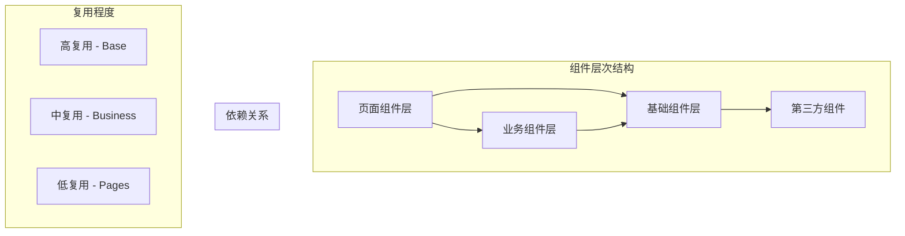

# src/components 组件系统深度分析

> 🧩 深入分析组件库的设计模式、复用策略和扩展架构

## 📁 目录结构分析

```
src/components/
├── base/                        # 基础组件
│   ├── Layout/                  # 布局组件
│   │   ├── index.tsx           # 主布局组件
│   │   └── components/         # 布局子组件
│   └── Navigation/              # 导航组件
└── business/                    # 业务组件
    ├── AgentCard/               # Agent 卡片组件
    ├── JobCard/                 # Job 卡片组件
    └── SearchFilter/            # 搜索过滤组件
```

## 🔍 组件架构深度解析

### 1. 组件分层策略分析

#### 当前分层模式
```typescript
// 组件分层架构评估
interface ComponentLayer {
  layer: string;
  purpose: string;
  examples: string[];
  characteristics: string[];
  reusability: 'high' | 'medium' | 'low';
}

const componentLayers: ComponentLayer[] = [
  {
    layer: 'Base Components',
    purpose: '提供基础UI构建块',
    examples: ['Layout', 'Navigation', 'Button', 'Input'],
    characteristics: [
      '高度可复用',
      '业务无关',
      '样式可定制',
      'API稳定'
    ],
    reusability: 'high',
  },
  {
    layer: 'Business Components', 
    purpose: '封装业务逻辑',
    examples: ['AgentCard', 'JobCard', 'SearchFilter'],
    characteristics: [
      '业务特定',
      '数据驱动',
      '交互丰富',
      '状态管理'
    ],
    reusability: 'medium',
  },
  {
    layer: 'Page Components',
    purpose: '页面级组合',
    examples: ['AgentList', 'JobDetail', 'Dashboard'],
    characteristics: [
      '路由绑定',
      '数据获取',
      '布局组合',
      '状态协调'
    ],
    reusability: 'low',
  },
];
```

#### 分层设计评估


### 2. Layout 组件深度分析

#### 布局系统设计
```typescript
// 当前 Layout 组件分析
interface LayoutProps {
  children: React.ReactNode;
  title?: string;
  showNavigation?: boolean;
  showSidebar?: boolean;
  variant?: 'default' | 'centered' | 'fullwidth';
}

const Layout: React.FC<LayoutProps> = ({
  children,
  title,
  showNavigation = true,
  showSidebar = false,
  variant = 'default'
}) => {
  return (
    <div className={`layout layout--${variant}`}>
      {showNavigation && <Navigation />}
      <main className="layout__main">
        {title && <PageHeader title={title} />}
        <div className="layout__content">
          {children}
        </div>
      </main>
      {showSidebar && <Sidebar />}
    </div>
  );
};
```

#### 布局灵活性评估
```typescript
// 布局系统的灵活性分析
interface LayoutFlexibilityAnalysis {
  aspect: string;
  current: string;
  score: number;
  improvement: string;
}

const layoutFlexibility: LayoutFlexibilityAnalysis[] = [
  {
    aspect: '布局变体支持',
    current: '3种基础变体',
    score: 6,
    improvement: '支持更多布局模式（双栏、三栏、网格等）',
  },
  {
    aspect: '响应式适配',
    current: 'CSS媒体查询',
    score: 7,
    improvement: '增加JS控制的响应式逻辑',
  },
  {
    aspect: '主题定制',
    current: '基础主题支持',
    score: 5,
    improvement: '完善主题系统和动态切换',
  },
  {
    aspect: '组件插槽',
    current: '固定插槽位置',
    score: 4,
    improvement: '支持灵活的插槽配置',
  },
];
```

#### 改进建议：增强布局系统
```typescript
// 增强版布局组件设计
interface EnhancedLayoutProps {
  children: React.ReactNode;
  
  // 布局配置
  layout?: {
    type: 'default' | 'centered' | 'sidebar' | 'split' | 'grid';
    width?: 'full' | 'container' | 'narrow';
    spacing?: 'compact' | 'normal' | 'spacious';
  };
  
  // 头部配置
  header?: {
    show: boolean;
    sticky?: boolean;
    height?: number;
    content?: React.ReactNode;
  };
  
  // 导航配置
  navigation?: {
    show: boolean;
    position: 'top' | 'left' | 'bottom';
    variant: 'tabs' | 'menu' | 'breadcrumb';
    items?: NavigationItem[];
  };
  
  // 侧边栏配置
  sidebar?: {
    show: boolean;
    position: 'left' | 'right';
    width?: number;
    collapsible?: boolean;
    content?: React.ReactNode;
  };
  
  // 页脚配置
  footer?: {
    show: boolean;
    sticky?: boolean;
    content?: React.ReactNode;
  };
  
  // 主题配置
  theme?: {
    mode: 'light' | 'dark' | 'auto';
    primaryColor?: string;
    customTheme?: any;
  };
}

const EnhancedLayout: React.FC<EnhancedLayoutProps> = ({
  children,
  layout = { type: 'default' },
  header = { show: true },
  navigation = { show: true, position: 'top', variant: 'tabs' },
  sidebar = { show: false },
  footer = { show: true },
  theme = { mode: 'light' },
}) => {
  const layoutClass = `layout layout--${layout.type} layout--${layout.width} layout--${layout.spacing}`;
  
  return (
    <div className={layoutClass} data-theme={theme.mode}>
      {header.show && (
        <header className={`layout__header ${header.sticky ? 'layout__header--sticky' : ''}`}>
          {header.content || <DefaultHeader />}
        </header>
      )}
      
      {navigation.show && navigation.position === 'top' && (
        <nav className="layout__navigation layout__navigation--top">
          <Navigation variant={navigation.variant} items={navigation.items} />
        </nav>
      )}
      
      <div className="layout__body">
        {navigation.show && navigation.position === 'left' && (
          <nav className="layout__navigation layout__navigation--left">
            <Navigation variant={navigation.variant} items={navigation.items} />
          </nav>
        )}
        
        {sidebar.show && sidebar.position === 'left' && (
          <aside className={`layout__sidebar layout__sidebar--left ${sidebar.collapsible ? 'layout__sidebar--collapsible' : ''}`}>
            {sidebar.content || <DefaultSidebar />}
          </aside>
        )}
        
        <main className="layout__main">
          {children}
        </main>
        
        {sidebar.show && sidebar.position === 'right' && (
          <aside className={`layout__sidebar layout__sidebar--right ${sidebar.collapsible ? 'layout__sidebar--collapsible' : ''}`}>
            {sidebar.content || <DefaultSidebar />}
          </aside>
        )}
      </div>
      
      {footer.show && (
        <footer className={`layout__footer ${footer.sticky ? 'layout__footer--sticky' : ''}`}>
          {footer.content || <DefaultFooter />}
        </footer>
      )}
    </div>
  );
};
```

### 3. 业务组件设计分析

#### AgentCard 组件设计
```typescript
// AgentCard 组件功能分析
interface AgentCardProps {
  agent: Agent;
  variant?: 'default' | 'compact' | 'detailed';
  actions?: AgentAction[];
  onClick?: (agent: Agent) => void;
  onActionClick?: (action: AgentAction, agent: Agent) => void;
}

interface AgentCardDesignAnalysis {
  strength: string[];
  weakness: string[];
  improvements: string[];
}

const agentCardAnalysis: AgentCardDesignAnalysis = {
  strength: [
    '数据驱动的设计',
    '多种显示变体',
    '交互回调清晰',
    '响应式布局'
  ],
  weakness: [
    '缺少加载状态',
    '无错误边界',
    '样式耦合度高',
    '国际化支持不足'
  ],
  improvements: [
    '增加骨架屏',
    '添加错误处理',
    '样式主题化',
    '多语言支持'
  ]
};
```

#### 改进版 AgentCard 设计
```typescript
// 增强版 AgentCard 组件
interface EnhancedAgentCardProps {
  // 数据
  agent?: Agent;
  loading?: boolean;
  error?: Error | null;
  
  // 显示配置
  variant?: 'default' | 'compact' | 'detailed' | 'hero';
  size?: 'small' | 'medium' | 'large';
  orientation?: 'horizontal' | 'vertical';
  
  // 交互配置
  selectable?: boolean;
  selected?: boolean;
  draggable?: boolean;
  
  // 内容配置
  showImage?: boolean;
  showDescription?: boolean;
  showTags?: boolean;
  showActions?: boolean;
  showRating?: boolean;
  
  // 操作配置
  actions?: AgentAction[];
  primaryAction?: AgentAction;
  
  // 回调
  onClick?: (agent: Agent) => void;
  onSelect?: (agent: Agent, selected: boolean) => void;
  onActionClick?: (action: AgentAction, agent: Agent) => void;
  onImageError?: () => void;
  
  // 自定义渲染
  renderHeader?: (agent: Agent) => React.ReactNode;
  renderContent?: (agent: Agent) => React.ReactNode;
  renderFooter?: (agent: Agent) => React.ReactNode;
  
  // 样式定制
  className?: string;
  style?: React.CSSProperties;
  theme?: AgentCardTheme;
}

const EnhancedAgentCard: React.FC<EnhancedAgentCardProps> = ({
  agent,
  loading = false,
  error = null,
  variant = 'default',
  size = 'medium',
  orientation = 'vertical',
  selectable = false,
  selected = false,
  draggable = false,
  showImage = true,
  showDescription = true,
  showTags = true,
  showActions = true,
  showRating = true,
  actions = [],
  primaryAction,
  onClick,
  onSelect,
  onActionClick,
  onImageError,
  renderHeader,
  renderContent,
  renderFooter,
  className,
  style,
  theme,
}) => {
  // 加载状态
  if (loading) {
    return <AgentCardSkeleton variant={variant} size={size} />;
  }
  
  // 错误状态
  if (error) {
    return (
      <AgentCardError 
        error={error} 
        onRetry={() => window.location.reload()}
      />
    );
  }
  
  // 无数据状态
  if (!agent) {
    return <AgentCardEmpty />;
  }
  
  const cardClass = clsx(
    'agent-card',
    `agent-card--${variant}`,
    `agent-card--${size}`,
    `agent-card--${orientation}`,
    {
      'agent-card--selectable': selectable,
      'agent-card--selected': selected,
      'agent-card--draggable': draggable,
    },
    className
  );
  
  return (
    <div 
      className={cardClass}
      style={style}
      onClick={() => onClick?.(agent)}
      draggable={draggable}
    >
      {/* 选择器 */}
      {selectable && (
        <div className="agent-card__selector">
          <Checkbox
            checked={selected}
            onChange={(checked) => onSelect?.(agent, checked)}
          />
        </div>
      )}
      
      {/* 头部 */}
      <div className="agent-card__header">
        {renderHeader ? renderHeader(agent) : (
          <DefaultAgentCardHeader 
            agent={agent}
            showImage={showImage}
            showRating={showRating}
            onImageError={onImageError}
          />
        )}
      </div>
      
      {/* 内容 */}
      <div className="agent-card__content">
        {renderContent ? renderContent(agent) : (
          <DefaultAgentCardContent
            agent={agent}
            showDescription={showDescription}
            showTags={showTags}
          />
        )}
      </div>
      
      {/* 页脚 */}
      <div className="agent-card__footer">
        {renderFooter ? renderFooter(agent) : (
          <DefaultAgentCardFooter
            agent={agent}
            actions={actions}
            primaryAction={primaryAction}
            showActions={showActions}
            onActionClick={onActionClick}
          />
        )}
      </div>
    </div>
  );
};

// 骨架屏组件
const AgentCardSkeleton: React.FC<{
  variant: string;
  size: string;
}> = ({ variant, size }) => (
  <div className={`agent-card-skeleton agent-card-skeleton--${variant} agent-card-skeleton--${size}`}>
    <div className="skeleton skeleton--avatar" />
    <div className="skeleton skeleton--text" />
    <div className="skeleton skeleton--text skeleton--short" />
    <div className="skeleton skeleton--button" />
  </div>
);

// 错误组件
const AgentCardError: React.FC<{
  error: Error;
  onRetry: () => void;
}> = ({ error, onRetry }) => (
  <div className="agent-card-error">
    <div className="agent-card-error__message">
      加载失败: {error.message}
    </div>
    <button onClick={onRetry} className="agent-card-error__retry">
      重试
    </button>
  </div>
);
```

### 4. 组件复用策略

#### 组件组合模式
```typescript
// 高阶组件模式
const withLoading = <P extends object>(
  Component: React.ComponentType<P>
) => {
  return (props: P & { loading?: boolean }) => {
    const { loading, ...rest } = props;
    
    if (loading) {
      return <LoadingSpinner />;
    }
    
    return <Component {...(rest as P)} />;
  };
};

const withErrorBoundary = <P extends object>(
  Component: React.ComponentType<P>
) => {
  return (props: P) => (
    <ErrorBoundary>
      <Component {...props} />
    </ErrorBoundary>
  );
};

// 使用组合
const EnhancedAgentCard = withErrorBoundary(
  withLoading(AgentCard)
);
```

#### Render Props 模式
```typescript
// 数据获取组件
interface DataFetcherProps<T> {
  url: string;
  children: (data: {
    data: T | null;
    loading: boolean;
    error: Error | null;
    refetch: () => void;
  }) => React.ReactNode;
}

const DataFetcher = <T,>({ url, children }: DataFetcherProps<T>) => {
  const { data, isLoading, error, refetch } = useQuery({
    queryKey: [url],
    queryFn: () => fetch(url).then(res => res.json()),
  });
  
  return (
    <>
      {children({
        data,
        loading: isLoading,
        error,
        refetch,
      })}
    </>
  );
};

// 使用示例
const AgentList = () => (
  <DataFetcher<Agent[]> url="/api/agents">
    {({ data, loading, error, refetch }) => (
      <div>
        {loading && <LoadingSpinner />}
        {error && <ErrorMessage error={error} onRetry={refetch} />}
        {data && (
          <div className="agent-grid">
            {data.map(agent => (
              <AgentCard key={agent.id} agent={agent} />
            ))}
          </div>
        )}
      </div>
    )}
  </DataFetcher>
);
```

### 5. 组件测试策略

#### 单元测试设计
```typescript
// AgentCard 组件测试
describe('AgentCard', () => {
  const mockAgent: Agent = {
    id: '1',
    name: 'Test Agent',
    description: 'Test Description',
    rating: 4.5,
    tags: ['test', 'agent'],
  };
  
  it('renders agent information correctly', () => {
    render(<AgentCard agent={mockAgent} />);
    
    expect(screen.getByText('Test Agent')).toBeInTheDocument();
    expect(screen.getByText('Test Description')).toBeInTheDocument();
    expect(screen.getByText('4.5')).toBeInTheDocument();
  });
  
  it('handles click events', () => {
    const handleClick = jest.fn();
    render(<AgentCard agent={mockAgent} onClick={handleClick} />);
    
    fireEvent.click(screen.getByRole('button'));
    expect(handleClick).toHaveBeenCalledWith(mockAgent);
  });
  
  it('shows loading state', () => {
    render(<AgentCard loading />);
    
    expect(screen.getByTestId('loading-spinner')).toBeInTheDocument();
  });
  
  it('shows error state', () => {
    const error = new Error('Test error');
    render(<AgentCard error={error} />);
    
    expect(screen.getByText('加载失败: Test error')).toBeInTheDocument();
  });
});
```

#### 集成测试设计
```typescript
// 组件集成测试
describe('AgentList Integration', () => {
  it('loads and displays agents', async () => {
    const mockAgents = [mockAgent];
    
    // Mock API
    server.use(
      rest.get('/api/agents', (req, res, ctx) => {
        return res(ctx.json(mockAgents));
      })
    );
    
    render(<AgentList />);
    
    // 检查加载状态
    expect(screen.getByTestId('loading-spinner')).toBeInTheDocument();
    
    // 等待数据加载
    await waitFor(() => {
      expect(screen.getByText('Test Agent')).toBeInTheDocument();
    });
    
    // 检查卡片渲染
    expect(screen.getAllByTestId('agent-card')).toHaveLength(1);
  });
});
```

## 📊 组件系统评估总结

### 综合评分

| 组件类型 | 设计质量 | 复用性 | 可维护性 | 测试覆盖 | 文档完整性 | 综合评分 |
|----------|----------|--------|----------|----------|------------|----------|
| **Layout 组件** | 7/10 | 8/10 | 7/10 | 5/10 | 4/10 | 6.2/10 |
| **Navigation 组件** | 6/10 | 7/10 | 6/10 | 4/10 | 3/10 | 5.2/10 |
| **AgentCard 组件** | 6/10 | 6/10 | 5/10 | 3/10 | 3/10 | 4.6/10 |
| **Business 组件** | 5/10 | 5/10 | 5/10 | 3/10 | 2/10 | 4.0/10 |

### 总体评估

**平均得分：5.0/10** - 基础功能完善，但系统性不足

#### 🏆 设计优势
- ✅ **分层清晰**：基础组件和业务组件分离合理
- ✅ **功能完整**：覆盖主要业务场景
- ✅ **样式统一**：使用一致的设计语言

#### 🔧 改进重点
- ❌ **组件设计粗糙**：缺少状态处理和错误边界
- ❌ **复用性不足**：业务逻辑耦合度高
- ❌ **测试覆盖低**：缺少系统性的测试策略
- ❌ **文档缺失**：组件使用文档不完善

#### 📋 改进路线图

**第一阶段（立即改进）**
1. 为关键组件添加加载和错误状态
2. 实现组件测试覆盖
3. 建立组件文档系统

**第二阶段（1-2个月）**
1. 重构组件API，提升复用性
2. 实现主题系统和样式定制
3. 完善组件库工具链

**第三阶段（长期规划）**
1. 建立设计系统规范
2. 实现组件自动化测试
3. 开发组件开发工具

### 🚀 最佳实践建议

1. **组件设计原则**：单一职责、高内聚、低耦合
2. **状态管理**：统一的状态处理模式
3. **错误处理**：完善的错误边界和降级策略
4. **性能优化**：组件懒加载和渲染优化
5. **测试策略**：单元测试 + 集成测试 + 视觉回归测试

通过系统性的改进，可以将组件系统打造成高质量、高复用的现代化组件库。