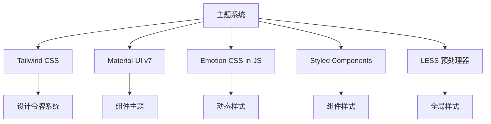

# src/theme 主题系统深度分析

> 🎨 分析 AgentFlow-FE 多层次主题系统的设计实现与集成方案

## 🎯 主题系统概览

### 整体架构设计

```
src/theme/
├── index.less           # 全局样式定义 (空文件)
└── material-ui.ts       # MUI 主题配置
```

### 多重主题技术栈集成



## 🎨 Tailwind CSS 设计令牌系统

### 颜色系统设计

```typescript
// tailwind.config.js 颜色令牌分析
const colorTokens = {
  // 品牌色系
  brand: "var(--color-brand)",           // 主品牌色
  "brand-hover": "var(--color-brand-hover)",    // 悬停状态
  "brand-press": "var(--color-brand-press)",    // 按压状态
  
  // 功能色系
  blue: "var(--color-blue)",             // 辅助深蓝紫
  red: "var(--color-red)",               // 火焰红
  secondary: "var(--color-secondary)",    // 浅冰蓝
  orange: "var(--color-orange)",         // 橙色
  
  // 文字色阶
  title: "var(--color-title)",           // 大标题、重要文字
  "sub-title": "var(--color-sub-title)", // 二级标题、正文
  descreption: "var(--color-descreption)", // 三级标题、表头
  hint: "var(--color-hint)",             // 提示文字
  
  // 界面分割
  line: "var(--color-line)",             // 边框线
  outline: "var(--color-outline)",       // 轮廓线
  
  // 背景色系
  primary: "var(--color-primary)",       // 主背景
  frontground: "var(--color-frontground)", // 前景背景
  background: "var(--color-background)",  // 灰色背景
  "background-2": "var(--color-background-2)", // 次级灰色背景
  light: "var(--color-light)",           // 亮色背景
  disable: "var(--color-disable)",       // 禁用状态
};
```

### 🎯 设计原则分析

#### ✅ 优秀设计点

1. **CSS 变量驱动**：使用 CSS 自定义属性，支持运行时主题切换
2. **语义化命名**：颜色名称反映功能而非具体颜色值
3. **状态变体**：为交互状态提供完整的颜色变体
4. **层次清晰**：文字色阶明确，界面层次分明

#### ⚠️ 潜在问题

```typescript
// 问题1：缺少CSS变量定义文件
// 当前 tailwind.config.js 引用了CSS变量，但没有找到定义文件

// 建议：创建主题变量定义
// src/theme/variables.css
:root {
  /* 品牌色系 */
  --color-brand: #3f51b5;
  --color-brand-hover: #5c6bc0;
  --color-brand-press: #3949ab;
  
  /* 功能色系 */
  --color-blue: #1976d2;
  --color-red: #d32f2f;
  --color-secondary: #64b5f6;
  --color-orange: #ff9800;
  
  /* 文字色系 */
  --color-title: rgba(0, 0, 0, 0.87);
  --color-sub-title: rgba(0, 0, 0, 0.6);
  --color-descreption: rgba(0, 0, 0, 0.54);
  --color-hint: rgba(0, 0, 0, 0.38);
}

/* 暗色主题 */
[data-theme="dark"] {
  --color-brand: #7986cb;
  --color-title: rgba(255, 255, 255, 0.87);
  /* ... 其他暗色变量 */
}
```

### 响应式设计系统

```typescript
// 断点设计分析
const breakpoints = {
  phone: { min: "320px", max: "767px" },   // 手机端
  pad: { min: "768px", max: "1200px" },    // 平板端  
  pc: { min: "1200px" },                   // PC端
};

// 设计评估：
// ✅ 覆盖主流设备
// ✅ 断点命名清晰
// ⚠️ 缺少超大屏适配 (>1920px)
// ⚠️ 建议增加 xs, sm, md, lg, xl 标准断点
```

## 🧩 Material-UI 主题配置

### 主题结构分析

```typescript
// src/theme/material-ui.ts 深度解析
interface MUIThemeAnalysis {
  version: "7.2.0";                    // MUI v7 最新版本
  palette: PaletteOptions;             // 调色板配置
  integration: "SSR-Optimized";       // SSR 优化集成
  emotionSupport: true;                // Emotion 支持
}

// 调色板设计评估
const paletteDesign = {
  primary: {
    main: '#3f51b5',      // Material Design Indigo
    light: '#7986cb',     // 自动计算的亮色
    dark: '#303f9f',      // 自动计算的暗色
    contrastText: '#ffffff'
  },
  // 优点：遵循 Material Design 规范
  // 缺点：与 Tailwind 颜色系统未统一
};
```

### 🔧 主题优化建议

#### 1. 颜色系统统一化

```typescript
// 建议：统一 MUI 和 Tailwind 颜色系统
// src/theme/unified-theme.ts
import { createTheme } from '@mui/material/styles';

// 从 Tailwind 变量导入颜色
const getThemeColors = () => ({
  primary: {
    main: 'var(--color-brand)',
    light: 'var(--color-brand-hover)', 
    dark: 'var(--color-brand-press)',
    contrastText: '#ffffff',
  },
  secondary: {
    main: 'var(--color-secondary)',
  },
  error: {
    main: 'var(--color-red)',
  },
  text: {
    primary: 'var(--color-title)',
    secondary: 'var(--color-sub-title)',
    disabled: 'var(--color-hint)',
  },
  background: {
    default: 'var(--color-background)',
    paper: 'var(--color-primary)',
  },
});

export const unifiedTheme = createTheme({
  palette: getThemeColors(),
  components: {
    // 组件级别的主题定制
    MuiButton: {
      styleOverrides: {
        root: {
          textTransform: 'none', // 取消大写转换
          borderRadius: '8px',   // 圆角统一
        },
      },
    },
  },
});
```

#### 2. 暗色主题支持

```typescript
// src/theme/dark-theme.ts
import { createTheme, PaletteMode } from '@mui/material/styles';

export const createUnifiedTheme = (mode: PaletteMode) => {
  return createTheme({
    palette: {
      mode,
      ...(mode === 'light' ? lightPalette : darkPalette),
    },
    components: {
      MuiCssBaseline: {
        styleOverrides: {
          body: {
            backgroundColor: mode === 'dark' 
              ? 'var(--color-background-dark)' 
              : 'var(--color-background)',
          },
        },
      },
    },
  });
};

// 主题切换 Hook
export const useThemeMode = () => {
  const [mode, setMode] = useState<PaletteMode>('light');
  
  const toggleMode = () => {
    setMode(prev => prev === 'light' ? 'dark' : 'light');
    document.documentElement.setAttribute('data-theme', mode);
  };
  
  return { mode, toggleMode };
};
```

## 🎭 CSS-in-JS 集成分析

### Emotion + Styled Components 双重集成

```typescript
// 当前集成状态分析
interface CSSInJSIntegration {
  emotion: {
    version: "11.14.0";
    ssrSupport: true;           // 服务端渲染支持
    cacheStrategy: "per-request"; // 请求级缓存
    usage: "MUI集成";
  };
  styledComponents: {
    version: "5.3.9";
    ssrSupport: true;           // SSR 样式收集
    usage: "自定义组件样式";
  };
}

// app/utils/emotionCache.ts 分析
const emotionCache = createCache({
  key: 'mui',
  prepend: true,  // 样式优先级控制
});

// 问题：双重 CSS-in-JS 可能导致
// 1. Bundle 体积增大
// 2. 样式优先级冲突
// 3. 运行时性能影响
```

### 🔧 CSS-in-JS 优化方案

#### 1. 统一 CSS-in-JS 方案

```typescript
// 建议：选择单一 CSS-in-JS 方案
// 方案A：全面使用 Emotion (推荐)
import { css, ThemeProvider } from '@emotion/react';
import { CacheProvider } from '@emotion/react';

// 方案B：全面使用 Styled Components
import styled, { ThemeProvider } from 'styled-components';

// 统一样式写法
const Button = styled.button<{ variant: 'primary' | 'secondary' }>`
  background: ${props => 
    props.variant === 'primary' 
      ? 'var(--color-brand)' 
      : 'var(--color-secondary)'
  };
  border-radius: 8px;
  padding: 12px 24px;
  
  &:hover {
    background: ${props =>
      props.variant === 'primary'
        ? 'var(--color-brand-hover)'
        : 'var(--color-secondary-hover)'
    };
  }
`;
```

#### 2. 关键 CSS 优化

```typescript
// src/theme/critical-css.ts
export const criticalStyles = css`
  /* 关键渲染路径样式 */
  html, body {
    margin: 0;
    padding: 0;
    font-family: 'Roboto', sans-serif;
    background-color: var(--color-background);
    color: var(--color-title);
  }
  
  /* 布局相关的关键样式 */
  .layout-container {
    min-height: 100vh;
    display: flex;
    flex-direction: column;
  }
  
  /* 加载状态样式 */
  .loading {
    display: flex;
    justify-content: center;
    align-items: center;
    min-height: 200px;
  }
`;

// 内联到 HTML head 中
// app/server/html.tsx
<style dangerouslySetInnerHTML={{
  __html: criticalStyles.styles
}} />
```

## 📱 LESS 预处理器集成

### 当前状态分析

```typescript
// 文件状态
interface LESSIntegration {
  globalStyles: "src/theme/index.less";  // 空文件
  moduleSupport: true;                   // CSS Modules 支持
  webpackConfig: "已配置";               // Webpack 处理器已设置
  usage: "最小化";                       // 几乎未使用
}

// webpack 配置分析
const lessConfig = {
  test: /\.less$/,
  exclude: /\.module\.less$/,
  use: [
    MiniCssExtractPlugin.loader,
    'css-loader',
    'postcss-loader',
    'less-loader',
  ],
};

// CSS Modules 支持
const lessModuleConfig = {
  test: /\.module\.less$/,
  use: [
    MiniCssExtractPlugin.loader,
    {
      loader: 'css-loader',
      options: {
        modules: {
          localIdentName: isDevelopment 
            ? '[path][name]__[local]'
            : '[hash:base64]',
        },
      },
    },
    'postcss-loader',
    'less-loader',
  ],
};
```

### 🎯 LESS 使用建议

#### 1. 全局样式系统

```less
// src/theme/index.less
// 主题变量定义
:root {
  // 品牌色系
  --color-brand: #3f51b5;
  --color-brand-hover: #5c6bc0;
  --color-brand-press: #3949ab;
  
  // 间距系统
  --spacing-xs: 4px;
  --spacing-sm: 8px;
  --spacing-md: 16px;
  --spacing-lg: 24px;
  --spacing-xl: 32px;
  
  // 字体系统
  --font-size-xs: 12px;
  --font-size-sm: 14px;
  --font-size-md: 16px;
  --font-size-lg: 18px;
  --font-size-xl: 24px;
  
  // 阴影系统
  --shadow-sm: 0 1px 3px rgba(0, 0, 0, 0.12);
  --shadow-md: 0 4px 6px rgba(0, 0, 0, 0.12);
  --shadow-lg: 0 10px 15px rgba(0, 0, 0, 0.12);
}

// 暗色主题
[data-theme="dark"] {
  --color-brand: #7986cb;
  --color-background: #121212;
  --color-primary: #1e1e1e;
  --color-title: rgba(255, 255, 255, 0.87);
}

// 全局重置样式
* {
  box-sizing: border-box;
}

html, body {
  margin: 0;
  padding: 0;
  font-family: 'Roboto', -apple-system, BlinkMacSystemFont, sans-serif;
  background-color: var(--color-background);
  color: var(--color-title);
  transition: background-color 0.3s ease, color 0.3s ease;
}

// 实用类样式
.flex-center {
  display: flex;
  justify-content: center;
  align-items: center;
}

.text-ellipsis {
  overflow: hidden;
  text-overflow: ellipsis;
  white-space: nowrap;
}
```

#### 2. 组件级 LESS Modules

```less
// src/components/Layout/Layout.module.less
.layout {
  display: flex;
  flex-direction: column;
  min-height: 100vh;
  background-color: var(--color-background);
  
  &__header {
    height: 64px;
    background-color: var(--color-primary);
    box-shadow: var(--shadow-sm);
    z-index: 100;
  }
  
  &__content {
    flex: 1;
    padding: var(--spacing-lg);
    
    @media (max-width: 768px) {
      padding: var(--spacing-md);
    }
  }
  
  &__sidebar {
    width: 240px;
    background-color: var(--color-frontground);
    border-right: 1px solid var(--color-line);
    
    &--collapsed {
      width: 64px;
    }
  }
}
```

## 🔄 主题系统集成优化

### 统一主题架构设计

```typescript
// src/theme/index.ts - 统一主题入口
import { createTheme } from '@mui/material/styles';
import { ThemeProvider as EmotionThemeProvider } from '@emotion/react';
import { ThemeProvider as StyledThemeProvider } from 'styled-components';

// 主题配置接口
interface UnifiedTheme {
  colors: ThemeColors;
  spacing: ThemeSpacing;
  typography: ThemeTypography;
  breakpoints: ThemeBreakpoints;
  shadows: ThemeShadows;
}

// 主题配置实现
export const lightTheme: UnifiedTheme = {
  colors: {
    brand: '#3f51b5',
    brandHover: '#5c6bc0',
    brandPress: '#3949ab',
    // ... 其他颜色
  },
  spacing: {
    xs: 4,
    sm: 8,
    md: 16,
    lg: 24,
    xl: 32,
  },
  // ... 其他配置
};

// MUI 主题适配器
export const muiTheme = createTheme({
  palette: {
    primary: {
      main: lightTheme.colors.brand,
      light: lightTheme.colors.brandHover,
      dark: lightTheme.colors.brandPress,
    },
  },
});

// 统一主题 Provider
export const UnifiedThemeProvider: React.FC<{ children: React.ReactNode }> = ({ 
  children 
}) => {
  return (
    <EmotionThemeProvider theme={lightTheme}>
      <StyledThemeProvider theme={lightTheme}>
        <ThemeProvider theme={muiTheme}>
          {children}
        </ThemeProvider>
      </StyledThemeProvider>
    </EmotionThemeProvider>
  );
};
```

### 主题切换系统

```typescript
// src/theme/ThemeContext.tsx
import { createContext, useContext, useState, useEffect } from 'react';

interface ThemeContextType {
  theme: 'light' | 'dark';
  toggleTheme: () => void;
  isLoading: boolean;
}

const ThemeContext = createContext<ThemeContextType | null>(null);

export const ThemeProvider: React.FC<{ children: React.ReactNode }> = ({ 
  children 
}) => {
  const [theme, setTheme] = useState<'light' | 'dark'>('light');
  const [isLoading, setIsLoading] = useState(true);
  
  useEffect(() => {
    // 从 localStorage 读取主题设置
    const savedTheme = localStorage.getItem('theme') as 'light' | 'dark';
    if (savedTheme) {
      setTheme(savedTheme);
    } else {
      // 检测系统主题偏好
      const prefersDark = window.matchMedia('(prefers-color-scheme: dark)').matches;
      setTheme(prefersDark ? 'dark' : 'light');
    }
    setIsLoading(false);
  }, []);
  
  useEffect(() => {
    // 更新 DOM 属性和 localStorage
    document.documentElement.setAttribute('data-theme', theme);
    localStorage.setItem('theme', theme);
  }, [theme]);
  
  const toggleTheme = () => {
    setTheme(prev => prev === 'light' ? 'dark' : 'light');
  };
  
  return (
    <ThemeContext.Provider value={{ theme, toggleTheme, isLoading }}>
      {children}
    </ThemeContext.Provider>
  );
};

export const useTheme = () => {
  const context = useContext(ThemeContext);
  if (!context) {
    throw new Error('useTheme must be used within ThemeProvider');
  }
  return context;
};
```

## 📊 主题系统评估总结

### 当前状态评分

| 维度 | 评分 | 说明 |
|------|------|------|
| **技术栈丰富度** | 9/10 | 支持多种样式方案，技术栈完整 |
| **设计系统完整性** | 6/10 | 缺少统一的设计令牌和变量定义 |
| **主题切换能力** | 3/10 | 基础设施存在，但缺少实现 |
| **响应式支持** | 7/10 | 断点清晰，但可以更完善 |
| **开发体验** | 6/10 | 多套方案并存，学习成本较高 |
| **性能优化** | 5/10 | 多重 CSS-in-JS 影响性能 |

### 优化建议优先级

#### 高优先级
1. **创建统一的 CSS 变量定义文件**
2. **实现完整的暗色主题支持**
3. **统一 Tailwind 和 MUI 颜色系统**

#### 中优先级
1. **选择统一的 CSS-in-JS 方案**
2. **完善响应式断点系统**
3. **优化关键 CSS 提取**

#### 低优先级
1. **添加更多设计令牌（间距、字体等）**
2. **实现主题预设系统**
3. **添加主题可视化配置工具**

通过统一主题系统设计，可以显著提升开发效率和用户体验，同时为后续的设计系统扩展提供良好基础。