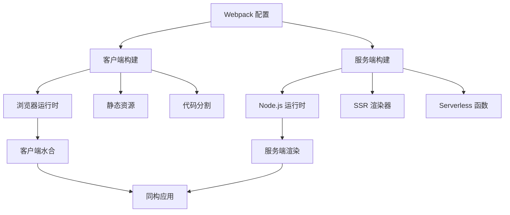

# 双重构建系统实现深度分析

> 🏗️ 深度解析 AgentFlow-FE 的客户端/服务端双重构建架构与同构渲染实现

## 🎯 双重构建架构概览

### 构建目标分离



### 构建产物对比分析

```typescript
interface BuildOutput {
  client: {
    target: "browserslist";           // 浏览器兼容性
    output: "build/client/";          // 客户端构建目录
    assets: [
      "js/[name].[contenthash].js",   // 主要脚本
      "css/[contenthash].css",        // 样式文件
      "media/[contenthash][ext]",     // 静态资源
      "index.html"                    // HTML 模板
    ];
    optimization: {
      splitChunks: true;              // 代码分割
      minimize: true;                 // 代码压缩
      treeShaking: true;              // 死代码消除
    };
  };
  
  server: {
    target: "node";                   // Node.js 环境
    output: "build/";                 // 服务端构建目录
    assets: [
      "server.js",                    // 服务器入口
      "serverless.js"                 // Serverless 入口
    ];
    externals: "node_modules";        // 外部依赖
    optimization: {
      minimize: false;                // 服务端不压缩
      nodePolyfills: false;           // 不包含浏览器 polyfill
    };
  };
}
```

## 🎯 客户端构建深度分析

### 客户端入口配置

```javascript
// config/webpack.config.js - 客户端配置分析
const baseClientConfig = (env) => {
  const isDevelopment = /^dev/.test(env.mode);
  
  return merge(common, {
    name: `client:${name}`,           // 构建名称标识
    target: "browserslist",           // 目标环境：现代浏览器
    
    // 入口配置
    entry: {
      client: [resolve("app/client/index.tsx")]
    },
    
    // 输出配置
    output: {
      path: join(buildPath, "client"),
      publicPath: `/static/client/`,   // CDN 友好的公共路径
      clean: true,                     // 构建前清理
    },
  });
};
```

### 🎨 客户端资源处理策略

```javascript
// 客户端专属资源处理规则
const clientAssetRules = {
  // 样式处理：提取到独立文件
  styles: {
    css: [MiniCssExtractPlugin.loader, "css-loader", "postcss-loader"],
    less: [MiniCssExtractPlugin.loader, "css-loader", "postcss-loader", "less-loader"],
    modules: {
      localIdentName: isDevelopment 
        ? "[path][name]__[local]"      // 开发环境：可读性
        : "[hash:base64]"              // 生产环境：压缩
    }
  },
  
  // 静态资源：优化和压缩
  assets: {
    images: {
      type: "asset/resource",          // Webpack 5 资源模块
      parser: {
        dataUrlCondition: {
          maxSize: 8 * 1024            // 8KB 以下内联
        }
      }
    },
    fonts: {
      type: "asset/resource",
      generator: {
        filename: "fonts/[name].[contenthash:8][ext]"
      }
    }
  },
  
  // SVG 特殊处理：支持组件化
  svg: {
    issuer: /\.[jt]sx?$/,
    use: [
      "@svgr/webpack",                 // SVG 转 React 组件
      {
        loader: "file-loader",
        options: {
          name: "media/[name].[contenthash:8].[ext]"
        }
      }
    ]
  }
};
```

### 🔌 客户端专属插件

```javascript
// 客户端构建插件配置
const clientPlugins = [
  // 代码分割统计生成
  new LoadablePlugin({
    outputAsset: false,               // 不包含在资源中
    writeToDisk: true,               // 写入磁盘供服务端使用
    filename: `${buildPath}/loadable-stats.json`
  }),
  
  // 资源清单生成
  new WebpackManifestPlugin({
    fileName: 'asset-manifest.json',
    publicPath: appConstants.publicPath,
    generate: (seed, files, entrypoints) => {
      const manifestFiles = files.reduce((manifest, file) => {
        manifest[file.name] = file.path;
        return manifest;
      }, seed);
      
      const entrypointFiles = entrypoints.client.filter(
        fileName => !fileName.endsWith('.map')
      );
      
      return {
        files: manifestFiles,
        entrypoints: entrypointFiles,
      };
    }
  }),
  
  // 环境变量注入
  new EnvironmentPlugin(require(`./env/${env.goal}`)),
  
  // 浏览器 Polyfill
  new ProvidePlugin({
    process: "process/browser.js",     // 浏览器端 process 对象
    Buffer: ["buffer", "Buffer"]       // 浏览器端 Buffer 实现
  })
];
```

## 🖥️ 服务端构建深度分析

### 服务端入口配置

```javascript
// 服务端构建配置分析
const serverConfig = (env) => merge(common, {
  name: `server:${name}`,
  externalsPresets: { node: true },   // Node.js 预设
  target: "node",                     // Node.js 运行环境
  
  // 条件入口：根据部署环境选择
  entry: omit({
    server: resolve("app/server/server.ts"),      // 传统服务器
    serverless: resolve("app/server/serverless.ts") // Serverless 函数
  }, [
    // 生产和测试环境排除 serverless，其他环境排除 server
    ["online", "beta"].includes(env.goal) ? "serverless" : "server"
  ]),
  
  // 输出配置
  output: omit({
    libraryTarget: "commonjs",        // CommonJS 模块格式
    path: resolve(buildPath),
    filename: "[name].js",           // 无哈希文件名
    chunkFilename: "scripts/[name].server.js",
    publicPath: "/",
  }, [
    // 条件移除某些配置
    !["online", "beta"].includes(env.goal) && "libraryTarget"
  ].filter(Boolean))
});
```

### 🔒 服务端外部依赖策略

```javascript
// 服务端依赖处理分析
const serverDependencyStrategy = {
  // 当前策略：注释掉的外部依赖配置
  // externals: [
  //   webpackNodeExternals({
  //     allowlist: [/rc-dropdown|lodash-es/],  // 允许打包的依赖
  //   }),
  // ],
  
  // 实际效果
  currentBehavior: {
    bundleAll: "所有依赖都打包到最终文件",
    pros: [
      "✅ 部署简单，无需安装 node_modules",
      "✅ 版本一致性保证",
      "✅ 避免运行时依赖缺失"
    ],
    cons: [
      "⚠️ 构建产物较大",
      "⚠️ 构建时间较长",
      "⚠️ 冷启动可能较慢"
    ]
  },
  
  // 建议优化策略
  optimizedStrategy: {
    externals: [
      webpackNodeExternals({
        allowlist: [
          /^@loadable/,               // 代码分割相关
          /^@emotion/,                // CSS-in-JS 运行时
          /styled-components/,        // 样式组件
          /lodash-es/,               // ES6 模块版本需要编译
        ]
      })
    ],
    benefits: [
      "📦 更小的构建产物",
      "⚡ 更快的构建速度", 
      "🚀 更快的冷启动"
    ]
  }
};
```

### 🚫 服务端资源忽略

```javascript
// 服务端静态资源处理
const serverAssetHandling = {
  // 忽略所有静态资源
  rules: [
    {
      test: /\.(less|css|svg|jpg|jpeg|png|webp|gif|eot|woff|woff2|ttf|otf)$/,
      loader: "ignore-loader",        // 完全忽略
    }
  ],
  
  // 设计理念
  philosophy: {
    separation: "服务端只处理逻辑，不处理资源",
    performance: "避免不必要的资源加载",
    simplicity: "简化服务端构建复杂度"
  },
  
  // 注意事项
  considerations: {
    ssr: "确保 SSR 过程中样式正确处理",
    imports: "避免在服务端代码中直接导入静态资源",
    conditionalImports: "使用条件导入处理环境差异"
  }
};
```

## 🔄 同构代码处理策略

### 环境检测机制

```typescript
// 同构代码环境检测
interface IsomorphicEnvironment {
  // 编译时检测
  compileTime: {
    NODE_ENV: string;                 // 'development' | 'production'
    REACT_APP_ENV: string;           // 'local' | 'beta' | 'online'
    webpack: {
      target: 'web' | 'node';        // 构建目标
      mode: 'development' | 'production';
    };
  };
  
  // 运行时检测
  runtime: {
    isServer: typeof window === 'undefined';
    isClient: typeof window !== 'undefined';
    isBrowser: typeof document !== 'undefined';
    isNode: typeof process !== 'undefined' && process.versions?.node;
  };
}

// 环境检测工具函数
export const envDetection = {
  isServer: () => typeof window === 'undefined',
  isClient: () => typeof window !== 'undefined',
  isDevelopment: () => process.env.NODE_ENV === 'development',
  isProduction: () => process.env.NODE_ENV === 'production',
  
  // 构建目标检测
  isBrowserBuild: () => process.env.WEBPACK_TARGET === 'web',
  isServerBuild: () => process.env.WEBPACK_TARGET === 'node',
};
```

### 条件代码执行

```typescript
// 同构代码条件执行模式
class IsomorphicCodePatterns {
  // 模式1：客户端专用代码
  clientOnlyCode() {
    if (typeof window !== 'undefined') {
      // 浏览器专用逻辑
      const analytics = window.gtag;
      const localStorage = window.localStorage;
      
      // DOM 操作
      document.addEventListener('click', handler);
    }
  }
  
  // 模式2：服务端专用代码
  serverOnlyCode() {
    if (typeof window === 'undefined') {
      // Node.js 专用逻辑
      const fs = require('fs');
      const path = require('path');
      
      // 文件系统操作
      const config = fs.readFileSync('./config.json');
    }
  }
  
  // 模式3：延迟执行（客户端水合后）
  deferredExecution() {
    useEffect(() => {
      // 确保在客户端执行
      if (typeof window !== 'undefined') {
        initializeClientFeatures();
      }
    }, []);
  }
  
  // 模式4：动态导入
  async dynamicImports() {
    if (typeof window !== 'undefined') {
      // 客户端动态导入
      const { default: ClientModule } = await import('./ClientModule');
      return new ClientModule();
    } else {
      // 服务端动态导入
      const { default: ServerModule } = await import('./ServerModule');
      return new ServerModule();
    }
  }
}
```

### 资源引用处理

```typescript
// 同构资源引用策略
interface IsomorphicAssetHandling {
  // 图片资源
  images: {
    // 客户端：正常导入
    client: `import logoUrl from './logo.png';`,
    
    // 服务端：条件导入或占位符
    server: `
      const logoUrl = typeof window === 'undefined' 
        ? '/static/logo.png'  // 服务端使用公共路径
        : require('./logo.png').default;
    `,
    
    // 推荐：使用公共路径
    recommended: `
      const logoUrl = '/static/images/logo.png';
    `
  };
  
  // 样式资源
  styles: {
    // CSS Modules：仅客户端有效
    modules: `
      import styles from './Component.module.css';
      const className = typeof window === 'undefined' 
        ? 'component'  // 服务端降级
        : styles.component;
    `,
    
    // CSS-in-JS：同构友好
    cssInJs: `
      const StyledComponent = styled.div\`
        color: blue;
        \${props => props.primary && 'background: red;'}
      \`;
    `
  };
}
```

## 🔗 构建产物集成

### 客户端资源映射

```javascript
// 客户端构建产物分析
const clientBuildArtifacts = {
  // 主要资源
  mainAssets: {
    "client.[contenthash].js": "主应用代码",
    "runtime.[contenthash].js": "Webpack 运行时",
    "vendors.[contenthash].js": "第三方库代码",
    "main.[contenthash].css": "主样式文件"
  },
  
  // 代码分割资源
  chunkAssets: {
    "pages-Home.[contenthash].js": "首页组件",
    "pages-Agents.[contenthash].js": "Agent 管理页",
    "pages-Jobs.[contenthash].js": "Job 管理页"
  },
  
  // 静态资源
  staticAssets: {
    "media/logo.[contenthash].png": "Logo 图片",
    "fonts/roboto.[contenthash].woff2": "字体文件"
  },
  
  // 元数据文件
  metadata: {
    "asset-manifest.json": "资源映射清单",
    "loadable-stats.json": "代码分割统计"
  }
};
```

### 服务端构建产物

```javascript
// 服务端构建产物分析
const serverBuildArtifacts = {
  // 传统服务器模式
  traditional: {
    "server.js": {
      purpose: "Koa 服务器入口",
      includes: [
        "SSR 渲染逻辑",
        "路由处理",
        "静态文件服务",
        "API 代理"
      ]
    }
  },
  
  // Serverless 模式
  serverless: {
    "serverless.js": {
      purpose: "Serverless 函数入口",
      includes: [
        "Lambda 处理函数",
        "事件解析",
        "响应格式化",
        "冷启动优化"
      ]
    }
  },
  
  // 共享资源
  shared: {
    "loadable-stats.json": "客户端构建统计，供 SSR 使用"
  }
};
```

### 构建产物同步

```typescript
// 构建产物同步和集成
class BuildArtifactSync {
  // 确保服务端能访问客户端构建统计
  syncLoadableStats() {
    const statsPath = path.resolve(buildPath, 'loadable-stats.json');
    
    // 检查文件是否存在
    if (!fs.existsSync(statsPath)) {
      throw new Error('Client build stats not found. Run client build first.');
    }
    
    return require(statsPath);
  }
  
  // 同步资源清单
  syncAssetManifest() {
    const manifestPath = path.resolve(buildPath, 'client/asset-manifest.json');
    const manifest = require(manifestPath);
    
    return {
      getAssetUrl: (assetName: string) => {
        return manifest.files[assetName] || assetName;
      },
      
      getEntrypoints: () => {
        return manifest.entrypoints || [];
      }
    };
  }
  
  // 验证构建完整性
  validateBuildIntegrity() {
    const requiredFiles = [
      'client/index.html',
      'client/asset-manifest.json',
      'loadable-stats.json',
      'server.js'
    ];
    
    const missingFiles = requiredFiles.filter(file => {
      return !fs.existsSync(path.resolve(buildPath, file));
    });
    
    if (missingFiles.length > 0) {
      throw new Error(`Missing build artifacts: ${missingFiles.join(', ')}`);
    }
    
    return true;
  }
}
```

## ⚡ 双重构建优化策略

### 1. 并行构建优化

```javascript
// 并行构建配置
const parallelBuildConfig = {
  // Webpack 5 并行构建
  parallelism: 4,                     // 并发数限制
  
  // 多配置并行处理
  configurations: [
    clientConfig,                     // 客户端配置
    serverConfig                      // 服务端配置
  ],
  
  // 构建顺序依赖
  buildOrder: {
    independent: [
      "client",                       // 客户端构建独立
      "server"                        // 服务端构建独立
    ],
    dependencies: {
      "server": ["client"]            // 服务端依赖客户端的 loadable-stats
    }
  }
};

// 并行构建脚本
const parallelBuild = async () => {
  const webpack = require('webpack');
  const configs = [clientConfig, serverConfig];
  
  return new Promise((resolve, reject) => {
    webpack(configs, (err, stats) => {
      if (err || stats.hasErrors()) {
        reject(err || new Error('Build failed'));
        return;
      }
      
      console.log('✅ Both client and server builds completed');
      resolve(stats);
    });
  });
};
```

### 2. 增量构建优化

```javascript
// 增量构建策略
const incrementalBuildStrategy = {
  // 文件系统缓存
  cache: {
    type: 'filesystem',
    buildDependencies: {
      config: [__filename],           // 配置文件依赖
    },
    cacheDirectory: path.resolve(__dirname, '../.webpack-cache'),
  },
  
  // 持久化缓存优化
  optimization: {
    moduleIds: 'deterministic',       // 稳定的模块 ID
    chunkIds: 'deterministic',        // 稳定的块 ID
    mangleExports: false,             // 避免导出名混淆
  },
  
  // 监听模式优化
  watchOptions: {
    ignored: [
      '**/node_modules/**',
      '**/build/**',
      '**/.git/**'
    ],
    aggregateTimeout: 300,            // 文件变更聚合延迟
    poll: 1000,                       // 轮询间隔（回退模式）
  }
};
```

### 3. 构建性能监控

```typescript
// 构建性能监控
interface BuildPerformanceMetrics {
  buildTime: {
    total: number;                    // 总构建时间
    client: number;                   // 客户端构建时间
    server: number;                   // 服务端构建时间
  };
  
  bundleSize: {
    client: {
      total: number;                  // 客户端总大小
      gzipped: number;                // Gzip 压缩后大小
      chunks: Record<string, number>; // 各个块的大小
    };
    server: {
      total: number;                  // 服务端大小
    };
  };
  
  cacheHitRate: number;               // 缓存命中率
  warnings: string[];                 // 构建警告
  errors: string[];                   // 构建错误
}

// 性能监控插件
class BuildPerformancePlugin {
  apply(compiler: any) {
    compiler.hooks.done.tap('BuildPerformancePlugin', (stats: any) => {
      const metrics = this.collectMetrics(stats);
      this.reportMetrics(metrics);
    });
  }
  
  private collectMetrics(stats: any): BuildPerformanceMetrics {
    const { compilation } = stats;
    
    return {
      buildTime: {
        total: stats.endTime - stats.startTime,
        client: 0, // 从统计中提取
        server: 0
      },
      bundleSize: {
        client: {
          total: this.calculateSize(compilation.assets),
          gzipped: 0, // 需要额外计算
          chunks: {}
        },
        server: {
          total: 0
        }
      },
      cacheHitRate: 0, // 从缓存统计提取
      warnings: compilation.warnings.map((w: any) => w.message),
      errors: compilation.errors.map((e: any) => e.message)
    };
  }
  
  private reportMetrics(metrics: BuildPerformanceMetrics) {
    console.log('📊 Build Performance Metrics:');
    console.log(`⏱️  Total build time: ${metrics.buildTime.total}ms`);
    console.log(`📦 Client bundle size: ${metrics.bundleSize.client.total} bytes`);
    console.log(`🔧 Server bundle size: ${metrics.bundleSize.server.total} bytes`);
    
    if (metrics.warnings.length > 0) {
      console.warn('⚠️  Warnings:', metrics.warnings.length);
    }
    
    if (metrics.errors.length > 0) {
      console.error('❌ Errors:', metrics.errors.length);
    }
  }
}
```

## 📊 双重构建评估总结

### 当前架构评分

| 维度 | 评分 | 说明 |
|------|------|------|
| **架构清晰度** | 9/10 | 客户端/服务端分离明确，职责清晰 |
| **构建效率** | 7/10 | 基础并行构建，但缺少优化 |
| **同构支持** | 8/10 | 良好的同构代码处理机制 |
| **依赖管理** | 6/10 | 服务端依赖策略可优化 |
| **开发体验** | 8/10 | 开发模式支持良好 |
| **生产优化** | 8/10 | 生产构建优化到位 |

### 优化建议优先级

#### 高优先级
1. **优化服务端依赖策略**：启用合理的 externals 配置
2. **实现真正的并行构建**：客户端和服务端独立构建
3. **完善增量构建**：优化缓存策略

#### 中优先级
1. **构建性能监控**：添加详细的构建指标
2. **构建产物验证**：确保构建完整性
3. **错误处理优化**：更好的构建错误提示

#### 低优先级
1. **构建可视化**：添加构建过程可视化
2. **自动化测试**：构建产物的自动化测试
3. **构建优化建议**：基于指标的优化建议

这套双重构建系统为高性能同构应用提供了坚实的工程基础，通过持续优化可以达到工业级标准。