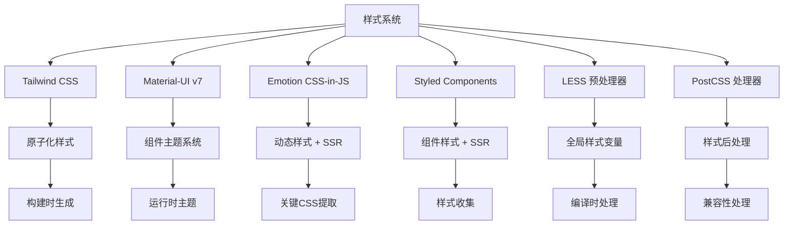

# 样式系统集成方案深度分析

> 🎨 深度解析 AgentFlow-FE 多重样式技术栈的 SSR 集成与性能优化策略

## 🎯 样式系统架构概览

### 多重技术栈集成



### SSR 样式处理流程

```typescript
interface SSRStyleProcessing {
  // 服务端样式收集
  serverSide: {
    emotionExtraction: "extractCriticalToChunks";
    styledComponentsCollection: "ServerStyleSheet.collectStyles";
    loadableStyleTags: "extractor.getStyleTags";
    muiStyleGeneration: "ThemeProvider + CssBaseline";
  };
  
  // 样式注入顺序
  injectionOrder: [
    "Loadable CSS 文件",      // 最低优先级
    "Styled Components",      // 中等优先级
    "Emotion 关键样式",       // 最高优先级
    "MUI CssBaseline"         // 基础样式重置
  ];
  
  // 客户端水合
  clientHydration: {
    emotionCacheRestore: "从序列化状态恢复缓存";
    styledComponentsRehydrate: "重新建立样式连接";
    muiThemeConsistency: "确保主题一致性";
  };
}
```

## 🎭 Emotion CSS-in-JS 深度分析

### 服务端关键 CSS 提取

```typescript
// app/server/index.tsx - Emotion 处理流程
const emotionSSRProcess = {
  // 步骤1：创建服务端缓存
  cacheCreation: `
    const emotionCache = createEmotionCache();
    const { extractCriticalToChunks, constructStyleTagsFromChunks } = 
      createEmotionServer(emotionCache);
  `,
  
  // 步骤2：渲染过程中收集样式
  styleCollection: `
    const jsx = await renderApp(ctx, emotionCache);
    const appContent = await renderToStream(jsx);
  `,
  
  // 步骤3：提取关键样式
  criticalExtraction: `
    const emotionChunks = extractCriticalToChunks(appContent);
    const emotionStyleTags = constructStyleTagsFromChunks(emotionChunks);
  `,
  
  // 步骤4：状态序列化
  stateSerialization: `
    const emotionCacheData = JSON.stringify({
      ids: Object.keys(emotionCache.inserted),
      key: emotionCache.key
    });
  `
};
```

### Emotion 缓存配置优化

```typescript
// app/utils/emotionCache.ts 深度分析
interface EmotionCacheConfiguration {
  key: string;                    // 缓存键名
  prepend: boolean;              // 样式插入顺序
  speedy: boolean;               // 生产环境性能优化
  nonce?: string;                // CSP 安全随机数
}

// 当前实现分析
const currentEmotionCache = {
  configuration: `createCache({ key: 'mui', prepend: true })`,
  
  benefits: [
    "✅ key: 'mui' 避免与其他 emotion 实例冲突",
    "✅ prepend: true 确保样式优先级正确",
    "✅ 服务端/客户端共享相同配置"
  ],
  
  optimizations: [
    "⚠️ 可以添加 nonce 支持 CSP",
    "⚠️ 可以根据环境调整 speedy 配置",
    "⚠️ 可以添加样式前缀避免全局污染"
  ]
};

// 增强版 Emotion 缓存
const createOptimizedEmotionCache = (options?: {
  nonce?: string;
  prefix?: string;
}) => {
  return createCache({
    key: options?.prefix || 'agentflow',
    prepend: true,
    speedy: process.env.NODE_ENV === 'production',
    nonce: options?.nonce,
    // 自定义样式插入
    insertionPoint: typeof document !== 'undefined' 
      ? document.querySelector('#emotion-insertion-point') || undefined
      : undefined,
  });
};
```

### Emotion 性能优化策略

```typescript
// Emotion 性能优化实现
class EmotionPerformanceOptimizer {
  // 样式缓存优化
  static optimizeStyleCache() {
    return {
      // 启用样式复用
      shouldForwardProp: (prop: string) => {
        // 避免将样式属性传递给 DOM
        return !prop.startsWith('$') && prop !== 'css';
      },
      
      // 样式标签合并
      mergeStyleTags: true,
      
      // 开发环境样式调试
      label: process.env.NODE_ENV === 'development',
    };
  }
  
  // 关键样式优化
  static extractCriticalStyles(html: string, cache: EmotionCache) {
    const chunks = extractCriticalToChunks(html);
    
    return {
      styles: chunks.styles,
      styleElements: constructStyleTagsFromChunks(chunks),
      cacheState: {
        ids: Object.keys(cache.inserted),
        registered: cache.registered,
      }
    };
  }
  
  // 客户端样式复用
  static rehydrateClientStyles(cacheData: string) {
    try {
      const { ids, key } = JSON.parse(cacheData);
      const cache = createEmotionCache();
      
      // 恢复已插入的样式 ID
      ids.forEach((id: string) => {
        cache.inserted[id] = true;
      });
      
      return cache;
    } catch (error) {
      console.warn('Failed to rehydrate emotion cache:', error);
      return createEmotionCache();
    }
  }
}
```

## 💄 Styled Components 集成分析

### 服务端样式收集

```typescript
// Styled Components SSR 实现分析
const styledComponentsSSR = {
  // 服务端样式收集
  serverCollection: `
    const SCSheet = new ServerStyleSheet();
    const jsx = SCSheet.collectStyles(
      extractor.collectChunks(await renderApp(ctx, emotionCache))
    );
    const styleTags = SCSheet.getStyleTags();
    SCSheet.seal(); // 清理资源
  `,
  
  // 样式注入机制
  injectionMechanism: {
    automatic: "自动收集组件树中的所有 styled-components",
    order: "按照组件渲染顺序收集样式",
    deduplication: "自动去重相同的样式规则"
  },
  
  // 性能考虑
  performance: {
    pros: [
      "✅ 只收集实际使用的样式",
      "✅ 支持动态样式计算",
      "✅ 主题系统集成良好"
    ],
    cons: [
      "⚠️ 运行时性能开销",
      "⚠️ bundle 体积较大",
      "⚠️ 与 Emotion 功能重叠"
    ]
  }
};
```

### Styled Components 优化建议

```typescript
// Styled Components 优化策略
interface StyledComponentsOptimization {
  // 编译时优化
  compileTime: {
    babelPlugin: "@babel/plugin-styled-components";
    options: {
      displayName: boolean;           // 开发环境显示组件名
      ssr: boolean;                  // 启用 SSR 支持
      fileName: boolean;             // 显示文件名
      minify: boolean;               // 生产环境压缩
      transpileTemplateLiterals: boolean; // 模板字符串转换
    };
  };
  
  // 运行时优化
  runtime: {
    shouldForwardProp: "避免无关属性传递到 DOM";
    as: "动态组件类型切换";
    theme: "主题系统集成";
  };
  
  // 建议迁移策略
  migrationStrategy: {
    rationale: "考虑迁移到 Emotion 以减少技术栈复杂度";
    benefits: ["更好的性能", "更小的 bundle", "更统一的 API"];
    steps: [
      "1. 新组件使用 Emotion",
      "2. 逐步迁移现有组件",
      "3. 移除 Styled Components 依赖"
    ];
  };
}
```

## 🎯 Material-UI v7 样式集成

### MUI 主题系统分析

```typescript
// src/theme/material-ui.ts - MUI 集成分析
const muiIntegration = {
  // 主题配置
  themeConfiguration: {
    version: "7.2.0",
    provider: "ThemeProvider",
    baseline: "CssBaseline",
    emotionIntegration: true
  },
  
  // SSR 集成方式
  ssrIntegration: `
    <CacheProvider value={emotionCache}>
      <ThemeProvider theme={theme}>
        <CssBaseline />
        <App />
      </ThemeProvider>
    </CacheProvider>
  `,
  
  // 样式生成机制
  styleGeneration: {
    createTheme: "生成主题对象",
    makeStyles: "已弃用，使用 sx 属性或 styled",
    sx: "内联样式属性",
    styled: "styled-components 风格 API"
  }
};
```

### MUI 性能优化

```typescript
// MUI 性能优化策略
class MUIPerformanceOptimizer {
  // Tree Shaking 优化
  static enableTreeShaking() {
    return {
      // 按需导入
      imports: `
        import Button from '@mui/material/Button';
        import TextField from '@mui/material/TextField';
        // 避免：import { Button, TextField } from '@mui/material';
      `,
      
      // Babel 插件配置
      babelPlugin: {
        name: "babel-plugin-import",
        options: {
          libraryName: "@mui/material",
          libraryDirectory: "",
          camel2DashComponentName: false
        }
      }
    };
  }
  
  // 主题优化
  static optimizeTheme(baseTheme: any) {
    return createTheme({
      ...baseTheme,
      
      // 禁用不需要的功能
      components: {
        MuiCssBaseline: {
          styleOverrides: {
            // 移除不必要的全局样式
            body: {
              fontFamily: 'inherit', // 使用系统字体
            }
          }
        },
        
        // 优化按钮样式
        MuiButton: {
          defaultProps: {
            disableRipple: true,      // 禁用水波纹效果
          },
          styleOverrides: {
            root: {
              textTransform: 'none',   // 禁用大写转换
            }
          }
        }
      },
      
      // 精简调色板
      palette: {
        mode: 'light',
        primary: { main: '#1976d2' },
        secondary: { main: '#dc004e' },
        // 移除不使用的颜色
      }
    });
  }
  
  // 动态主题切换
  static createDynamicTheme() {
    const [mode, setMode] = useState<'light' | 'dark'>('light');
    
    const theme = useMemo(() => {
      return createTheme({
        palette: { mode },
        // 其他主题配置
      });
    }, [mode]);
    
    return { theme, toggleMode: () => setMode(m => m === 'light' ? 'dark' : 'light') };
  }
}
```

## 🌟 Tailwind CSS 集成分析

### 原子化样式策略

```typescript
// tailwind.config.js 配置分析
const tailwindIntegration = {
  // 内容扫描配置
  content: ["./src/**/*.{tsx,jsx,ts,html,js}"],
  
  // 设计令牌系统
  designTokens: {
    colors: "CSS 变量驱动的颜色系统",
    spacing: "统一的间距系统",
    typography: "响应式字体系统",
    breakpoints: "自定义断点配置"
  },
  
  // 与其他样式系统协作
  coexistence: {
    emotion: "Tailwind 提供基础样式，Emotion 处理动态样式",
    mui: "Tailwind 处理布局，MUI 提供组件",
    methodology: "职责分离，避免冲突"
  }
};
```

### Tailwind 优化策略

```typescript
// Tailwind CSS 优化配置
interface TailwindOptimization {
  // PurgeCSS 优化
  purging: {
    enabled: boolean;
    content: string[];
    safelist: string[];           // 安全保留的类名
    blocklist: string[];          // 强制移除的类名
  };
  
  // JIT 模式
  justInTime: {
    enabled: true;
    benefits: [
      "按需生成样式类",
      "更快的构建速度",
      "更小的 CSS 文件",
      "支持任意值"
    ];
  };
  
  // 自定义工具类
  customUtilities: {
    plugins: [
      "@tailwindcss/typography",   // 排版插件
      "@tailwindcss/forms",        // 表单插件
      "@tailwindcss/aspect-ratio"  // 宽高比插件
    ];
  };
}

// 自定义 Tailwind 插件
const customTailwindPlugin = plugin(({ addUtilities, theme }) => {
  addUtilities({
    '.text-shadow': {
      textShadow: '0 2px 4px rgba(0,0,0,0.10)',
    },
    '.text-shadow-md': {
      textShadow: '0 4px 8px rgba(0,0,0,0.12), 0 2px 4px rgba(0,0,0,0.08)',
    },
    '.text-shadow-lg': {
      textShadow: '0 15px 35px rgba(0,0,0,0.10), 0 5px 15px rgba(0,0,0,0.07)',
    },
    '.text-shadow-none': {
      textShadow: 'none',
    },
  });
});
```

## 📝 LESS 预处理器集成

### 全局样式管理

```less
// src/theme/index.less - 全局样式系统
// CSS 变量定义
:root {
  // 颜色系统
  --color-primary: #1976d2;
  --color-secondary: #dc004e;
  --color-success: #2e7d32;
  --color-error: #d32f2f;
  --color-warning: #ed6c02;
  --color-info: #0288d1;
  
  // 语义化颜色
  --color-text-primary: rgba(0, 0, 0, 0.87);
  --color-text-secondary: rgba(0, 0, 0, 0.6);
  --color-text-disabled: rgba(0, 0, 0, 0.38);
  
  // 背景颜色
  --color-background-default: #fafafa;
  --color-background-paper: #ffffff;
  
  // 间距系统
  --spacing-unit: 8px;
  --spacing-xs: calc(var(--spacing-unit) * 0.5);  // 4px
  --spacing-sm: var(--spacing-unit);              // 8px
  --spacing-md: calc(var(--spacing-unit) * 2);    // 16px
  --spacing-lg: calc(var(--spacing-unit) * 3);    // 24px
  --spacing-xl: calc(var(--spacing-unit) * 4);    // 32px
  
  // 边框圆角
  --border-radius-sm: 4px;
  --border-radius-md: 8px;
  --border-radius-lg: 12px;
  
  // 阴影系统
  --shadow-sm: 0 1px 3px rgba(0, 0, 0, 0.12), 0 1px 2px rgba(0, 0, 0, 0.24);
  --shadow-md: 0 4px 6px rgba(0, 0, 0, 0.12), 0 2px 4px rgba(0, 0, 0, 0.08);
  --shadow-lg: 0 10px 15px rgba(0, 0, 0, 0.12), 0 4px 6px rgba(0, 0, 0, 0.04);
}

// 暗色主题
[data-theme="dark"] {
  --color-primary: #90caf9;
  --color-text-primary: rgba(255, 255, 255, 0.87);
  --color-text-secondary: rgba(255, 255, 255, 0.6);
  --color-background-default: #121212;
  --color-background-paper: #1e1e1e;
}

// 全局重置和基础样式
*,
*::before,
*::after {
  box-sizing: border-box;
}

html {
  -webkit-font-smoothing: antialiased;
  -moz-osx-font-smoothing: grayscale;
}

body {
  margin: 0;
  font-family: 'Roboto', -apple-system, BlinkMacSystemFont, 'Segoe UI', sans-serif;
  background-color: var(--color-background-default);
  color: var(--color-text-primary);
  line-height: 1.5;
  transition: background-color 0.3s ease, color 0.3s ease;
}

// 实用工具类
.sr-only {
  position: absolute;
  width: 1px;
  height: 1px;
  padding: 0;
  margin: -1px;
  overflow: hidden;
  clip: rect(0, 0, 0, 0);
  white-space: nowrap;
  border: 0;
}

.truncate {
  overflow: hidden;
  text-overflow: ellipsis;
  white-space: nowrap;
}

.visually-hidden {
  clip: rect(0 0 0 0);
  clip-path: inset(50%);
  height: 1px;
  overflow: hidden;
  position: absolute;
  white-space: nowrap;
  width: 1px;
}
```

### LESS Modules 组件样式

```less
// 组件级 LESS 模块示例
// src/components/Button/Button.module.less
.button {
  display: inline-flex;
  align-items: center;
  justify-content: center;
  min-height: 44px;
  padding: var(--spacing-sm) var(--spacing-md);
  border: none;
  border-radius: var(--border-radius-md);
  font-size: 14px;
  font-weight: 500;
  text-decoration: none;
  cursor: pointer;
  transition: all 0.2s ease;
  user-select: none;
  
  &:focus {
    outline: 2px solid var(--color-primary);
    outline-offset: 2px;
  }
  
  &:disabled {
    opacity: 0.6;
    cursor: not-allowed;
  }
  
  // 变体样式
  &.primary {
    background-color: var(--color-primary);
    color: white;
    
    &:hover:not(:disabled) {
      background-color: color-mix(in srgb, var(--color-primary) 90%, black);
    }
  }
  
  &.secondary {
    background-color: transparent;
    color: var(--color-primary);
    border: 1px solid var(--color-primary);
    
    &:hover:not(:disabled) {
      background-color: color-mix(in srgb, var(--color-primary) 10%, transparent);
    }
  }
  
  &.ghost {
    background-color: transparent;
    color: var(--color-text-primary);
    
    &:hover:not(:disabled) {
      background-color: var(--color-background-paper);
    }
  }
  
  // 尺寸变体
  &.small {
    min-height: 32px;
    padding: calc(var(--spacing-unit) * 0.75) var(--spacing-sm);
    font-size: 12px;
  }
  
  &.large {
    min-height: 56px;
    padding: var(--spacing-md) var(--spacing-lg);
    font-size: 16px;
  }
}

.icon {
  margin-right: var(--spacing-xs);
  
  &.iconOnly {
    margin: 0;
  }
}

.loading {
  @keyframes spin {
    from { transform: rotate(0deg); }
    to { transform: rotate(360deg); }
  }
  
  animation: spin 1s linear infinite;
}
```

## 🚀 样式系统性能优化

### 关键 CSS 提取策略

```typescript
// 关键 CSS 提取和优化
class CriticalCSSExtractor {
  // 提取首屏关键样式
  static extractCriticalCSS(html: string, allStyles: string[]): string {
    const criticalSelectors = new Set<string>();
    
    // 解析 HTML，提取使用的类名
    const classMatches = html.match(/class="([^"]*)"/g) || [];
    classMatches.forEach(match => {
      const classes = match.replace(/class="([^"]*)"/, '$1').split(' ');
      classes.forEach(cls => criticalSelectors.add(cls.trim()));
    });
    
    // 从样式表中提取对应的 CSS 规则
    const criticalCSS = allStyles.filter(rule => {
      return Array.from(criticalSelectors).some(selector => 
        rule.includes(`.${selector}`)
      );
    });
    
    return criticalCSS.join('\n');
  }
  
  // 样式优先级优化
  static optimizeStylePriority() {
    return {
      // 样式加载顺序
      loadOrder: [
        'critical-inline-styles',    // 关键样式内联
        'base-reset-styles',         // 基础重置样式
        'component-styles',          // 组件样式
        'utility-styles',            // 工具类样式
        'theme-styles'               // 主题样式
      ],
      
      // CSS 特异性管理
      specificityLevels: {
        reset: 0,                    // 重置样式
        base: 10,                    // 基础样式
        components: 20,              // 组件样式
        utilities: 30,               // 工具类
        overrides: 40                // 覆盖样式
      }
    };
  }
}
```

### 样式缓存和复用

```typescript
// 样式缓存策略
interface StyleCachingStrategy {
  // 构建时缓存
  buildTime: {
    cssModules: "CSS Modules 类名映射缓存";
    emotionCache: "Emotion 样式规则缓存";
    tailwindJIT: "Tailwind JIT 生成缓存";
  };
  
  // 运行时缓存
  runtime: {
    styledComponents: "样式对象缓存";
    emotionInserted: "已插入样式记录";
    themeCache: "主题计算结果缓存";
  };
  
  // 浏览器缓存
  browser: {
    staticCSS: "静态 CSS 文件长期缓存";
    dynamicStyles: "动态样式短期缓存";
    fontFiles: "字体文件永久缓存";
  };
}

// 样式缓存实现
class StyleCacheManager {
  private static styleCache = new Map<string, string>();
  private static themeCache = new Map<string, any>();
  
  // 缓存计算后的样式
  static cacheComputedStyle(key: string, style: string): void {
    this.styleCache.set(key, style);
  }
  
  // 获取缓存的样式
  static getCachedStyle(key: string): string | undefined {
    return this.styleCache.get(key);
  }
  
  // 缓存主题计算结果
  static cacheTheme(themeKey: string, theme: any): void {
    this.themeCache.set(themeKey, theme);
  }
  
  // 清理过期缓存
  static cleanupCache(): void {
    // 保留最近使用的 100 个样式缓存
    if (this.styleCache.size > 100) {
      const entries = Array.from(this.styleCache.entries());
      const toKeep = entries.slice(-100);
      this.styleCache.clear();
      toKeep.forEach(([key, value]) => this.styleCache.set(key, value));
    }
  }
}
```

## 📊 样式系统评估总结

### 当前实现评分

| 维度 | 评分 | 说明 |
|------|------|------|
| **技术栈集成** | 8/10 | 多重样式系统集成良好，但略显复杂 |
| **SSR 支持** | 9/10 | 关键 CSS 提取和样式收集完善 |
| **性能优化** | 7/10 | 基础优化到位，可进一步提升 |
| **开发体验** | 8/10 | 多种样式方案满足不同需求 |
| **维护性** | 6/10 | 技术栈较多，维护复杂度较高 |
| **一致性** | 7/10 | 设计令牌统一，但实现分散 |

### 优化建议优先级

#### 高优先级
1. **样式技术栈精简**：减少 Styled Components，统一使用 Emotion
2. **完善全局样式系统**：补充 LESS 全局样式和 CSS 变量
3. **优化关键 CSS 提取**：更精确的首屏样式提取

#### 中优先级
1. **实现样式缓存系统**：提升样式计算和复用效率
2. **完善主题系统**：统一 Tailwind 和 MUI 的主题配置
3. **添加样式性能监控**：样式加载和渲染性能指标

#### 低优先级
1. **样式 lint 规则**：统一样式代码风格
2. **可视化样式工具**：样式系统管理和调试工具
3. **样式文档系统**：组件样式使用指南

通过这些优化，样式系统将更加高效、一致和易维护，为用户提供更好的视觉体验。