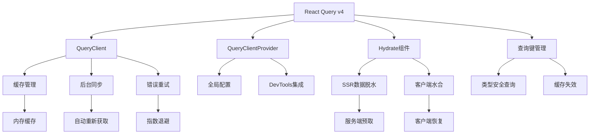

# React Query 集成分析深度解析

> 🔄 深度解析 AgentFlow-FE 基于 @tanstack/react-query 的数据管理与 SSR 集成策略

## 🎯 React Query 架构概览

### 核心组件集成



### 技术栈集成点

```typescript
interface ReactQueryIntegration {
  // 核心依赖
  dependencies: {
    "@tanstack/react-query": "4.29.3";
    runtime: "React 18";
    ssr: "自定义 SSR 框架";
  };
  
  // 集成组件
  components: {
    QueryClientProvider: "全局查询客户端提供者";
    Hydrate: "SSR 数据水合组件";
    useQuery: "数据查询 Hook";
    useMutation: "数据变更 Hook";
  };
  
  // SSR 集成
  ssrIntegration: {
    prefetch: "服务端数据预取";
    dehydrate: "状态序列化";
    hydrate: "客户端状态恢复";
  };
}
```

## 🔧 QueryClient 配置分析

### 当前配置深度解析

```typescript
// app/client/index.tsx - QueryClient 配置分析
const queryClientConfig = {
  // 当前配置
  current: `
    const queryClient = new QueryClient({
      defaultOptions: {
        queries: {
          refetchOnWindowFocus: false,    // 禁用窗口焦点重新获取
        },
      },
    });
  `,
  
  // 配置分析
  analysis: {
    refetchOnWindowFocus: {
      value: false,
      reason: "提升用户体验，避免频繁的后台请求",
      impact: "减少不必要的网络请求，提升性能"
    }
  },
  
  // 缺失的配置
  missingConfigurations: [
    "retry: 自动重试配置",
    "staleTime: 数据新鲜度配置", 
    "cacheTime: 缓存时间配置",
    "refetchInterval: 自动刷新配置"
  ]
};
```

### 增强版 QueryClient 配置

```typescript
// 建议：完整的 QueryClient 配置
const createOptimizedQueryClient = () => {
  return new QueryClient({
    defaultOptions: {
      queries: {
        // 数据新鲜度：5分钟内认为数据是新鲜的
        staleTime: 5 * 60 * 1000,
        
        // 缓存时间：30分钟后清理未使用的缓存
        cacheTime: 30 * 60 * 1000,
        
        // 重试配置：失败时重试3次
        retry: (failureCount, error: any) => {
          // API 错误不重试
          if (error?.response?.status >= 400 && error?.response?.status < 500) {
            return false;
          }
          return failureCount < 3;
        },
        
        // 重试延迟：指数退避
        retryDelay: (attemptIndex) => Math.min(1000 * 2 ** attemptIndex, 30000),
        
        // 窗口焦点重新获取：禁用
        refetchOnWindowFocus: false,
        
        // 网络重连重新获取：启用
        refetchOnReconnect: true,
        
        // 组件挂载重新获取：禁用
        refetchOnMount: false,
        
        // 错误时在后台重新获取：启用
        refetchOnError: true,
      },
      
      mutations: {
        // 变更重试：只重试1次
        retry: 1,
        
        // 变更重试延迟
        retryDelay: 1000,
        
        // 错误处理
        onError: (error: any) => {
          console.error('Mutation error:', error);
          // 可以集成全局错误处理
        },
      },
    },
  });
};

// 环境特定配置
const createEnvironmentQueryClient = () => {
  const isDevelopment = process.env.NODE_ENV === 'development';
  
  return new QueryClient({
    defaultOptions: {
      queries: {
        staleTime: isDevelopment ? 0 : 5 * 60 * 1000,  // 开发环境总是重新获取
        cacheTime: isDevelopment ? 10 * 60 * 1000 : 30 * 60 * 1000,
        retry: isDevelopment ? false : 3,               // 开发环境不重试
      },
    },
  });
};
```

## 📋 查询键管理策略

### 当前查询键设计

```typescript
// src/apis/queryKeys.ts 分析
const queryKeysAnalysis = {
  // 当前实现
  implementation: {
    structure: "enum PrefetchKeys",
    naming: "语义化命名",
    coverage: "覆盖主要业务实体"
  },
  
  // 查询键列表
  keys: {
    HOME: "home-page",
    AGENTS: "agents", 
    AGENT_DETAIL: "agent-detail",
    JOBS: "jobs",
    JOB_DETAIL: "job-detail",
    REQUEST_DEMO: "request-demo"
  },
  
  // 设计优势
  advantages: [
    "✅ 集中管理，易于维护",
    "✅ 语义化命名，可读性好",
    "✅ 枚举类型，类型安全"
  ],
  
  // 改进空间
  improvements: [
    "⚠️ 缺少层次化结构",
    "⚠️ 不支持动态参数",
    "⚠️ 缺少查询键工厂函数"
  ]
};
```

### 增强版查询键系统

```typescript
// 建议：层次化查询键系统
// src/apis/queryKeys.ts
export const queryKeys = {
  // 用户相关
  users: {
    all: ['users'] as const,
    lists: () => [...queryKeys.users.all, 'list'] as const,
    list: (filters: string) => [...queryKeys.users.lists(), { filters }] as const,
    details: () => [...queryKeys.users.all, 'detail'] as const,
    detail: (id: string) => [...queryKeys.users.details(), id] as const,
  },
  
  // Agent 相关
  agents: {
    all: ['agents'] as const,
    lists: () => [...queryKeys.agents.all, 'list'] as const,
    list: (filters?: AgentFilters) => [...queryKeys.agents.lists(), { filters }] as const,
    details: () => [...queryKeys.agents.all, 'detail'] as const,
    detail: (id: string) => [...queryKeys.agents.details(), id] as const,
    jobs: (agentId: string) => [...queryKeys.agents.detail(agentId), 'jobs'] as const,
  },
  
  // Job 相关  
  jobs: {
    all: ['jobs'] as const,
    lists: () => [...queryKeys.jobs.all, 'list'] as const,
    list: (filters?: JobFilters) => [...queryKeys.jobs.lists(), { filters }] as const,
    details: () => [...queryKeys.jobs.all, 'detail'] as const,
    detail: (id: string) => [...queryKeys.jobs.details(), id] as const,
    history: (jobId: string) => [...queryKeys.jobs.detail(jobId), 'history'] as const,
  },
  
  // 首页数据
  home: {
    all: ['home'] as const,
    stats: () => [...queryKeys.home.all, 'stats'] as const,
    recentItems: () => [...queryKeys.home.all, 'recent'] as const,
  },
} as const;

// 查询键工厂函数
export class QueryKeyFactory {
  // 生成带分页的查询键
  static withPagination(baseKey: readonly unknown[], page: number, size: number) {
    return [...baseKey, { page, size }] as const;
  }
  
  // 生成带排序的查询键
  static withSorting(baseKey: readonly unknown[], sort: { field: string; order: 'asc' | 'desc' }) {
    return [...baseKey, { sort }] as const;
  }
  
  // 生成带时间范围的查询键
  static withTimeRange(baseKey: readonly unknown[], from: Date, to: Date) {
    return [...baseKey, { timeRange: { from: from.toISOString(), to: to.toISOString() } }] as const;
  }
  
  // 生成用户特定的查询键
  static withUser(baseKey: readonly unknown[], userId: string) {
    return [...baseKey, { userId }] as const;
  }
}

// 类型安全的查询键
type QueryKeys = typeof queryKeys;
type AgentQueryKeys = QueryKeys['agents'];
type JobQueryKeys = QueryKeys['jobs'];
```

### 查询键最佳实践

```typescript
// 查询键使用最佳实践
interface QueryKeyBestPractices {
  // 1. 层次化结构
  hierarchical: {
    principle: "从通用到具体";
    example: "['agents', 'list', { status: 'active' }]";
    benefits: ["易于缓存失效", "逻辑清晰", "便于调试"];
  };
  
  // 2. 参数序列化
  parameterSerialization: {
    principle: "参数对象应该可序列化";
    good: "['users', { page: 1, size: 10 }]";
    bad: "['users', userFilterFunction]";
    reason: "确保缓存键的一致性";
  };
  
  // 3. 缓存失效策略
  invalidationStrategy: {
    exact: "queryClient.invalidateQueries({ queryKey: ['agents', 'detail', '123'] })";
    partial: "queryClient.invalidateQueries({ queryKey: ['agents'] })";
    predicate: "queryClient.invalidateQueries({ predicate: query => query.queryKey[0] === 'agents' })";
  };
}

// 缓存失效辅助函数
export class CacheInvalidation {
  constructor(private queryClient: QueryClient) {}
  
  // 失效 Agent 相关缓存
  invalidateAgents(agentId?: string) {
    if (agentId) {
      // 失效特定 Agent
      this.queryClient.invalidateQueries({ queryKey: queryKeys.agents.detail(agentId) });
    } else {
      // 失效所有 Agent 查询
      this.queryClient.invalidateQueries({ queryKey: queryKeys.agents.all });
    }
  }
  
  // 失效 Job 相关缓存
  invalidateJobs(jobId?: string) {
    if (jobId) {
      this.queryClient.invalidateQueries({ queryKey: queryKeys.jobs.detail(jobId) });
    } else {
      this.queryClient.invalidateQueries({ queryKey: queryKeys.jobs.all });
    }
  }
  
  // 批量失效
  invalidateMultiple(keys: readonly unknown[][]) {
    keys.forEach(key => {
      this.queryClient.invalidateQueries({ queryKey: key });
    });
  }
  
  // 智能失效：根据变更类型自动失效相关缓存
  smartInvalidate(mutation: string, entityId?: string) {
    switch (mutation) {
      case 'createAgent':
        this.invalidateAgents();
        this.queryClient.invalidateQueries({ queryKey: queryKeys.home.stats() });
        break;
        
      case 'updateAgent':
        if (entityId) {
          this.invalidateAgents(entityId);
          this.queryClient.invalidateQueries({ queryKey: queryKeys.agents.lists() });
        }
        break;
        
      case 'deleteAgent':
        this.invalidateAgents();
        this.queryClient.invalidateQueries({ queryKey: queryKeys.home.stats() });
        break;
        
      default:
        console.warn(`Unknown mutation type: ${mutation}`);
    }
  }
}
```

## 🔄 SSR 数据预取与水合

### 服务端数据预取实现

```typescript
// 服务端数据预取分析
interface SSRDataPrefetch {
  // 当前实现（推测）
  current: {
    location: "app/server/app.tsx 或路由匹配中";
    mechanism: "queryClient.prefetchQuery";
    routing: "基于路由配置的 loadData 函数";
  };
  
  // 预取流程
  process: [
    "1. 路由匹配",
    "2. 获取路由的 queryKey 和 loadData",
    "3. 执行 queryClient.prefetchQuery",
    "4. 等待数据加载完成",
    "5. 继续 SSR 渲染"
  ];
}

// 服务端预取实现
class SSRDataPrefetcher {
  constructor(private queryClient: QueryClient) {}
  
  // 预取单个查询
  async prefetchQuery(queryKey: unknown[], queryFn: () => Promise<any>) {
    try {
      await this.queryClient.prefetchQuery({
        queryKey,
        queryFn,
        staleTime: 10 * 60 * 1000,  // 10分钟内不重新获取
      });
    } catch (error) {
      console.error('SSR prefetch error:', error);
      // SSR 预取失败不应该阻止页面渲染
    }
  }
  
  // 批量预取
  async prefetchMultiple(queries: Array<{ queryKey: unknown[]; queryFn: () => Promise<any> }>) {
    const prefetchPromises = queries.map(({ queryKey, queryFn }) =>
      this.prefetchQuery(queryKey, queryFn)
    );
    
    // 并行预取，不等待全部完成
    await Promise.allSettled(prefetchPromises);
  }
  
  // 根据路由预取数据
  async prefetchForRoute(pathname: string, params: Record<string, string>) {
    const routeQueries = this.getQueriesForRoute(pathname, params);
    await this.prefetchMultiple(routeQueries);
  }
  
  private getQueriesForRoute(pathname: string, params: Record<string, string>) {
    const queries = [];
    
    if (pathname === '/') {
      queries.push({
        queryKey: queryKeys.home.stats(),
        queryFn: () => HomeService.getStats()
      });
    } else if (pathname.startsWith('/agents')) {
      queries.push({
        queryKey: queryKeys.agents.list(),
        queryFn: () => AgentService.getList()
      });
      
      if (params.id) {
        queries.push({
          queryKey: queryKeys.agents.detail(params.id),
          queryFn: () => AgentService.getById(params.id)
        });
      }
    } else if (pathname.startsWith('/jobs')) {
      queries.push({
        queryKey: queryKeys.jobs.list(),
        queryFn: () => JobService.getList()
      });
    }
    
    return queries;
  }
}
```

### 客户端数据水合

```typescript
// app/client/index.tsx - 水合过程分析
const hydrationProcess = {
  // 当前实现
  current: `
    const dehydratedState = document.querySelector('#__REACT_QUERY_STATE__')?.textContent;
    
    <Hydrate state={JSON.parse(dehydratedState)}>
      <App />
    </Hydrate>
  `,
  
  // 水合流程
  flow: [
    "1. 从 DOM 中获取序列化状态",
    "2. 解析 JSON 数据",
    "3. 通过 Hydrate 组件恢复查询缓存",
    "4. 客户端查询自动使用缓存数据"
  ],
  
  // 潜在问题
  issues: [
    "⚠️ 缺少错误处理",
    "⚠️ 没有验证数据完整性",
    "⚠️ 可能存在序列化/反序列化不一致"
  ]
};

// 增强版水合处理
const EnhancedHydration: React.FC<{ children: React.ReactNode }> = ({ children }) => {
  const [dehydratedState, setDehydratedState] = useState(null);
  const [hydrationError, setHydrationError] = useState<string | null>(null);
  
  useEffect(() => {
    try {
      const stateElement = document.querySelector('#__REACT_QUERY_STATE__');
      if (stateElement?.textContent) {
        const parsed = JSON.parse(stateElement.textContent);
        
        // 验证数据结构
        if (validateDehydratedState(parsed)) {
          setDehydratedState(parsed);
        } else {
          console.warn('Invalid dehydrated state structure');
          setDehydratedState(null);
        }
      }
    } catch (error) {
      console.error('Failed to parse dehydrated state:', error);
      setHydrationError('Failed to restore server data');
    }
  }, []);
  
  if (hydrationError) {
    // 水合失败时显示警告，但不阻止应用运行
    console.warn('Hydration failed, falling back to client-side data fetching');
  }
  
  return (
    <Hydrate state={dehydratedState}>
      {children}
    </Hydrate>
  );
};

// 状态验证函数
function validateDehydratedState(state: any): boolean {
  if (!state || typeof state !== 'object') return false;
  if (!state.queries || !Array.isArray(state.queries)) return false;
  
  // 验证查询结构
  return state.queries.every((query: any) => {
    return query.queryKey && Array.isArray(query.queryKey) && 
           query.state && typeof query.state === 'object';
  });
}
```

## 🎣 自定义 Hooks 设计

### 业务 Hooks 实现

```typescript
// 基于查询键的自定义 Hooks
export const useAgents = (filters?: AgentFilters) => {
  return useQuery({
    queryKey: queryKeys.agents.list(filters),
    queryFn: () => AgentService.getList(filters),
    staleTime: 5 * 60 * 1000,  // 5分钟内数据保持新鲜
  });
};

export const useAgent = (id: string) => {
  return useQuery({
    queryKey: queryKeys.agents.detail(id),
    queryFn: () => AgentService.getById(id),
    enabled: !!id,  // 只有当 id 存在时才执行查询
    staleTime: 10 * 60 * 1000,
  });
};

export const useJobs = (filters?: JobFilters) => {
  return useQuery({
    queryKey: queryKeys.jobs.list(filters),
    queryFn: () => JobService.getList(filters),
  });
};

export const useJob = (id: string) => {
  return useQuery({
    queryKey: queryKeys.jobs.detail(id),
    queryFn: () => JobService.getById(id),
    enabled: !!id,
  });
};

// 首页数据 Hooks
export const useHomeStats = () => {
  return useQuery({
    queryKey: queryKeys.home.stats(),
    queryFn: () => HomeService.getStats(),
    staleTime: 15 * 60 * 1000,  // 统计数据15分钟刷新
  });
};

// 分页查询 Hook
export const usePaginatedAgents = (page: number, size: number, filters?: AgentFilters) => {
  return useQuery({
    queryKey: QueryKeyFactory.withPagination(queryKeys.agents.list(filters), page, size),
    queryFn: () => AgentService.getList({ ...filters, page, size }),
    keepPreviousData: true,  // 保持前一页数据，避免加载闪烁
  });
};
```

### 变更 Hooks 实现

```typescript
// 变更操作 Hooks
export const useCreateAgent = () => {
  const queryClient = useQueryClient();
  const cacheInvalidation = new CacheInvalidation(queryClient);
  
  return useMutation({
    mutationFn: (agentData: CreateAgentRequest) => AgentService.create(agentData),
    onSuccess: (newAgent) => {
      // 更新缓存
      queryClient.setQueryData(
        queryKeys.agents.detail(newAgent.id),
        newAgent
      );
      
      // 失效相关查询
      cacheInvalidation.smartInvalidate('createAgent');
      
      // 可选：乐观更新列表
      queryClient.setQueryData(
        queryKeys.agents.list(),
        (oldData: Agent[] | undefined) => {
          return oldData ? [...oldData, newAgent] : [newAgent];
        }
      );
    },
    onError: (error) => {
      console.error('Failed to create agent:', error);
      // 可以集成全局错误处理
    }
  });
};

export const useUpdateAgent = () => {
  const queryClient = useQueryClient();
  const cacheInvalidation = new CacheInvalidation(queryClient);
  
  return useMutation({
    mutationFn: ({ id, data }: { id: string; data: UpdateAgentRequest }) => 
      AgentService.update(id, data),
    onMutate: async ({ id, data }) => {
      // 乐观更新
      await queryClient.cancelQueries({ queryKey: queryKeys.agents.detail(id) });
      
      const previousAgent = queryClient.getQueryData(queryKeys.agents.detail(id));
      
      queryClient.setQueryData(
        queryKeys.agents.detail(id),
        (old: Agent | undefined) => old ? { ...old, ...data } : undefined
      );
      
      return { previousAgent };
    },
    onError: (error, variables, context) => {
      // 回滚乐观更新
      if (context?.previousAgent) {
        queryClient.setQueryData(
          queryKeys.agents.detail(variables.id),
          context.previousAgent
        );
      }
    },
    onSettled: (data, error, variables) => {
      // 重新获取最新数据
      cacheInvalidation.smartInvalidate('updateAgent', variables.id);
    }
  });
};

export const useDeleteAgent = () => {
  const queryClient = useQueryClient();
  const cacheInvalidation = new CacheInvalidation(queryClient);
  
  return useMutation({
    mutationFn: (id: string) => AgentService.delete(id),
    onSuccess: (_, deletedId) => {
      // 从列表中移除
      queryClient.setQueryData(
        queryKeys.agents.list(),
        (oldData: Agent[] | undefined) => {
          return oldData?.filter(agent => agent.id !== deletedId) || [];
        }
      );
      
      // 移除详情缓存
      queryClient.removeQueries({ queryKey: queryKeys.agents.detail(deletedId) });
      
      // 失效相关查询
      cacheInvalidation.smartInvalidate('deleteAgent');
    }
  });
};
```

## ⚡ 性能优化策略

### 1. 查询优化

```typescript
// 查询性能优化策略
class QueryOptimization {
  // 预取策略
  static setupPrefetching(queryClient: QueryClient) {
    return {
      // 鼠标悬停预取
      onAgentHover: (agentId: string) => {
        queryClient.prefetchQuery({
          queryKey: queryKeys.agents.detail(agentId),
          queryFn: () => AgentService.getById(agentId),
          staleTime: 10 * 60 * 1000,
        });
      },
      
      // 路由预取
      onRouteChange: (nextPath: string) => {
        if (nextPath.startsWith('/jobs')) {
          queryClient.prefetchQuery({
            queryKey: queryKeys.jobs.list(),
            queryFn: () => JobService.getList(),
          });
        }
      },
      
      // 后台预取
      backgroundPrefetch: () => {
        // 在空闲时间预取常用数据
        if ('requestIdleCallback' in window) {
          window.requestIdleCallback(() => {
            queryClient.prefetchQuery({
              queryKey: queryKeys.home.stats(),
              queryFn: () => HomeService.getStats(),
            });
          });
        }
      }
    };
  }
  
  // 缓存优化
  static optimizeCache(queryClient: QueryClient) {
    return {
      // 设置全局缓存大小限制
      setGlobalCacheSize: () => {
        queryClient.setDefaultOptions({
          queries: {
            cacheTime: 30 * 60 * 1000,  // 30分钟
          }
        });
      },
      
      // 定期清理过期缓存
      scheduleCleanup: () => {
        setInterval(() => {
          queryClient.clear();
        }, 60 * 60 * 1000);  // 每小时清理一次
      },
      
      // 内存使用监控
      monitorMemoryUsage: () => {
        if ('memory' in performance) {
          const memoryInfo = (performance as any).memory;
          if (memoryInfo.usedJSHeapSize > 100 * 1024 * 1024) {  // 100MB
            console.warn('High memory usage detected, consider clearing cache');
            queryClient.clear();
          }
        }
      }
    };
  }
}
```

### 2. 错误处理与重试

```typescript
// 错误处理和重试策略
class QueryErrorHandling {
  static createErrorBoundary(queryClient: QueryClient) {
    return class ReactQueryErrorBoundary extends React.Component<
      { children: React.ReactNode },
      { hasError: boolean }
    > {
      constructor(props: any) {
        super(props);
        this.state = { hasError: false };
      }
      
      static getDerivedStateFromError(error: Error) {
        return { hasError: true };
      }
      
      componentDidCatch(error: Error, errorInfo: React.ErrorInfo) {
        console.error('React Query error:', error, errorInfo);
        
        // 清理可能损坏的缓存
        queryClient.clear();
      }
      
      render() {
        if (this.state.hasError) {
          return (
            <div style={{ padding: '2rem', textAlign: 'center' }}>
              <h2>数据加载出错</h2>
              <button onClick={() => window.location.reload()}>
                刷新页面
              </button>
            </div>
          );
        }
        
        return this.props.children;
      }
    };
  }
  
  // 全局错误处理
  static setupGlobalErrorHandling(queryClient: QueryClient) {
    queryClient.setDefaultOptions({
      queries: {
        onError: (error: any) => {
          console.error('Query error:', error);
          
          // 根据错误类型处理
          if (error?.response?.status === 401) {
            // 认证失败，重定向到登录页
            window.location.href = '/login';
          } else if (error?.response?.status >= 500) {
            // 服务器错误，显示通用错误信息
            console.error('Server error, please try again later');
          }
        },
      },
      mutations: {
        onError: (error: any) => {
          console.error('Mutation error:', error);
          
          // 变更错误的特殊处理
          if (error?.response?.status === 409) {
            // 冲突错误，可能需要刷新数据
            queryClient.invalidateQueries();
          }
        },
      },
    });
  }
}
```

## 📊 React Query 集成评估

### 当前实现评分

| 维度 | 评分 | 说明 |
|------|------|------|
| **基础集成** | 8/10 | QueryClient 和 Hydrate 集成完善 |
| **查询键管理** | 6/10 | 基础枚举设计，缺少层次化结构 |
| **SSR 集成** | 9/10 | 数据预取和水合机制完整 |
| **错误处理** | 5/10 | 缺少全局错误处理和重试策略 |
| **性能优化** | 6/10 | 基础配置合理，缺少高级优化 |
| **开发体验** | 7/10 | 基础 Hooks 可用，可进一步增强 |

### 优化建议优先级

#### 高优先级
1. **完善查询键系统**：实现层次化查询键和工厂函数
2. **增强 QueryClient 配置**：添加重试、缓存时间等配置
3. **实现全局错误处理**：统一的错误处理和用户反馈

#### 中优先级
1. **创建业务 Hooks**：封装常用的查询和变更操作
2. **优化缓存策略**：智能缓存失效和预取
3. **添加性能监控**：查询性能和缓存使用情况监控

#### 低优先级
1. **离线支持**：网络断开时的数据缓存和同步
2. **开发工具集成**：React Query DevTools 配置
3. **A/B 测试集成**：查询策略的实验性配置

这套 React Query 集成方案为数据管理提供了坚实基础，通过持续优化可以实现更高效的数据流管理。