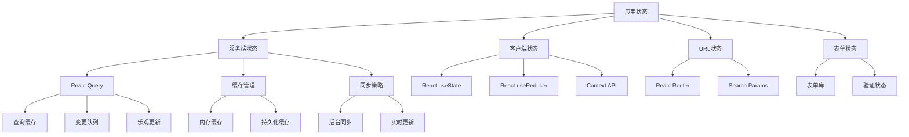

# 状态管理策略深度分析

> 🎛️ 深度解析 AgentFlow-FE 基于 React Query 的服务端状态管理与本地状态策略

## 🎯 状态管理架构概览

### 状态分层策略



### 状态管理原则

```typescript
interface StateManagementPrinciples {
  // 状态分离原则
  separation: {
    serverState: "由 React Query 管理";
    clientState: "由 React 内置 Hooks 管理";
    urlState: "由 React Router 管理";
    formState: "由表单库管理";
  };
  
  // 单向数据流
  dataFlow: {
    direction: "自顶向下";
    updates: "事件驱动更新";
    consistency: "状态一致性保证";
  };
  
  // 状态范围
  scope: {
    global: "应用级状态（主题、认证）";
    page: "页面级状态（过滤器、分页）";
    component: "组件级状态（展开/折叠）";
    form: "表单状态（输入值、验证）";
  };
}
```

## 🌐 服务端状态管理

### React Query 集成策略

```typescript
// 服务端状态管理核心实现
interface ServerStateManagement {
  // 数据获取策略
  fetching: {
    queries: "useQuery for data fetching";
    mutations: "useMutation for data modification";
    prefetching: "SSR and route prefetching";
    background: "background refetching";
  };
  
  // 缓存策略
  caching: {
    memory: "in-memory query cache";
    persistence: "optional localStorage persistence";
    invalidation: "smart cache invalidation";
    gc: "automatic garbage collection";
  };
  
  // 同步策略
  synchronization: {
    realtime: "WebSocket integration";
    polling: "interval-based polling";
    focus: "refetch on window focus";
    reconnect: "refetch on network reconnect";
  };
}

// 服务端状态 Hooks 封装
export class ServerStateHooks {
  // Agent 数据管理
  static useAgentState(agentId?: string) {
    const agentsQuery = useQuery({
      queryKey: queryKeys.agents.list(),
      queryFn: () => AgentService.getList(),
      staleTime: 5 * 60 * 1000,
    });
    
    const agentQuery = useQuery({
      queryKey: queryKeys.agents.detail(agentId!),
      queryFn: () => AgentService.getById(agentId!),
      enabled: !!agentId,
    });
    
    const createMutation = useMutation({
      mutationFn: AgentService.create,
      onSuccess: () => {
        queryClient.invalidateQueries({ queryKey: queryKeys.agents.all });
      },
    });
    
    const updateMutation = useMutation({
      mutationFn: ({ id, data }: { id: string; data: any }) => 
        AgentService.update(id, data),
      onSuccess: (_, { id }) => {
        queryClient.invalidateQueries({ queryKey: queryKeys.agents.detail(id) });
        queryClient.invalidateQueries({ queryKey: queryKeys.agents.list() });
      },
    });
    
    const deleteMutation = useMutation({
      mutationFn: AgentService.delete,
      onSuccess: () => {
        queryClient.invalidateQueries({ queryKey: queryKeys.agents.all });
      },
    });
    
    return {
      // 查询状态
      agents: agentsQuery.data || [],
      agent: agentQuery.data,
      isLoading: agentsQuery.isLoading || agentQuery.isLoading,
      error: agentsQuery.error || agentQuery.error,
      
      // 变更操作
      createAgent: createMutation.mutate,
      updateAgent: updateMutation.mutate,
      deleteAgent: deleteMutation.mutate,
      
      // 变更状态
      isCreating: createMutation.isLoading,
      isUpdating: updateMutation.isLoading,
      isDeleting: deleteMutation.isLoading,
    };
  }
  
  // Job 数据管理
  static useJobState(jobId?: string) {
    const jobsQuery = useQuery({
      queryKey: queryKeys.jobs.list(),
      queryFn: () => JobService.getList(),
    });
    
    const jobQuery = useQuery({
      queryKey: queryKeys.jobs.detail(jobId!),
      queryFn: () => JobService.getById(jobId!),
      enabled: !!jobId,
    });
    
    // Job 特有的状态管理
    const runJobMutation = useMutation({
      mutationFn: (id: string) => JobService.run(id),
      onSuccess: (_, id) => {
        // 运行后更新 Job 状态
        queryClient.invalidateQueries({ queryKey: queryKeys.jobs.detail(id) });
      },
    });
    
    const stopJobMutation = useMutation({
      mutationFn: (id: string) => JobService.stop(id),
      onSuccess: (_, id) => {
        queryClient.invalidateQueries({ queryKey: queryKeys.jobs.detail(id) });
      },
    });
    
    return {
      jobs: jobsQuery.data || [],
      job: jobQuery.data,
      isLoading: jobsQuery.isLoading || jobQuery.isLoading,
      error: jobsQuery.error || jobQuery.error,
      
      // Job 操作
      runJob: runJobMutation.mutate,
      stopJob: stopJobMutation.mutate,
      isRunning: runJobMutation.isLoading,
      isStopping: stopJobMutation.isLoading,
    };
  }
}
```

### 乐观更新策略

```typescript
// 乐观更新实现
class OptimisticUpdates {
  // Agent 更新的乐观策略
  static useOptimisticAgentUpdate() {
    const queryClient = useQueryClient();
    
    return useMutation({
      mutationFn: ({ id, data }: { id: string; data: Partial<Agent> }) =>
        AgentService.update(id, data),
      
      // 乐观更新
      onMutate: async ({ id, data }) => {
        // 取消正在进行的查询
        await queryClient.cancelQueries({ queryKey: queryKeys.agents.detail(id) });
        
        // 获取当前数据
        const previousAgent = queryClient.getQueryData<Agent>(
          queryKeys.agents.detail(id)
        );
        
        // 乐观更新
        queryClient.setQueryData<Agent>(
          queryKeys.agents.detail(id),
          (old) => old ? { ...old, ...data } : undefined
        );
        
        // 同时更新列表中的数据
        queryClient.setQueryData<Agent[]>(
          queryKeys.agents.list(),
          (old) => old ? old.map(agent => 
            agent.id === id ? { ...agent, ...data } : agent
          ) : []
        );
        
        return { previousAgent, id };
      },
      
      // 成功后确认更新
      onSuccess: (updatedAgent, { id }) => {
        queryClient.setQueryData(queryKeys.agents.detail(id), updatedAgent);
      },
      
      // 失败时回滚
      onError: (error, { id }, context) => {
        if (context?.previousAgent) {
          queryClient.setQueryData(
            queryKeys.agents.detail(id),
            context.previousAgent
          );
        }
        console.error('Update failed, rolling back:', error);
      },
      
      // 完成后重新获取
      onSettled: (_, __, { id }) => {
        queryClient.invalidateQueries({ queryKey: queryKeys.agents.detail(id) });
      },
    });
  }
  
  // 列表项删除的乐观策略
  static useOptimisticDelete<T extends { id: string }>(
    queryKey: unknown[],
    deleteFn: (id: string) => Promise<void>
  ) {
    const queryClient = useQueryClient();
    
    return useMutation({
      mutationFn: deleteFn,
      
      onMutate: async (id: string) => {
        await queryClient.cancelQueries({ queryKey });
        
        const previousData = queryClient.getQueryData<T[]>(queryKey);
        
        // 乐观删除
        queryClient.setQueryData<T[]>(
          queryKey,
          (old) => old ? old.filter(item => item.id !== id) : []
        );
        
        return { previousData, id };
      },
      
      onError: (error, id, context) => {
        // 回滚删除
        if (context?.previousData) {
          queryClient.setQueryData(queryKey, context.previousData);
        }
      },
      
      onSettled: () => {
        queryClient.invalidateQueries({ queryKey });
      },
    });
  }
}
```

## 🎨 客户端状态管理

### React 内置状态管理

```typescript
// 客户端状态管理模式
interface ClientStatePatterns {
  // 组件级状态
  componentLevel: {
    useState: "简单状态值";
    useReducer: "复杂状态逻辑";
    useRef: "DOM引用和可变值";
    useCallback: "函数缓存";
    useMemo: "计算值缓存";
  };
  
  // 应用级状态
  applicationLevel: {
    Context: "全局状态共享";
    customHooks: "状态逻辑复用";
    providers: "状态提供者模式";
  };
}

// 主题状态管理
interface ThemeState {
  mode: 'light' | 'dark';
  primaryColor: string;
  fontSize: 'small' | 'medium' | 'large';
}

const ThemeContext = createContext<{
  theme: ThemeState;
  setTheme: (theme: Partial<ThemeState>) => void;
  toggleMode: () => void;
} | null>(null);

export const ThemeProvider: React.FC<{ children: React.ReactNode }> = ({ 
  children 
}) => {
  const [theme, setThemeState] = useState<ThemeState>({
    mode: 'light',
    primaryColor: '#1976d2',
    fontSize: 'medium',
  });
  
  // 持久化主题设置
  useEffect(() => {
    const savedTheme = localStorage.getItem('theme');
    if (savedTheme) {
      try {
        setThemeState(JSON.parse(savedTheme));
      } catch (error) {
        console.error('Failed to parse saved theme:', error);
      }
    }
  }, []);
  
  useEffect(() => {
    localStorage.setItem('theme', JSON.stringify(theme));
    document.documentElement.setAttribute('data-theme', theme.mode);
  }, [theme]);
  
  const setTheme = useCallback((newTheme: Partial<ThemeState>) => {
    setThemeState(prev => ({ ...prev, ...newTheme }));
  }, []);
  
  const toggleMode = useCallback(() => {
    setTheme({ mode: theme.mode === 'light' ? 'dark' : 'light' });
  }, [theme.mode, setTheme]);
  
  const value = useMemo(() => ({
    theme,
    setTheme,
    toggleMode,
  }), [theme, setTheme, toggleMode]);
  
  return (
    <ThemeContext.Provider value={value}>
      {children}
    </ThemeContext.Provider>
  );
};

export const useTheme = () => {
  const context = useContext(ThemeContext);
  if (!context) {
    throw new Error('useTheme must be used within ThemeProvider');
  }
  return context;
};

// 用户认证状态管理
interface AuthState {
  user: User | null;
  token: string | null;
  isAuthenticated: boolean;
  isLoading: boolean;
}

interface AuthActions {
  login: (credentials: LoginCredentials) => Promise<void>;
  logout: () => void;
  refreshToken: () => Promise<void>;
}

const AuthContext = createContext<(AuthState & AuthActions) | null>(null);

export const AuthProvider: React.FC<{ children: React.ReactNode }> = ({ 
  children 
}) => {
  const [state, setState] = useState<AuthState>({
    user: null,
    token: null,
    isAuthenticated: false,
    isLoading: true,
  });
  
  // 初始化认证状态
  useEffect(() => {
    const initAuth = async () => {
      const token = localStorage.getItem('auth_token');
      if (token) {
        try {
          const user = await AuthService.verifyToken(token);
          setState({
            user,
            token,
            isAuthenticated: true,
            isLoading: false,
          });
        } catch (error) {
          localStorage.removeItem('auth_token');
          setState(prev => ({ ...prev, isLoading: false }));
        }
      } else {
        setState(prev => ({ ...prev, isLoading: false }));
      }
    };
    
    initAuth();
  }, []);
  
  const login = useCallback(async (credentials: LoginCredentials) => {
    setState(prev => ({ ...prev, isLoading: true }));
    
    try {
      const { user, token } = await AuthService.login(credentials);
      localStorage.setItem('auth_token', token);
      setState({
        user,
        token,
        isAuthenticated: true,
        isLoading: false,
      });
    } catch (error) {
      setState(prev => ({ ...prev, isLoading: false }));
      throw error;
    }
  }, []);
  
  const logout = useCallback(() => {
    localStorage.removeItem('auth_token');
    setState({
      user: null,
      token: null,
      isAuthenticated: false,
      isLoading: false,
    });
  }, []);
  
  const refreshToken = useCallback(async () => {
    const currentToken = state.token;
    if (!currentToken) return;
    
    try {
      const { token: newToken } = await AuthService.refreshToken(currentToken);
      localStorage.setItem('auth_token', newToken);
      setState(prev => ({ ...prev, token: newToken }));
    } catch (error) {
      logout();
      throw error;
    }
  }, [state.token, logout]);
  
  const value = useMemo(() => ({
    ...state,
    login,
    logout,
    refreshToken,
  }), [state, login, logout, refreshToken]);
  
  return (
    <AuthContext.Provider value={value}>
      {children}
    </AuthContext.Provider>
  );
};

export const useAuth = () => {
  const context = useContext(AuthContext);
  if (!context) {
    throw new Error('useAuth must be used within AuthProvider');
  }
  return context;
};
```

### 复杂状态逻辑管理

```typescript
// 使用 useReducer 管理复杂状态
interface FilterState {
  search: string;
  category: string;
  status: string;
  sortBy: string;
  sortOrder: 'asc' | 'desc';
  page: number;
  pageSize: number;
}

type FilterAction =
  | { type: 'SET_SEARCH'; payload: string }
  | { type: 'SET_CATEGORY'; payload: string }
  | { type: 'SET_STATUS'; payload: string }
  | { type: 'SET_SORT'; payload: { sortBy: string; sortOrder: 'asc' | 'desc' } }
  | { type: 'SET_PAGE'; payload: number }
  | { type: 'RESET_FILTERS' }
  | { type: 'LOAD_FROM_URL'; payload: Partial<FilterState> };

const filterReducer = (state: FilterState, action: FilterAction): FilterState => {
  switch (action.type) {
    case 'SET_SEARCH':
      return { ...state, search: action.payload, page: 1 };
    
    case 'SET_CATEGORY':
      return { ...state, category: action.payload, page: 1 };
    
    case 'SET_STATUS':
      return { ...state, status: action.payload, page: 1 };
    
    case 'SET_SORT':
      return { ...state, ...action.payload, page: 1 };
    
    case 'SET_PAGE':
      return { ...state, page: action.payload };
    
    case 'RESET_FILTERS':
      return {
        search: '',
        category: '',
        status: '',
        sortBy: 'createdAt',
        sortOrder: 'desc',
        page: 1,
        pageSize: 20,
      };
    
    case 'LOAD_FROM_URL':
      return { ...state, ...action.payload };
    
    default:
      return state;
  }
};

// 过滤器状态 Hook
export const useFilters = (initialState?: Partial<FilterState>) => {
  const [state, dispatch] = useReducer(filterReducer, {
    search: '',
    category: '',
    status: '',
    sortBy: 'createdAt',
    sortOrder: 'desc',
    page: 1,
    pageSize: 20,
    ...initialState,
  });
  
  // URL 同步
  const [searchParams, setSearchParams] = useSearchParams();
  
  useEffect(() => {
    // 从 URL 加载过滤器状态
    const urlState: Partial<FilterState> = {};
    
    const search = searchParams.get('search');
    const category = searchParams.get('category');
    const status = searchParams.get('status');
    const sortBy = searchParams.get('sortBy');
    const sortOrder = searchParams.get('sortOrder') as 'asc' | 'desc';
    const page = searchParams.get('page');
    
    if (search) urlState.search = search;
    if (category) urlState.category = category;
    if (status) urlState.status = status;
    if (sortBy) urlState.sortBy = sortBy;
    if (sortOrder) urlState.sortOrder = sortOrder;
    if (page) urlState.page = parseInt(page, 10);
    
    if (Object.keys(urlState).length > 0) {
      dispatch({ type: 'LOAD_FROM_URL', payload: urlState });
    }
  }, [searchParams]);
  
  useEffect(() => {
    // 同步状态到 URL
    const params = new URLSearchParams();
    
    if (state.search) params.set('search', state.search);
    if (state.category) params.set('category', state.category);
    if (state.status) params.set('status', state.status);
    if (state.sortBy !== 'createdAt') params.set('sortBy', state.sortBy);
    if (state.sortOrder !== 'desc') params.set('sortOrder', state.sortOrder);
    if (state.page !== 1) params.set('page', state.page.toString());
    
    setSearchParams(params, { replace: true });
  }, [state, setSearchParams]);
  
  const actions = useMemo(() => ({
    setSearch: (search: string) => 
      dispatch({ type: 'SET_SEARCH', payload: search }),
    
    setCategory: (category: string) => 
      dispatch({ type: 'SET_CATEGORY', payload: category }),
    
    setStatus: (status: string) => 
      dispatch({ type: 'SET_STATUS', payload: status }),
    
    setSort: (sortBy: string, sortOrder: 'asc' | 'desc') => 
      dispatch({ type: 'SET_SORT', payload: { sortBy, sortOrder } }),
    
    setPage: (page: number) => 
      dispatch({ type: 'SET_PAGE', payload: page }),
    
    resetFilters: () => 
      dispatch({ type: 'RESET_FILTERS' }),
  }), []);
  
  return { state, actions };
};
```

## 📝 表单状态管理

### 表单状态策略

```typescript
// 表单状态管理模式
interface FormStateManagement {
  // 简单表单
  simple: {
    pattern: "useState + controlled components";
    validation: "inline validation";
    submission: "manual submission handling";
  };
  
  // 复杂表单
  complex: {
    pattern: "useReducer + form library";
    validation: "schema-based validation";
    submission: "optimistic updates";
  };
  
  // 表单库集成
  libraries: {
    reactHookForm: "performance-focused";
    formik: "feature-rich";
    custom: "lightweight custom solution";
  };
}

// 自定义表单 Hook
export const useForm = <T extends Record<string, any>>(
  initialValues: T,
  validationSchema?: any
) => {
  const [values, setValues] = useState<T>(initialValues);
  const [errors, setErrors] = useState<Partial<Record<keyof T, string>>>({});
  const [touched, setTouched] = useState<Partial<Record<keyof T, boolean>>>({});
  const [isSubmitting, setIsSubmitting] = useState(false);
  
  const setValue = useCallback(<K extends keyof T>(
    field: K,
    value: T[K]
  ) => {
    setValues(prev => ({ ...prev, [field]: value }));
    
    // 清除该字段的错误
    if (errors[field]) {
      setErrors(prev => ({ ...prev, [field]: undefined }));
    }
  }, [errors]);
  
  const setFieldTouched = useCallback(<K extends keyof T>(
    field: K,
    isTouched = true
  ) => {
    setTouched(prev => ({ ...prev, [field]: isTouched }));
  }, []);
  
  const validate = useCallback(() => {
    if (!validationSchema) return true;
    
    try {
      validationSchema.validateSync(values, { abortEarly: false });
      setErrors({});
      return true;
    } catch (validationError: any) {
      const newErrors: Partial<Record<keyof T, string>> = {};
      
      validationError.inner?.forEach((error: any) => {
        if (error.path) {
          newErrors[error.path as keyof T] = error.message;
        }
      });
      
      setErrors(newErrors);
      return false;
    }
  }, [values, validationSchema]);
  
  const handleSubmit = useCallback(
    (onSubmit: (values: T) => Promise<void> | void) => 
      async (e: React.FormEvent) => {
        e.preventDefault();
        
        if (!validate()) return;
        
        setIsSubmitting(true);
        
        try {
          await onSubmit(values);
        } catch (error) {
          console.error('Form submission error:', error);
        } finally {
          setIsSubmitting(false);
        }
      },
    [values, validate]
  );
  
  const reset = useCallback(() => {
    setValues(initialValues);
    setErrors({});
    setTouched({});
    setIsSubmitting(false);
  }, [initialValues]);
  
  const getFieldProps = useCallback(<K extends keyof T>(field: K) => ({
    value: values[field],
    onChange: (value: T[K]) => setValue(field, value),
    onBlur: () => setFieldTouched(field),
    error: touched[field] ? errors[field] : undefined,
  }), [values, setValue, setFieldTouched, touched, errors]);
  
  return {
    values,
    errors,
    touched,
    isSubmitting,
    setValue,
    setFieldTouched,
    validate,
    handleSubmit,
    reset,
    getFieldProps,
  };
};

// Agent 创建表单示例
export const useAgentForm = (initialAgent?: Partial<Agent>) => {
  const createMutation = useMutation({
    mutationFn: AgentService.create,
  });
  
  const updateMutation = useMutation({
    mutationFn: ({ id, data }: { id: string; data: Partial<Agent> }) =>
      AgentService.update(id, data),
  });
  
  const form = useForm(
    {
      name: '',
      description: '',
      type: 'assistant',
      config: {},
      ...initialAgent,
    },
    agentValidationSchema
  );
  
  const handleSubmit = form.handleSubmit(async (values) => {
    if (initialAgent?.id) {
      await updateMutation.mutateAsync({ 
        id: initialAgent.id, 
        data: values 
      });
    } else {
      await createMutation.mutateAsync(values);
    }
  });
  
  return {
    ...form,
    handleSubmit,
    isLoading: createMutation.isLoading || updateMutation.isLoading,
    error: createMutation.error || updateMutation.error,
  };
};
```

## 🔄 状态同步策略

### 实时状态同步

```typescript
// WebSocket 状态同步
class RealtimeStateSync {
  private ws: WebSocket | null = null;
  private queryClient: QueryClient;
  private reconnectAttempts = 0;
  private maxReconnectAttempts = 5;
  
  constructor(queryClient: QueryClient) {
    this.queryClient = queryClient;
  }
  
  connect() {
    const wsUrl = process.env.REACT_APP_WS_URL || 'ws://localhost:8008';
    this.ws = new WebSocket(wsUrl);
    
    this.ws.onopen = () => {
      console.log('WebSocket connected');
      this.reconnectAttempts = 0;
    };
    
    this.ws.onmessage = (event) => {
      try {
        const message = JSON.parse(event.data);
        this.handleMessage(message);
      } catch (error) {
        console.error('Failed to parse WebSocket message:', error);
      }
    };
    
    this.ws.onclose = () => {
      console.log('WebSocket disconnected');
      this.reconnect();
    };
    
    this.ws.onerror = (error) => {
      console.error('WebSocket error:', error);
    };
  }
  
  private handleMessage(message: any) {
    switch (message.type) {
      case 'agent_updated':
        this.queryClient.invalidateQueries({ 
          queryKey: queryKeys.agents.detail(message.data.id) 
        });
        break;
        
      case 'job_status_changed':
        this.queryClient.invalidateQueries({ 
          queryKey: queryKeys.jobs.detail(message.data.id) 
        });
        break;
        
      case 'new_agent_created':
        this.queryClient.invalidateQueries({ 
          queryKey: queryKeys.agents.list() 
        });
        break;
        
      default:
        console.log('Unknown message type:', message.type);
    }
  }
  
  private reconnect() {
    if (this.reconnectAttempts < this.maxReconnectAttempts) {
      const delay = Math.pow(2, this.reconnectAttempts) * 1000;
      setTimeout(() => {
        this.reconnectAttempts++;
        this.connect();
      }, delay);
    }
  }
  
  disconnect() {
    if (this.ws) {
      this.ws.close();
      this.ws = null;
    }
  }
}

// 实时状态 Hook
export const useRealtimeSync = () => {
  const queryClient = useQueryClient();
  const syncRef = useRef<RealtimeStateSync | null>(null);
  
  useEffect(() => {
    syncRef.current = new RealtimeStateSync(queryClient);
    syncRef.current.connect();
    
    return () => {
      syncRef.current?.disconnect();
    };
  }, [queryClient]);
  
  return {
    isConnected: syncRef.current?.ws?.readyState === WebSocket.OPEN,
  };
};
```

## 📊 状态管理评估总结

### 当前实现评分

| 维度 | 评分 | 说明 |
|------|------|------|
| **服务端状态** | 9/10 | React Query 集成完善，缓存策略优秀 |
| **客户端状态** | 7/10 | 基础 React Hooks，缺少全局状态管理 |
| **表单状态** | 5/10 | 缺少统一的表单状态管理方案 |
| **URL状态** | 8/10 | React Router 集成良好 |
| **状态同步** | 6/10 | 基础同步机制，缺少实时更新 |
| **性能优化** | 8/10 | 查询缓存和乐观更新策略合理 |

### 优化建议优先级

#### 高优先级
1. **完善全局状态管理**：实现主题、认证等全局状态的 Context
2. **统一表单状态管理**：选择表单库或实现统一的表单 Hooks
3. **实现乐观更新**：为关键操作添加乐观更新策略

#### 中优先级
1. **添加实时状态同步**：WebSocket 集成，实时数据更新
2. **状态持久化**：关键状态的本地存储和恢复
3. **状态调试工具**：开发环境的状态调试和监控

#### 低优先级
1. **状态性能监控**：状态更新性能指标收集
2. **状态时间旅行**：开发环境的状态回溯功能
3. **状态测试工具**：状态管理的单元测试支持

通过这些优化，状态管理系统将更加完善和高效，为复杂应用提供可靠的状态管理基础。