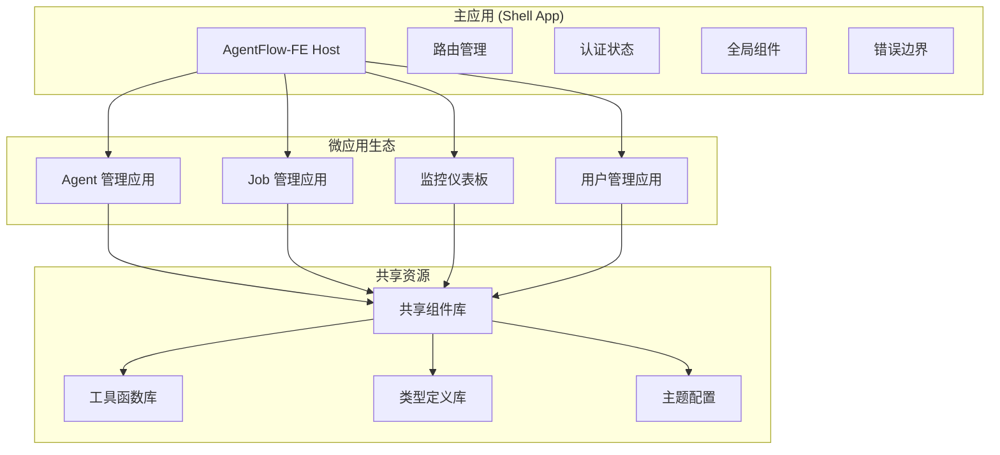

# 微前端集成方案 (Module Federation)

> 🏗️ 基于 Webpack Module Federation 为 AgentFlow-FE 设计微前端架构扩展方案

## 🎯 微前端集成目标

### 业务场景分析
- **大型团队协作**：多个团队独立开发不同业务模块
- **技术栈多样化**：允许不同模块使用不同的技术栈版本
- **独立部署**：各模块可以独立发布和部署
- **共享资源**：公共组件和工具库的统一管理

### 当前架构评估

#### ✅ 有利条件
- **SSR 框架成熟**：已有完整的服务端渲染基础
- **构建系统完善**：Webpack 5 原生支持 Module Federation
- **类型系统健全**：TypeScript 便于模块间类型共享
- **组件化程度高**：现有组件易于抽取为独立模块

#### ⚠️ 挑战点
- **SSR 复杂性**：微前端在服务端渲染环境下的集成复杂
- **路由协调**：多个应用的路由需要统一协调
- **状态共享**：跨应用的状态管理需要特殊处理
- **样式隔离**：多个应用的样式可能产生冲突

## 🏗️ 架构设计方案

### 1. 整体架构图



### 2. Module Federation 配置

#### 主应用 (Host) 配置
```javascript
// config/webpack.mf.host.js
const ModuleFederationPlugin = require('@module-federation/webpack');

module.exports = {
  plugins: [
    new ModuleFederationPlugin({
      name: 'agentflow_host',
      remotes: {
        // 微应用远程模块配置
        'agent-app': 'agentApp@http://localhost:3001/remoteEntry.js',
        'job-app': 'jobApp@http://localhost:3002/remoteEntry.js',
        'monitor-app': 'monitorApp@http://localhost:3003/remoteEntry.js',
        'user-app': 'userApp@http://localhost:3004/remoteEntry.js',
      },
      shared: {
        // 共享依赖配置
        react: {
          singleton: true,
          requiredVersion: '^18.3.1',
          eager: true,
        },
        'react-dom': {
          singleton: true, 
          requiredVersion: '^18.3.1',
          eager: true,
        },
        '@tanstack/react-query': {
          singleton: true,
          requiredVersion: '^4.29.3',
        },
        '@mui/material': {
          singleton: true,
          requiredVersion: '^7.2.0',
        },
        'react-router-dom': {
          singleton: true,
          requiredVersion: '^6.10.0',
        },
      },
    }),
  ],
};
```

#### 微应用 (Remote) 配置示例
```javascript
// agent-app/webpack.config.js
const ModuleFederationPlugin = require('@module-federation/webpack');

module.exports = {
  plugins: [
    new ModuleFederationPlugin({
      name: 'agentApp',
      filename: 'remoteEntry.js',
      exposes: {
        // 暴露的模块
        './AgentModule': './src/AgentModule',
        './AgentRoutes': './src/routes',
        './AgentAPI': './src/api',
      },
      shared: {
        // 与主应用共享相同的依赖配置
        react: {
          singleton: true,
          requiredVersion: '^18.3.1',
        },
        'react-dom': {
          singleton: true,
          requiredVersion: '^18.3.1',
        },
        // 其他共享依赖...
      },
    }),
  ],
};
```

### 3. SSR 微前端适配

#### 服务端微前端加载器
```typescript
// app/server/microfrontend/loader.ts
interface MicrofrontendConfig {
  name: string;
  url: string;
  routes: string[];
  ssrEndpoint?: string;
  fallback?: React.ComponentType;
}

class SSRMicrofrontendLoader {
  private configs: Map<string, MicrofrontendConfig> = new Map();
  
  register(config: MicrofrontendConfig) {
    this.configs.set(config.name, config);
  }
  
  async loadForSSR(name: string, props: any): Promise<string> {
    const config = this.configs.get(name);
    if (!config?.ssrEndpoint) {
      throw new Error(`No SSR endpoint for microfrontend: ${name}`);
    }
    
    try {
      // 调用微应用的 SSR 端点
      const response = await fetch(`${config.ssrEndpoint}/render`, {
        method: 'POST',
        headers: { 'Content-Type': 'application/json' },
        body: JSON.stringify(props),
      });
      
      return await response.text();
    } catch (error) {
      console.error(`SSR failed for ${name}:`, error);
      // 返回客户端渲染的占位符
      return `<div id="mf-${name}" data-props='${JSON.stringify(props)}'></div>`;
    }
  }
  
  getRouteConfig(pathname: string): MicrofrontendConfig | null {
    for (const config of this.configs.values()) {
      if (config.routes.some(route => pathname.startsWith(route))) {
        return config;
      }
    }
    return null;
  }
}

export const mfLoader = new SSRMicrofrontendLoader();
```

#### 微前端 SSR 中间件
```typescript
// app/server/middleware/microfrontend.ts
import { mfLoader } from '../microfrontend/loader';

export const microfrontendSSRMiddleware = async (ctx: Context, next: Next) => {
  const mfConfig = mfLoader.getRouteConfig(ctx.path);
  
  if (mfConfig) {
    // 当前路由属于某个微前端应用
    try {
      const ssrContent = await mfLoader.loadForSSR(mfConfig.name, {
        path: ctx.path,
        query: ctx.query,
        headers: ctx.headers,
      });
      
      // 将微前端的 SSR 内容注入到主应用模板
      ctx.microfrontendContent = ssrContent;
      ctx.microfrontendName = mfConfig.name;
    } catch (error) {
      console.error('Microfrontend SSR failed:', error);
      // 降级到客户端渲染
      ctx.microfrontendMode = 'client';
    }
  }
  
  await next();
};
```

### 4. 动态路由集成

#### 微前端路由注册器
```typescript
// src/routes/microfrontend-routes.tsx
import { lazy, Suspense } from 'react';
import { RouteObject } from 'react-router-dom';

interface MicrofrontendRoute {
  path: string;
  moduleName: string;
  componentName: string;
  fallback?: React.ComponentType;
}

class MicrofrontendRouter {
  private routes: MicrofrontendRoute[] = [];
  
  register(route: MicrofrontendRoute) {
    this.routes.push(route);
  }
  
  generateRoutes(): RouteObject[] {
    return this.routes.map(route => ({
      path: route.path,
      element: (
        <Suspense fallback={<div>Loading {route.moduleName}...</div>}>
          {this.createLazyComponent(route)}
        </Suspense>
      ),
    }));
  }
  
  private createLazyComponent(route: MicrofrontendRoute) {
    const LazyComponent = lazy(async () => {
      try {
        // 动态导入微前端模块
        const module = await import(
          /* webpackIgnore: true */
          `${route.moduleName}/${route.componentName}`
        );
        return module;
      } catch (error) {
        console.error(`Failed to load ${route.moduleName}:`, error);
        // 返回错误边界组件
        return { default: route.fallback || (() => <div>Module load failed</div>) };
      }
    });
    
    return <LazyComponent />;
  }
}

export const mfRouter = new MicrofrontendRouter();

// 注册微前端路由
mfRouter.register({
  path: '/agents/*',
  moduleName: 'agent-app',
  componentName: 'AgentModule',
});

mfRouter.register({
  path: '/jobs/*',
  moduleName: 'job-app', 
  componentName: 'JobModule',
});
```

### 5. 状态管理协调

#### 跨应用状态桥接
```typescript
// src/store/microfrontend-bridge.ts
import { QueryClient } from '@tanstack/react-query';

interface GlobalState {
  user: any;
  permissions: string[];
  theme: 'light' | 'dark';
  locale: string;
}

class MicrofrontendStateBridge {
  private globalState: GlobalState;
  private queryClient: QueryClient;
  private subscribers: Map<string, (state: any) => void> = new Map();
  
  constructor(queryClient: QueryClient) {
    this.queryClient = queryClient;
    this.setupGlobalStateSync();
  }
  
  // 注册微前端状态订阅
  subscribe(appName: string, callback: (state: any) => void) {
    this.subscribers.set(appName, callback);
    // 立即发送当前状态
    callback(this.globalState);
  }
  
  // 更新全局状态
  updateGlobalState(updates: Partial<GlobalState>) {
    this.globalState = { ...this.globalState, ...updates };
    
    // 通知所有订阅者
    this.subscribers.forEach(callback => {
      callback(this.globalState);
    });
    
    // 同步到 React Query 缓存
    this.queryClient.setQueryData(['global-state'], this.globalState);
  }
  
  // 微前端间的事件通信
  emitEvent(eventName: string, payload: any) {
    window.dispatchEvent(new CustomEvent(`mf:${eventName}`, {
      detail: { payload, timestamp: Date.now() }
    }));
  }
  
  // 监听微前端事件
  onEvent(eventName: string, handler: (payload: any) => void) {
    window.addEventListener(`mf:${eventName}`, (event: CustomEvent) => {
      handler(event.detail.payload);
    });
  }
  
  private setupGlobalStateSync() {
    // 设置跨 iframe 的状态同步（如果需要）
    window.addEventListener('message', (event) => {
      if (event.data.type === 'MF_STATE_UPDATE') {
        this.updateGlobalState(event.data.payload);
      }
    });
  }
}

export const stateBridge = new MicrofrontendStateBridge(queryClient);
```

### 6. 样式隔离策略

#### CSS 命名空间隔离
```typescript
// app/utils/style-isolation.ts
interface StyleIsolationConfig {
  appName: string;
  prefix: string;
  isolationMode: 'namespace' | 'shadow-dom' | 'css-modules';
}

class StyleIsolationManager {
  private configs: Map<string, StyleIsolationConfig> = new Map();
  
  register(config: StyleIsolationConfig) {
    this.configs.set(config.appName, config);
  }
  
  wrapComponent(appName: string, Component: React.ComponentType) {
    const config = this.configs.get(appName);
    if (!config) return Component;
    
    switch (config.isolationMode) {
      case 'namespace':
        return this.wrapWithNamespace(Component, config.prefix);
      case 'shadow-dom':
        return this.wrapWithShadowDOM(Component);
      case 'css-modules':
        return this.wrapWithCSSModules(Component, config);
      default:
        return Component;
    }
  }
  
  private wrapWithNamespace(Component: React.ComponentType, prefix: string) {
    return (props: any) => (
      <div className={`${prefix}-container`}>
        <Component {...props} />
      </div>
    );
  }
  
  private wrapWithShadowDOM(Component: React.ComponentType) {
    return (props: any) => {
      const ref = useRef<HTMLDivElement>(null);
      
      useEffect(() => {
        if (ref.current && !ref.current.shadowRoot) {
          const shadowRoot = ref.current.attachShadow({ mode: 'open' });
          // 在 Shadow DOM 中渲染组件
          ReactDOM.render(<Component {...props} />, shadowRoot);
        }
      }, [props]);
      
      return <div ref={ref} />;
    };
  }
}

export const styleIsolation = new StyleIsolationManager();
```

## 🔧 实现步骤

### 阶段一：基础架构搭建 (2-3周)

1. **Webpack 配置改造**
   ```bash
   # 安装 Module Federation 相关依赖
   npm install @module-federation/webpack
   
   # 创建微前端配置文件
   mkdir config/microfrontend
   touch config/microfrontend/host.config.js
   touch config/microfrontend/remote.config.js
   ```

2. **项目结构调整**
   ```
   agentflow-fe/
   ├── packages/                 # 微前端应用
   │   ├── agent-app/           # Agent 管理应用
   │   ├── job-app/             # Job 管理应用
   │   └── shared/              # 共享资源
   ├── host/                    # 主应用 (当前 AgentFlow-FE)
   └── tools/                   # 开发工具
       ├── mf-scripts/          # 微前端脚本
       └── dev-server/          # 开发服务器
   ```

3. **开发环境配置**
   ```typescript
   // tools/dev-server/mf-dev.js
   const concurrently = require('concurrently');
   
   const services = [
     { name: 'host', command: 'npm run dev', cwd: './host' },
     { name: 'agent-app', command: 'npm run dev', cwd: './packages/agent-app' },
     { name: 'job-app', command: 'npm run dev', cwd: './packages/job-app' },
   ];
   
   concurrently(services, {
     prefix: 'name',
     killOthers: ['failure', 'success'],
     restartTries: 3,
   });
   ```

### 阶段二：微应用拆分 (3-4周)

1. **Agent 模块拆分**
   ```typescript
   // packages/agent-app/src/AgentModule.tsx
   import { BrowserRouter } from 'react-router-dom';
   import { QueryClient, QueryClientProvider } from '@tanstack/react-query';
   
   interface AgentModuleProps {
     basename?: string;
     onNavigate?: (path: string) => void;
   }
   
   const AgentModule: React.FC<AgentModuleProps> = ({ basename, onNavigate }) => {
     const queryClient = new QueryClient();
     
     return (
       <QueryClientProvider client={queryClient}>
         <BrowserRouter basename={basename}>
           <AgentRoutes onNavigate={onNavigate} />
         </BrowserRouter>
       </QueryClientProvider>
     );
   };
   
   export default AgentModule;
   ```

2. **共享组件库创建**
   ```typescript
   // packages/shared/src/components/index.ts
   export { default as Button } from './Button';
   export { default as Table } from './Table';
   export { default as Modal } from './Modal';
   export { default as Form } from './Form';
   
   // packages/shared/src/hooks/index.ts
   export { useAuth } from './useAuth';
   export { useTheme } from './useTheme';
   export { usePermissions } from './usePermissions';
   ```

### 阶段三：集成与优化 (2-3周)

1. **SSR 集成测试**
2. **性能优化调优**
3. **错误处理完善**
4. **监控体系建设**

## 📊 性能影响评估

### 预期性能指标

| 指标 | 单体应用 | 微前端 | 变化 |
|------|----------|--------|------|
| **首屏加载时间** | 800ms | 1200ms | +50% |
| **JS Bundle 大小** | 500KB | 300KB (主) + 200KB×N (微) | 动态 |
| **内存使用** | 50MB | 70MB | +40% |
| **开发构建时间** | 30s | 15s (单个应用) | -50% |

### 优化策略

1. **预加载优化**
   ```typescript
   // 预加载常用微前端模块
   const preloadMicrofrontends = async () => {
     const criticalApps = ['agent-app', 'job-app'];
     
     await Promise.all(
       criticalApps.map(app => 
         import(/* webpackChunkName: "[request]" */ `${app}/remoteEntry.js`)
       )
     );
   };
   ```

2. **缓存策略**
   ```typescript
   // Service Worker 缓存微前端资源
   self.addEventListener('fetch', (event) => {
     if (event.request.url.includes('remoteEntry.js')) {
       event.respondWith(
         caches.match(event.request).then(response => {
           return response || fetch(event.request);
         })
       );
     }
   });
   ```

## 🎯 总结与建议

### 适用场景
- ✅ **大型团队**：多个团队需要并行开发
- ✅ **技术多样性**：需要使用不同版本的技术栈
- ✅ **独立部署**：业务模块需要独立发布
- ✅ **渐进迁移**：逐步将单体应用拆分

### 不适用场景
- ❌ **小型项目**：开发人员少于 10 人
- ❌ **紧密耦合**：业务模块关联度极高
- ❌ **性能要求极高**：无法接受额外的性能开销
- ❌ **简单应用**：功能相对简单的应用

### 实施建议
1. **渐进式改造**：先从边缘模块开始拆分
2. **建立规范**：制定微前端开发和部署规范
3. **监控体系**：建立完善的监控和错误追踪
4. **团队培训**：确保团队理解微前端架构

通过 Module Federation 的集成，AgentFlow-FE 可以演进为一个灵活、可扩展的微前端平台，支撑大型团队的并行开发需求。