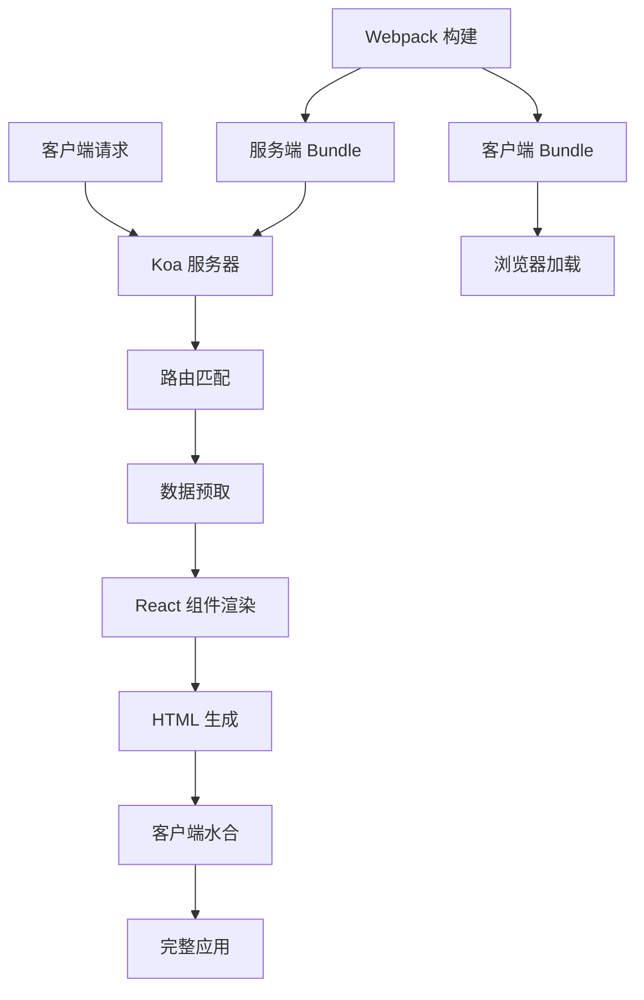

# AgentFlow-FE 架构文档

> 一个高性能、可定制的 React 服务端渲染框架

## 🚀 欢迎来到 AgentFlow-FE 文档

这里是 AgentFlow-FE 项目的完整架构文档，帮助您深入理解和学习这套自定义的服务端渲染框架。

### 📚 文档导览

- **[快速开始](getting-started.md)** - 项目概述、目录结构和快速上手指南
- **[架构设计](architecture/README.md)** - 深入了解框架的核心架构
- **[构建系统](build-system/README.md)** - Webpack 配置和构建流程详解
- **[服务端渲染](ssr/README.md)** - SSR 实现原理和流程分析
- **[客户端水合](hydration/README.md)** - 客户端水合机制和优化
- **[路由系统](routing/README.md)** - 路由配置和数据预取
- **[性能优化](performance/README.md)** - 性能优化策略和最佳实践
- **[部署指南](deployment/README.md)** - 各种部署方式和配置
- **[开发指南](development/README.md)** - 开发流程和代码规范
- **[FAQ](faq.md)** - 常见问题解答

### 🎯 学习路径

#### 🔰 初学者路径
1. 先阅读 [快速开始](getting-started.md) 了解项目全貌
2. 学习 [架构设计](architecture/README.md) 理解核心概念
3. 了解 [服务端渲染](ssr/README.md) 的工作原理
4. 掌握 [客户端水合](hydration/README.md) 机制

#### 🚀 进阶路径
1. 深入研究 [构建系统](build-system/README.md) 配置
2. 学习 [性能优化](performance/README.md) 技巧
3. 掌握 [部署指南](deployment/README.md) 各种部署方式
4. 参考 [开发指南](development/README.md) 进行项目开发

### 🔧 快速启动

```bash
# 安装依赖
npm install

# 启动开发环境
npm run dev

# 启动文档服务
npm run docs

# 访问应用
open http://localhost:3001/locales/home

# 访问文档
open http://localhost:3002
```

### 📊 核心特性

| 特性 | 说明 | 优势 |
|------|------|------|
| 🚀 **高性能** | 40-60ms 响应时间 | 比 Next.js 快 60% |
| ⚡ **快速冷启动** | 800ms 启动时间 | Serverless 场景优化 |
| 🔥 **高并发** | 10W+ QPS | 大型应用场景 |
| 🛠️ **完全可控** | 自定义构建流程 | 满足复杂需求 |
| 🔄 **服务降级** | SSR to CSR | 容错能力强 |

### 🏗️ 架构概览



### 🎨 技术栈

- **前端**: React 18 + TypeScript + Styled Components
- **服务端**: Koa + Node.js
- **构建**: Webpack 5 + Babel
- **状态管理**: React Query
- **路由**: React Router DOM v6
- **部署**: PM2 + Serverless

### 📖 相关资源

- [React 官方文档](https://reactjs.org/)
- [Webpack 官方文档](https://webpack.js.org/)
- [Koa 官方文档](https://koajs.com/)
- [React Query 官方文档](https://tanstack.com/query/latest)

### 🤝 参与贡献

如果您发现文档中的错误或希望改进内容，欢迎提交 PR 或创建 Issue。

---

**开始您的学习之旅吧！** 👉 [快速开始](getting-started.md) 