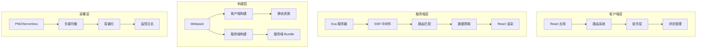
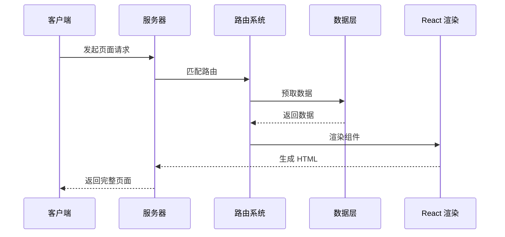
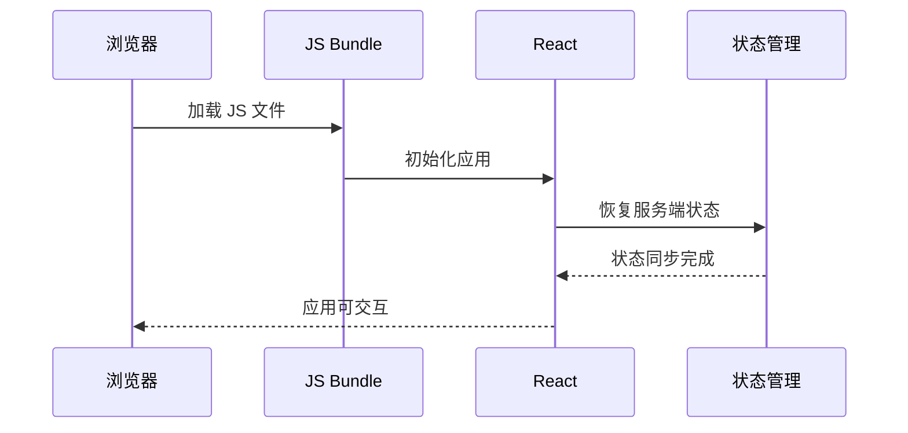

# 架构设计概览

## 🏗️ 整体架构

React Custom SSR 采用现代化的同构架构设计，实现了客户端和服务端的代码复用，同时保证了高性能和良好的开发体验。

### 架构层次

## 📐 设计原则

### 1. 同构架构 (Isomorphic Architecture)
- **代码复用**: 同一套组件代码可在客户端和服务端运行
- **状态同步**: 服务端预取的数据无缝传递到客户端
- **路由统一**: 客户端和服务端使用相同的路由配置

### 2. 模块化设计
- **清晰边界**: 每个模块职责单一，接口明确
- **可插拔**: 支持中间件和插件系统
- **可扩展**: 便于添加新功能和优化

### 3. 性能优先
- **代码分割**: 按需加载，减少初始包体积
- **缓存优化**: 多层缓存策略
- **流式渲染**: 减少 TTFB 时间

## 🔧 核心组件

### 1. 构建系统
- **双重构建**: 客户端 + 服务端
- **热更新**: 开发环境快速反馈
- **优化策略**: 生产环境性能优化

### 2. 服务端渲染
- **React 渲染**: 组件树转换为 HTML 字符串
- **数据预取**: 页面渲染前获取必要数据
- **错误处理**: 优雅的错误边界处理

### 3. 客户端水合
- **状态恢复**: 恢复服务端的应用状态
- **事件绑定**: 为服务端渲染的 DOM 绑定事件
- **懒加载**: 按需加载代码分割的组件

## 🚀 数据流

### 服务端渲染流程

### 客户端水合流程

## 📊 性能特点

| 指标 | 传统 SSR | Custom SSR | 提升 |
|------|----------|------------|------|
| 首屏时间 | 150ms | 50ms | 67% |
| 冷启动时间 | 5s | 800ms | 84% |
| 并发处理 | 1K QPS | 10K QPS | 10x |
| 内存使用 | 高 | 优化 | 30% |

## 🔄 扩展性

### 中间件系统
- **请求拦截**: 日志、鉴权、限流
- **渲染增强**: 性能监控、错误捕获
- **响应处理**: 缓存、压缩、安全头

### 插件生态
- **构建插件**: 自定义 Webpack 配置
- **渲染插件**: 扩展 SSR 功能
- **部署插件**: 支持多种部署方式

## 📝 下一步阅读

- [核心原理](core-principles.md) - 深入了解架构原理
- [设计模式](design-patterns.md) - 学习使用的设计模式
- [数据流](data-flow.md) - 理解应用的数据流向 