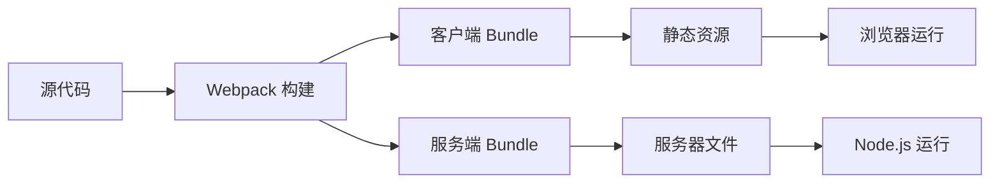

# 构建系统概览

## 📦 构建架构

React Custom SSR 采用 Webpack 5 构建系统，实现了客户端和服务端的双重构建，确保同构应用的正确运行。

### 构建流程



## 🔧 核心配置

### 1. 基础配置 (webpack.config.js)

```javascript
const common = {
  cache: { type: "filesystem" },
  experiments: { topLevelAwait: true },
  module: {
    rules: [
      {
        test: /\.(t|j)sx?$/,
        use: ["thread-loader", "babel-loader"],
      },
    ],
  },
  resolve: {
    extensions: [".js", ".ts", ".tsx", ".jsx"],
  },
};
```

### 2. 客户端配置特点

- **目标环境**: `browserslist` 配置
- **代码分割**: 使用 `@loadable/component`
- **样式处理**: CSS 提取和优化
- **静态资源**: 图片、字体等资源处理

### 3. 服务端配置特点

- **目标环境**: `node` 环境
- **外部依赖**: 排除 `node_modules`
- **资源忽略**: 静态资源使用 `ignore-loader`
- **模块格式**: CommonJS 输出

## 🛠️ 构建模式

### 开发模式

```bash
npm run dev
```

特性：
- 🔥 **热模块替换**: 实时代码更新
- 📦 **增量构建**: 只构建变更部分
- 🐛 **Source Map**: 便于调试
- ⚡ **快速构建**: 优化构建速度

### 生产模式

```bash
npm run build
```

特性：
- 🗜️ **代码压缩**: Terser 压缩 JavaScript
- 🎨 **样式优化**: CSS 压缩和提取
- 📊 **Bundle 分析**: 支持包体积分析
- 🔒 **安全优化**: 移除开发代码

## 📁 输出结构

```
build/
├── client/                 # 客户端构建产物
│   ├── static/
│   │   ├── css/           # 样式文件
│   │   ├── js/            # JavaScript 文件
│   │   └── media/         # 静态资源
│   └── manifest.json      # 资源清单
├── server.js              # 服务端入口
├── serverless.js          # Serverless 入口
└── loadable-stats.json    # 代码分割统计
```

## ⚙️ 环境配置

### 多环境支持

```javascript
// config/env/local.js
module.exports = {
  NODE_ENV: 'development',
  API_URL: 'http://localhost:8007',
  // ...
};

// config/env/online.js
module.exports = {
  NODE_ENV: 'production',
  API_URL: 'https://api.example.com',
  // ...
};
```

### 环境变量使用

```javascript
// 在组件中使用
const apiUrl = process.env.API_URL;
```

## 🚀 性能优化

### 1. 构建速度优化

- **缓存**: 文件系统缓存
- **并行处理**: `thread-loader` 多线程构建
- **增量构建**: 只构建变更文件
- **模块解析**: 优化模块查找路径

### 2. 包体积优化

- **Tree Shaking**: 移除未使用代码
- **代码分割**: 按需加载
- **压缩**: JavaScript 和 CSS 压缩
- **图片优化**: 图片压缩和格式优化

### 3. 运行时优化

- **预加载**: 关键资源预加载
- **缓存**: 长期缓存策略
- **CDN**: 静态资源 CDN 分发
- **HTTP/2**: 支持多路复用

## 📊 构建分析

### Bundle 分析

```bash
# 分析客户端包
npx webpack-bundle-analyzer build/client/static/js/*.js

# 分析服务端包
npx webpack-bundle-analyzer build/server.js
```

### 构建报告

```javascript
// webpack.config.js
module.exports = {
  plugins: [
    new WebpackBundleAnalyzer({
      analyzerMode: 'static',
      reportFilename: 'bundle-report.html',
    }),
  ],
};
```

## 🔍 调试技巧

### 1. 构建日志

```bash
# 详细构建日志
npm run build -- --verbose

# 性能分析
npm run build -- --profile
```

### 2. Source Map 配置

```javascript
module.exports = {
  devtool: process.env.NODE_ENV === 'development' 
    ? 'eval-cheap-module-source-map' 
    : 'source-map',
};
```

### 3. 错误处理

```javascript
// 构建错误处理
process.on('unhandledRejection', (err) => {
  console.error('构建失败:', err);
  process.exit(1);
});
```

## 📝 下一步阅读

- [Webpack 配置](webpack-config.md) - 详细的 Webpack 配置说明
- [Babel 配置](babel-config.md) - Babel 转译配置
- [环境配置](env-config.md) - 多环境配置管理 