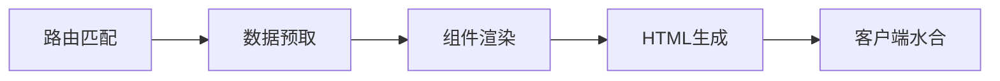

# 项目概述

## 📖 项目简介

这是一个**自定义React SSR（服务端渲染）框架**的完整实现，旨在提供比Next.js更高的性能和更强的定制化能力。项目特别适合需要极致性能和高度定制化的大型应用场景。

### 核心特性
- ⚡ **高性能**: 响应时间从100-150ms优化到40-60ms
- 🚀 **快速冷启动**: Serverless冷启动从4-5s优化到800ms  
- 🔥 **高并发**: 支持10W+ QPS的高并发场景
- 🛠️ **完全可控**: 自定义构建和部署流程
- 🔄 **服务降级**: 内置SSR到CSR的降级机制

### 快速开始
```bash
# 安装依赖
npm install

# 启动开发环境
npm run dev

# 访问应用
open http://localhost:3001/locales/home
```

## 📁 项目目录结构

```
react-custom-ssr/
├── app/                    # 应用核心代码
│   ├── client/            # 客户端入口
│   │   └── index.tsx      # 客户端水合代码
│   ├── server/            # 服务端代码
│   │   ├── index.tsx      # 服务端渲染核心
│   │   ├── app.tsx        # 应用配置
│   │   ├── html.tsx       # HTML模板生成
│   │   ├── server.ts      # 服务器入口
│   │   ├── serverless.ts  # Serverless部署
│   │   ├── middleware/    # 服务端中间件
│   │   └── stream/        # 流式渲染
│   └── utils/             # 工具函数
├── src/                   # 源代码
│   ├── pages/             # 页面组件
│   │   ├── index.tsx      # 根页面
│   │   └── Home/          # 首页组件
│   ├── routes/            # 路由配置
│   │   └── index.tsx      # 路由定义
│   ├── apis/              # API服务
│   │   ├── services/      # 业务服务
│   │   ├── model/         # 数据模型
│   │   └── queryKeys.ts   # 查询键定义
│   ├── utils/             # 工具函数
│   └── theme/             # 主题配置
├── config/                # 构建配置
│   ├── webpack.config.js  # Webpack基础配置
│   ├── webpack.dev.js     # 开发环境配置
│   ├── webpack.prod.js    # 生产环境配置
│   ├── constants.js       # 常量定义
│   └── env/               # 环境变量配置
├── scripts/               # 脚本文件
│   └── dev.js             # 开发启动脚本
├── build/                 # 构建输出目录
├── public/                # 静态资源
├── mocks/                 # 模拟数据
└── logs/                  # 日志文件
```

## 🏗️ 核心架构设计

### 1. 双重构建系统

项目采用**客户端+服务端**双重构建策略：

- **客户端构建**: 生成浏览器端的JavaScript和CSS bundle
- **服务端构建**: 生成Node.js端的服务器代码
- 使用Webpack的多配置实现真正的同构应用

### 2. 服务端渲染流程



核心渲染步骤：
1. **路由匹配**: 根据URL匹配对应的路由配置
2. **数据预取**: 执行路由级别的数据预取逻辑
3. **组件渲染**: 渲染React组件树为字符串
4. **HTML生成**: 生成完整的HTML文档
5. **客户端水合**: 浏览器端接管并恢复交互

### 3. 数据获取策略

- **React Query**: 统一的数据缓存和状态管理
- **服务端预取**: 在服务端预先获取页面所需数据
- **客户端水合**: 无缝接管服务端的数据状态
- **路由级配置**: 支持路由级别的数据预取配置

### 4. 代码分割和懒加载

- 使用`@loadable/component`实现组件懒加载
- 自动生成代码分割的manifest文件
- 支持服务端和客户端的代码分割
- 智能的chunk splitting策略

## 🔧 技术栈分析

### 核心技术栈

| 分类 | 技术 | 版本 | 作用 |
|------|------|------|------|
| **服务端** | Koa + Node.js | 2.14.1 | HTTP服务器框架 |
| **前端框架** | React | 18.3.1 | 前端框架 |
| **类型系统** | TypeScript | 5.0.3 | 类型安全 |
| **构建工具** | Webpack | 5.78.0 | 模块打包器 |
| **编译器** | Babel | 7.21.4 | JavaScript编译器 |
| **样式方案** | Styled Components + Tailwind | 5.3.9 + 3.3.1 | CSS-in-JS + 实用类 |
| **状态管理** | React Query | 4.29.3 | 服务端状态管理 |
| **路由** | React Router DOM | 6.10.0 | 客户端路由 |
| **SEO**      | React Helmet Async           | 1.3.0         | 头部标签管理       |
| **组件库**   | MUI                          | 7.2.0         | UI组件库           |

### 开发工具链

- **开发环境**: Webpack Dev Server + HMR
- **生产部署**: PM2 + Serverless支持
- **代码质量**: ESLint + Prettier
- **类型检查**: TypeScript + Fork TS Checker
- **性能监控**: Webpack Bundle Analyzer
- **测试数据**: JSON Server

## 🚀 启动和部署流程

### 开发环境

```bash
# 启动开发环境
npm run dev

# 命令解析：
# node scripts/dev.js & nodemon build/server.js
# 1. 启动Webpack客户端和服务端构建监听
# 2. 启动Express开发服务器（HMR）
# 3. 启动Nodemon监听服务端代码变化
```

开发环境特性：
- 🔥 **热模块替换**: 支持React组件热更新
- 📦 **增量构建**: 仅重新构建变化的模块
- 🐛 **错误提示**: 友好的错误信息和堆栈跟踪
- 📡 **代理支持**: 支持API代理到开发服务器

### 生产环境部署

```bash
# 构建生产代码
npm run build

# 多环境构建
npm run build:online  # 线上环境
npm run build:beta    # 测试环境
npm run build:test1   # 测试环境1

# 启动生产服务
npm start  # 使用PM2启动
```

### 支持的部署方式

1. **传统服务器部署**
   - 使用PM2进行进程管理
   - 支持集群模式和负载均衡
   - 内置健康检查和自动重启

2. **Serverless部署**
   - 支持AWS Lambda
   - 支持Cloudflare Workers
   - 优化的冷启动时间

3. **容器化部署**
   - Docker支持
   - Kubernetes就绪
   - 水平扩展能力

## 🎯 架构特点和优势

### 1. 性能优化

- **服务端渲染**: 提升首屏加载速度和SEO效果
- **代码分割**: 减少初始bundle体积
- **智能缓存**: React Query缓存减少重复请求
- **流式渲染**: 支持renderToStream提升TTFB
- **资源优化**: 图片优化、字体优化、CSS优化

### 2. 开发体验

- **热模块替换**: 快速的开发反馈循环
- **TypeScript**: 完整的类型安全和智能提示
- **多环境配置**: 支持local/test/beta/online环境
- **错误处理**: 完善的错误边界和日志系统
- **调试支持**: Source Map支持，便于调试

### 3. 部署灵活性

- **多部署方式**: 传统服务器、Serverless、容器化
- **环境隔离**: 完善的环境变量管理
- **监控集成**: 内置性能监控和日志收集
- **自动化部署**: 支持CI/CD流水线

### 4. 扩展性

- **模块化架构**: 清晰的模块边界和依赖关系
- **中间件系统**: 可插拔的服务端中间件
- **路由系统**: 灵活的路由配置和数据预取
- **主题系统**: 可扩展的主题和样式系统
- **国际化支持**: 内置i18n路由支持

## 📊 与Next.js对比优势

| 特性 | Next.js | Custom SSR | 优势说明 |
|------|---------|------------|----------|
| **响应时间** | 100-150ms | 40-60ms | 性能提升60% |
| **冷启动** | 4-5s | 800ms | 启动速度提升5倍 |
| **并发能力** | 限制较大 | 10W+ QPS | 支持高并发场景 |
| **定制化** | 框架限制 | 完全可控 | 满足复杂业务需求 |
| **部署方式** | Vercel优化 | 多样化 | 部署选择更灵活 |
| **服务降级** | 有限支持 | 内置机制 | 更强的容错能力 |

### 适用场景分析

**选择Next.js的场景**：
- 快速原型开发
- 标准的企业官网
- 简单的电商应用
- 团队对定制化要求不高

**选择Custom SSR的场景**：
- 大型电商平台（币安、OKX等）
- 高并发应用
- 复杂的微前端架构
- 老项目CSR到SSR迁移
- 对性能有极致要求的场景

## 📝 代码示例分析

### 路由配置示例

```typescript
// src/routes/index.tsx
const routes: PreFetchRouteObject[] = [
  {
    path: "/",
    element: <Index />,
    children: [
      {
        path: ":locales/home",
        element: <Home />,
        queryKey: [PrefetchKeys.HOME],
        loadData: HomeService.getList,
      },
      {
        path: ":locales?/about",
        element: <div>about</div>,
      },
    ],
  },
];
```

**特点分析**：
- 支持动态路由参数（`:locales`）
- 集成数据预取配置（`queryKey`、`loadData`）
- 嵌套路由支持
- 可选参数支持（`:locales?`）

### 服务端渲染核心

```typescript
// app/server/index.tsx
const jsx = SCSheet.collectStyles(
  extractor.collectChunks(await renderApp(ctx))
);
let appContent = "";
try {
  appContent = await renderToStream(jsx);
} catch (error) {
  console.error(error);
  // 服务降级逻辑
}
```

**特点分析**：
- 样式收集和注入
- 代码分割chunk收集
- 流式渲染支持
- 完善的错误处理

### 客户端水合

```typescript
// app/client/index.tsx
tradeFlag.isSSR
  ? loadableReady(() => {
      hydrateRoot(root, <ClientApp />);
    })
  : createRoot(root).render(<ClientApp />);
```

**特点分析**：
- 智能的渲染策略选择
- 代码分割的懒加载就绪检查
- SSR/CSR模式切换
- React 18的并发特性支持

### MUI/Material & Lucide-React 使用说明

#### 简介

**MUI (Material-UI)** 是 React 的 Material Design 组件库，提供丰富的 UI 组件。**Lucide-React** 是轻量级的图标库，提供清晰美观的图标。

#### 安装

```bash
npm install @mui/material @emotion/react @emotion/styled
npm install lucide-react
```

#### MUI 基础使用

##### 主要组件

- **Button**: 按钮组件，支持不同样式 (contained, outlined, text)
- **TextField**: 输入框组件，支持各种输入类型
- **Typography**: 文本组件，提供标题、正文等样式
- **Paper**: 纸张效果容器，带阴影
- **Card**: 卡片组件，展示信息块
- **Grid**: 栅格布局系统
- **AppBar**: 应用顶栏
- **Drawer**: 侧边栏抽屉

##### 基本用法

```jsx
import { Button, TextField, Typography } from '@mui/material';

// 按钮
<Button variant="contained" color="primary">点击我</Button>

// 输入框
<TextField label="用户名" variant="outlined" />

// 标题
<Typography variant="h4">这是标题</Typography>
```

#### Lucide-React 图标使用

##### 常用图标

- **User**: 用户图标
- **Home**: 首页图标
- **Settings**: 设置图标
- **Search**: 搜索图标
- **Bell**: 通知图标
- **Menu**: 菜单图标
- **Plus**: 加号图标
- **Download**: 下载图标

##### 基本用法

```jsx
import { User, Home, Settings, Search } from 'lucide-react';

// 直接使用
<User size={24} />

// 设置颜色
<Home color="blue" size={20} />

// 在按钮中使用
<Button startIcon={<Settings size={16} />}>
  设置
</Button>
```

#### 组合使用示例

##### 带图标的按钮

```jsx
import { Button } from '@mui/material';
import { Download, Send } from 'lucide-react';

<Button variant="contained" startIcon={<Download size={16} />}>
  下载
</Button>
```

##### 带图标的输入框

```jsx
import { TextField, InputAdornment } from '@mui/material';
import { User } from 'lucide-react';

<TextField
  label="用户名"
  InputProps={{
    startAdornment: (
      <InputAdornment position="start">
        <User size={20} />
      </InputAdornment>
    ),
  }}
/>
```

#### 主题配置

```jsx
import { ThemeProvider, createTheme } from '@mui/material/styles';

const theme = createTheme({
  palette: {
    primary: {
      main: '#1976d2',
    },
    secondary: {
      main: '#dc004e',
    },
  },
});

<ThemeProvider theme={theme}>
  {/* 你的应用 */}
</ThemeProvider>
```

#### 最佳实践

1. **统一导入**: 从同一个包导入相关组件
2. **图标大小**: 通常使用 16px-24px 大小
3. **颜色一致性**: 使用主题色彩系统
4. **响应式设计**: 利用 Grid 系统适配不同屏幕
5. **无障碍访问**: 为图标添加适当的 aria-label

#### 常用组合模式

```jsx
// 导航栏
<AppBar position="static">
  <Toolbar>
    <Menu />
    <Typography variant="h6">应用名称</Typography>
  </Toolbar>
</AppBar>

// 搜索框
<TextField
  placeholder="搜索..."
  InputProps={{
    startAdornment: <Search size={20} />
  }}
/>

// 用户卡片
<Card>
  <CardContent>
    <User size={24} />
    <Typography variant="h6">用户名</Typography>
  </CardContent>
</Card>
```

这样的组合使用可以快速构建现代化的 React 应用界面。

## 🔍 最佳实践建议

### 1. 性能优化

- 合理使用代码分割，避免过度拆分
- 利用React Query的缓存机制
- 优化图片和静态资源加载
- 监控和优化bundle体积

### 2. 开发规范

- 严格的TypeScript类型定义
- 统一的代码风格和linting规则
- 完善的错误边界处理
- 规范的日志记录

### 3. 部署策略

- 根据业务场景选择合适的部署方式
- 配置完善的监控和告警
- 实施渐进式发布策略
- 准备服务降级预案

### 4. 扩展开发

- 保持模块化的架构设计
- 合理使用中间件扩展功能
- 遵循单一职责原则
- 编写完善的文档和测试

## 📚 相关资源

- [React 18 文档](https://reactjs.org/)
- [Webpack 5 指南](https://webpack.js.org/)
- [Koa.js 文档](https://koajs.com/)
- [React Query 文档](https://tanstack.com/query/latest)
- [Styled Components 文档](https://styled-components.com/)

## 🤝 贡献指南

1. Fork 项目仓库
2. 创建特性分支
3. 提交代码变更
4. 推送到分支
5. 创建Pull Request

## 📄 许可证

本项目采用 ISC 许可证，详见 [LICENSE](../LICENSE) 文件。
