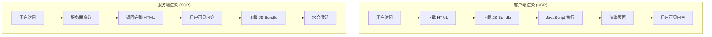

# 服务端渲染 (SSR) 概述

## 🎯 什么是服务端渲染？

服务端渲染（Server-Side Rendering，SSR）是指在服务器端将 React 组件渲染成 HTML 字符串，然后发送给客户端。相比于客户端渲染（CSR），SSR 能够提供更好的首屏加载性能和 SEO 支持。

### SSR vs CSR



## 🔧 SSR 实现原理

### 1. 核心流程

我们的 SSR 实现基于以下核心流程：

```javascript
// app/server/index.tsx
router.get("(.*)", async (ctx: Koa.Context) => {
  // 1. 代码分割处理
  const extractor = new ChunkExtractor({
    statsFile,
    entrypoints: ["client"],
  });
  
  // 2. 样式收集
  const SCSheet = new ServerStyleSheet();
  const jsx = SCSheet.collectStyles(
    extractor.collectChunks(await renderApp(ctx))
  );
  
  // 3. 渲染 React 组件
  let appContent = "";
  try {
    appContent = await renderToStream(jsx);
  } catch (error) {
    console.error(error);
    // 错误处理和服务降级
  }
  
  // 4. 生成完整 HTML
  ctx.body = renderHtml({
    appContent,
    dehydratedState: JSON.stringify(dehydratedState),
    linkTags: extractor.getLinkTags(),
    scriptTags: extractor.getScriptTags(),
    styleTags: [extractor.getStyleTags(), SCSheet.getStyleTags()].join(""),
    helmetTags,
  });
});
```

### 2. 渲染策略

我们支持多种渲染策略：

#### 同步渲染
```javascript
import { renderToString } from "react-dom/server";

const html = renderToString(<App />);
```

#### 流式渲染
```javascript
import { renderToReadableStream } from "react-dom/server";

const stream = await renderToReadableStream(<App />);
```

#### 管道渲染
```javascript
import { renderToPipeableStream } from "react-dom/server";

const { pipe } = renderToPipeableStream(<App />);
```

## 🚀 数据预取

### 路由级数据预取

```javascript
// src/routes/index.tsx
const routes: PreFetchRouteObject[] = [
  {
    path: ":locales/home",
    element: <Home />,
    queryKey: [PrefetchKeys.HOME],
    loadData: HomeService.getList,
  },
];
```

### 预取执行流程

```javascript
// app/server/app.tsx
export default async (ctx: Context) => {
  const queryClient = new QueryClient();
  const prefetchRoutes = matchRoutes(routes, ctx.req.url);

  if (prefetchRoutes) {
    const promiseRoutes = prefetchRoutes
      .map(({ route, params }) => {
        if (route?.queryKey && route?.loadData) {
          return queryClient.prefetchQuery(route?.queryKey, () =>
            route?.loadData(params)
          );
        }
      })
      .filter((i) => i);

    await Promise.all(promiseRoutes);
  }

  const dehydratedState = dehydrate(queryClient);
  ctx.dehydratedState = dehydratedState;
  ctx.queryClient = queryClient;
  
  return <App />;
};
```

## 🎨 样式处理

### Styled Components SSR

```javascript
import { ServerStyleSheet } from "styled-components";

const sheet = new ServerStyleSheet();
try {
  const jsx = sheet.collectStyles(<App />);
  const html = renderToString(jsx);
  const styleTags = sheet.getStyleTags();
  
  // 将样式注入到 HTML 中
  const finalHtml = `
    <html>
      <head>${styleTags}</head>
      <body><div id="root">${html}</div></body>
    </html>
  `;
} finally {
  sheet.seal();
}
```

### CSS 模块处理

```javascript
// webpack.config.js
{
  test: /\.module\.css$/,
  use: [
    isServer ? "ignore-loader" : MiniCssExtractPlugin.loader,
    {
      loader: "css-loader",
      options: {
        modules: {
          localIdentName: "[hash:base64]",
        },
      },
    },
  ],
}
```

## 🔄 错误处理

### 渲染错误处理

```javascript
router.get("(.*)", async (ctx) => {
  try {
    const appContent = await renderToStream(jsx);
    ctx.body = renderHtml({ appContent, isSSR: true });
  } catch (error) {
    console.error("SSR 渲染失败:", error);
    
    // 服务降级：返回 CSR 页面
    ctx.body = renderHtml({ 
      appContent: '<div id="root"></div>',
      isSSR: false 
    });
  }
});
```

### 错误边界

```javascript
// components/ErrorBoundary.tsx
class ErrorBoundary extends React.Component {
  constructor(props) {
    super(props);
    this.state = { hasError: false };
  }

  static getDerivedStateFromError(error) {
    return { hasError: true };
  }

  componentDidCatch(error, errorInfo) {
    console.error("SSR 错误:", error, errorInfo);
  }

  render() {
    if (this.state.hasError) {
      return <h1>Something went wrong.</h1>;
    }

    return this.props.children;
  }
}
```

## 📊 性能优化

### 1. 缓存策略

```javascript
// 页面级缓存
const pageCache = new Map();

app.use(async (ctx, next) => {
  const key = `${ctx.path}:${ctx.querystring}`;
  
  if (pageCache.has(key)) {
    ctx.body = pageCache.get(key);
    return;
  }
  
  await next();
  
  // 缓存结果
  if (ctx.status === 200) {
    pageCache.set(key, ctx.body);
  }
});
```

### 2. 流式渲染优化

```javascript
// 使用流式渲染减少 TTFB
const stream = await renderToReadableStream(<App />, {
  bootstrapScripts: ['/static/js/client.js'],
  onError: (error) => {
    console.error('流式渲染错误:', error);
  }
});

ctx.body = stream;
```

### 3. 资源优化

```javascript
// 预加载关键资源
const criticalResources = [
  '<link rel="preload" href="/static/css/main.css" as="style">',
  '<link rel="preload" href="/static/js/main.js" as="script">',
];

const html = renderHtml({
  appContent,
  criticalResources: criticalResources.join(''),
});
```

## 🔍 调试技巧

### 1. 服务端调试

```javascript
// 启用详细日志
if (process.env.NODE_ENV === 'development') {
  console.log('SSR 渲染开始:', ctx.url);
  console.time('SSR 渲染耗时');
  
  const html = renderToString(<App />);
  
  console.timeEnd('SSR 渲染耗时');
  console.log('SSR 渲染完成');
}
```

### 2. 性能监控

```javascript
// 性能指标收集
const renderMetrics = {
  startTime: Date.now(),
  renderTime: 0,
  componentCount: 0,
  memoryUsage: process.memoryUsage(),
};

// 渲染完成后记录指标
renderMetrics.renderTime = Date.now() - renderMetrics.startTime;
console.log('SSR 性能指标:', renderMetrics);
```

## 🎯 最佳实践

### 1. 组件设计原则

- **纯函数组件**: 避免副作用，保证服务端和客户端渲染一致
- **条件渲染**: 使用 `useEffect` 处理客户端特定逻辑
- **错误边界**: 为每个页面添加错误边界组件

### 2. 数据获取策略

- **预取关键数据**: 在路由级别配置数据预取
- **懒加载非关键数据**: 客户端水合后再加载
- **错误处理**: 数据获取失败时的降级策略

### 3. 性能优化建议

- **合理使用缓存**: 页面级、组件级、数据级缓存
- **代码分割**: 减少初始包体积
- **资源优化**: 图片、字体等静态资源优化

## 📝 下一步阅读

- [渲染流程](render-process.md) - 详细的渲染流程分析
- [数据预取](data-prefetch.md) - 深入了解数据预取机制
- [错误处理](error-handling.md) - 完善的错误处理策略 